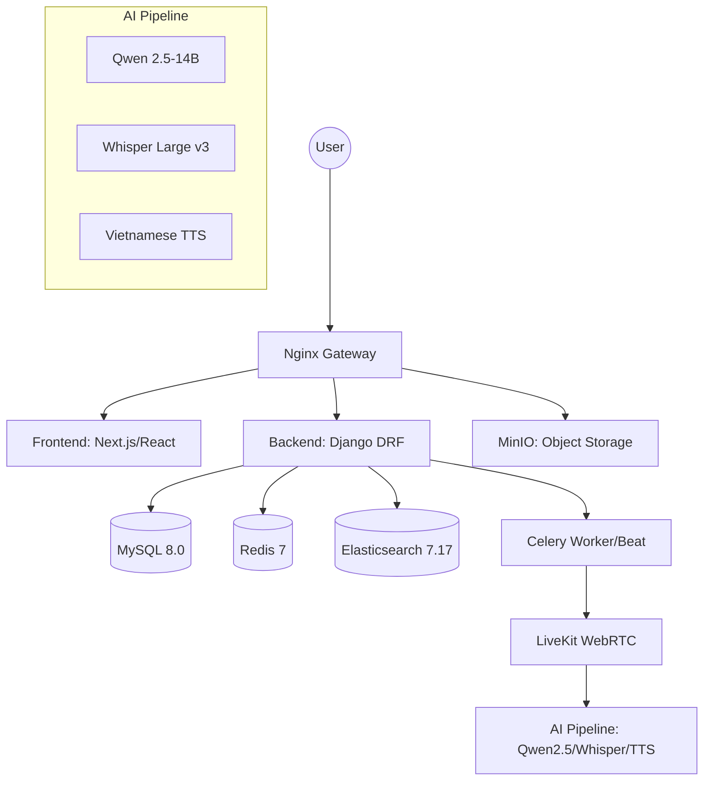

# Square Tuyển Dụng - Project Comprehensive Documentation

## 1. Project Overview
**Square Tuyển Dụng** is a next-generation recruitment platform specifically built for the Architecture and Design industry in Vietnam. It leverages cutting-edge AI technologies to automate the initial screening process through interactive voice interviews.

### Core Mission
- Streamline hiring for specialized technical roles.
- Provide a seamless, AI-driven experience for job seekers and employers.
- Enhance accessibility with high-quality Vietnamese text-to-speech and speech-to-text.

---

## 2. System Architecture

---

## 3. Tech Stack

### Frontend
- **Framework**: Next.js 16+, React 19
- **UI Library**: Material UI (MUI) 6, Emotion, TailwindCSS 4
- **State Management**: Redux Toolkit
- **Realtime**: LiveKit Components, Firebase Realtime Database
- **Mapping**: Goong Maps

### Backend
- **Framework**: Django 4.x, Django Rest Framework (DRF)
- **Task Queue**: Celery with Redis broker
- **Authentication**: Social OAuth2, JWT
- **Search**: Elasticsearch DSL
- **Object Storage**: MinIO (S3 compatible)

### AI & Voice
- **LLM**: Qwen 2.5-14B (running on llama.cpp)
- **STT**: Whisper Large v3
- **TTS**: Custom Vietnamese TTS engine
- **Realtime Comms**: LiveKit WebRTC

---

## 4. Module Breakdown

### Backend (Django Apps)
- `accounts`: User authentication and role management (Job Seeker, Employer, Admin).
- `jobs`: Job posting, matching algorithms, and application tracking.
- `interviews`: AI-driven interview session management and scoring.
- `profiles`: Detailed candidate and company profile management.
- `chatbot`: Realtime AI assistance for users.
- `content`: CMS features for articles and announcements.
- `files`: Object storage integration and file handling.
- `locations`: Geographic data management.

### Frontend (Modules)
- `components/`: Atomic and composite UI components.
- `pages/`: Route-level components for seeker, employer, and admin portals.
- `services/`: API client layer using Axios and TanStack Query.
- `redux/`: Slice-based global state.
- `routes/`: Centralized routing configuration.

---

## 5. Project Statistics (Approximate)

| Extension | Count | Description |
|-----------|-------|-------------|
| `.py`     | 8,400+| Backend logic, migrations, tests. |
| `.tsx`    | 450+  | React components with TypeScript. |
| `.ts`     | 150+  | Utility functions, types, and services. |
| `.json`   | 50+   | Configuration and translation files. |
| `.md`     | 80+   | Documentation and guides. |

---

## 6. Setup & Deployment

The project uses a containerized approach with **Docker Compose**:
- **Gateway**: Nginx handles SSL and routing.
- **App Servers**: Django (Gunicorn) and Next.js.
- **Background Servers**: Celery workers and beat.
- **Inference Servers**: Dedicated GPU-ready containers for LLM and Whisper.
- **Database Servers**: MySQL, Redis, and Elasticsearch.

### Key Commands
- `docker compose up -d --build`: Build and start the entire stack.
- `python manage.py seed_all`: Populate the database with initial data.
- `npm run dev`: Start frontend development server.
