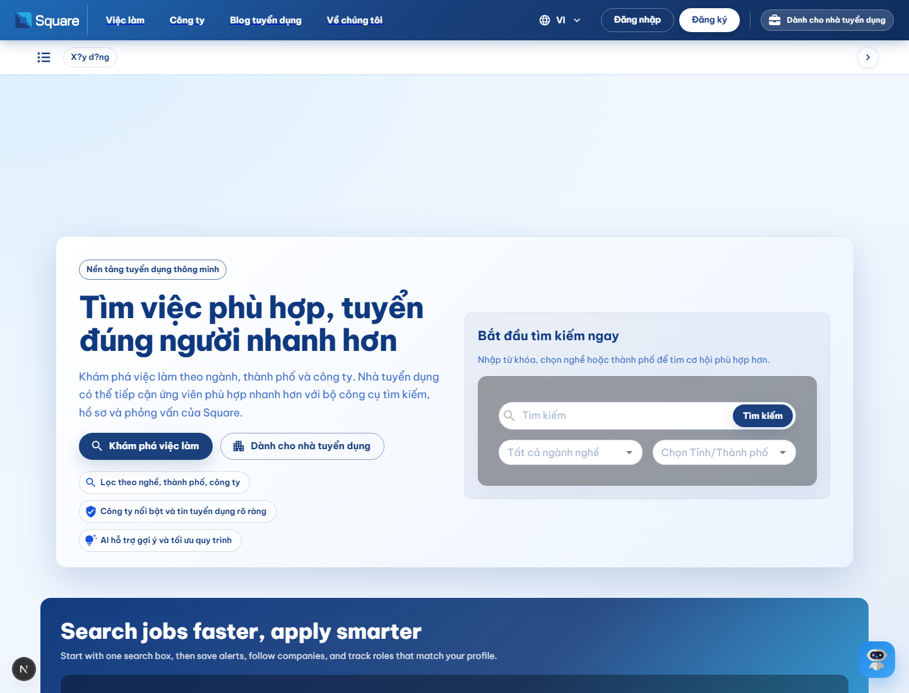
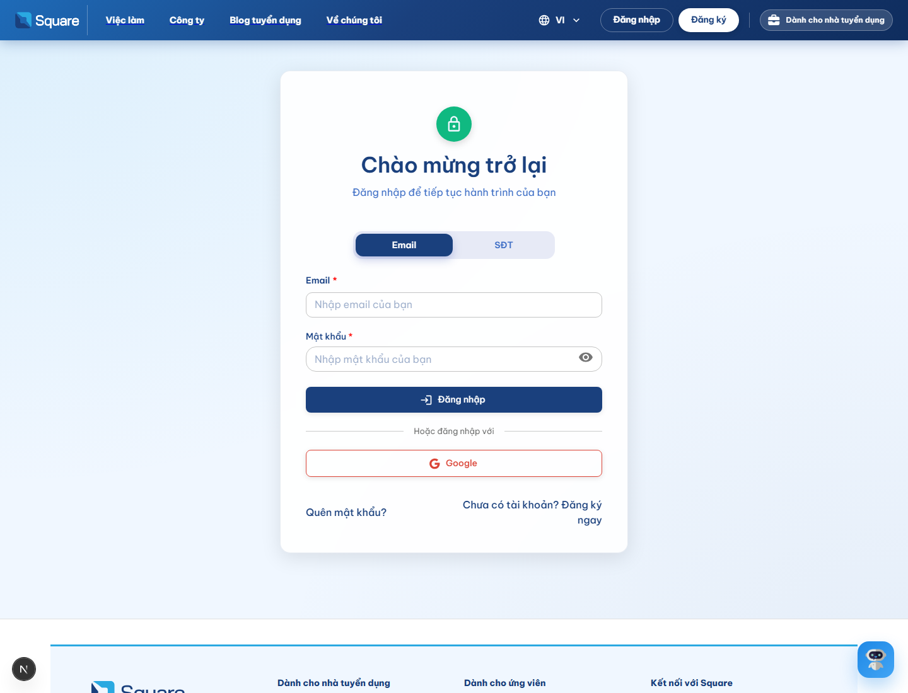
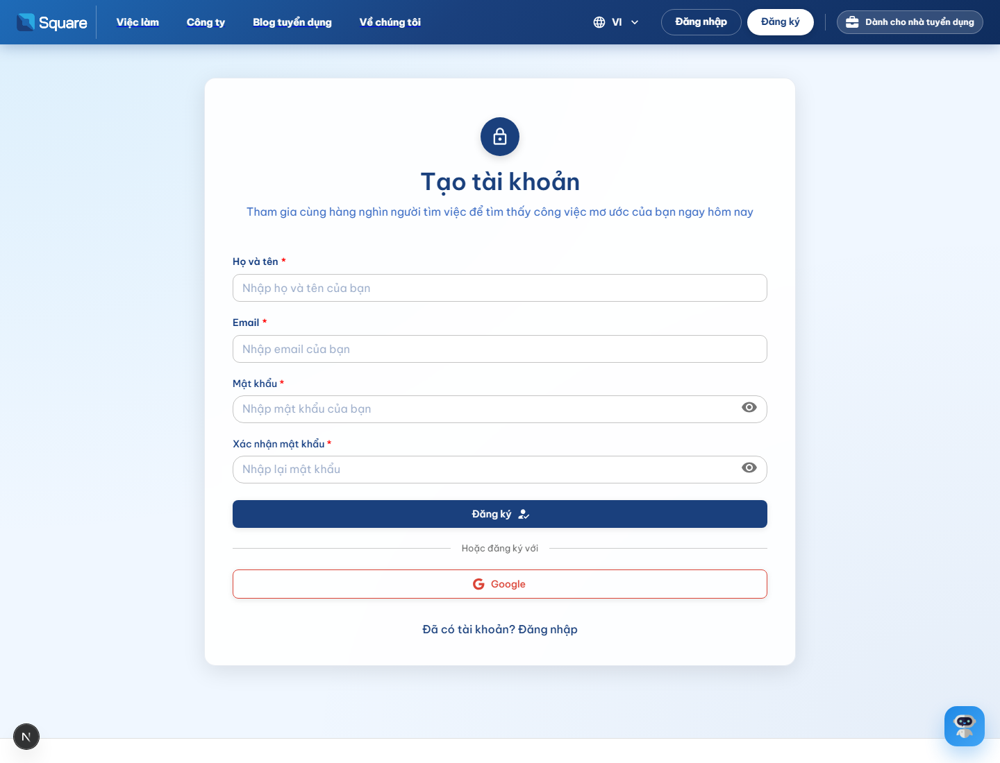
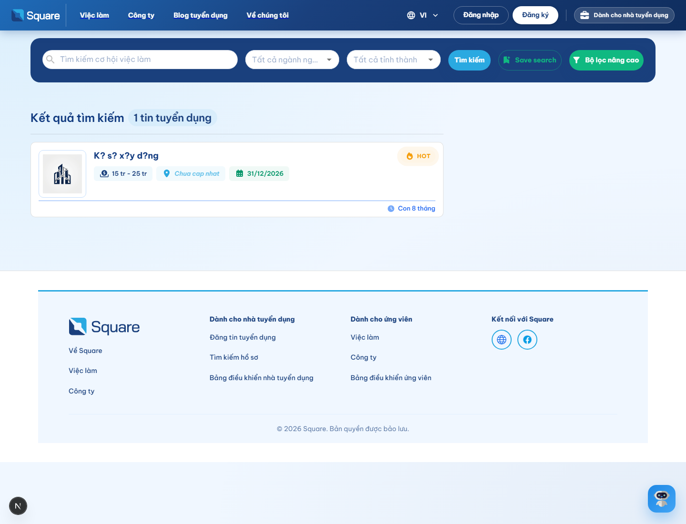
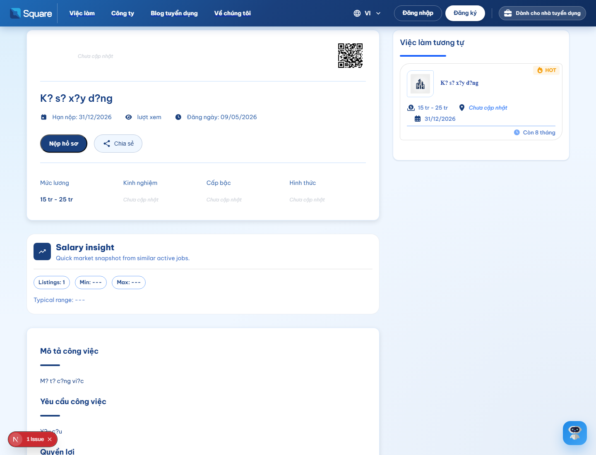
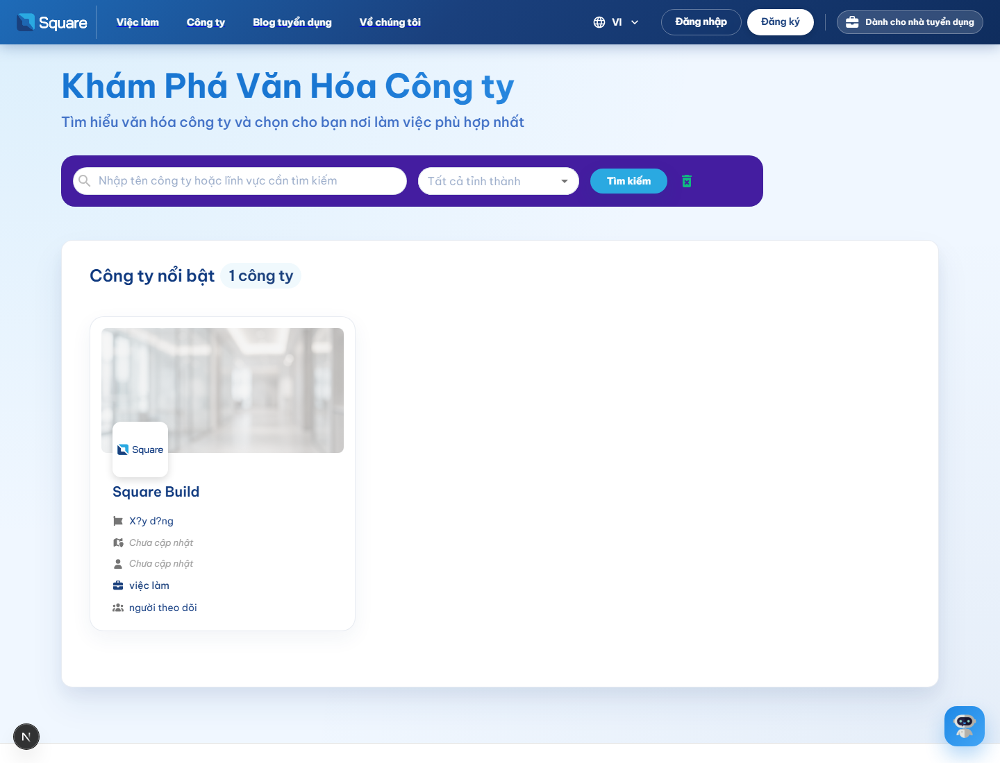
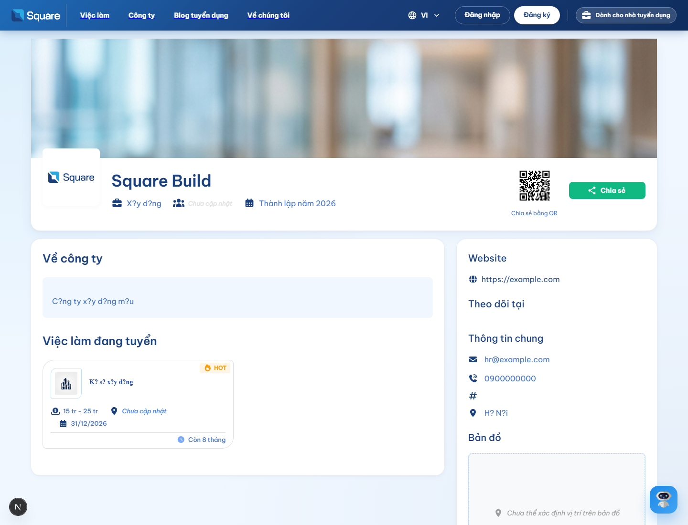

# Hướng dẫn sử dụng Square Tuyển Dụng

- Đối tượng: người dùng cuối, ứng viên, nhà tuyển dụng
- Phạm vi: các màn hình công khai và các thao tác thường dùng
- Phiên bản: 1.0
- Ngày cập nhật: 09/05/2026

## 1. Mục đích tài liệu

Tài liệu này hướng dẫn cách sử dụng nền tảng Square Tuyển Dụng từ góc nhìn người dùng cuối. Nội dung tập trung vào:

- Truy cập trang chủ và điều hướng các khu vực chính.
- Tạo tài khoản, đăng nhập và hoàn thiện hồ sơ.
- Tìm kiếm việc làm, xem chi tiết tin tuyển dụng, lưu tin và ứng tuyển.
- Tìm kiếm công ty, xem hồ sơ doanh nghiệp và theo dõi việc làm đang tuyển.
- Các thao tác thường gặp như thông báo, phỏng vấn AI và xử lý lỗi cơ bản.

## 2. Tổng quan các khu vực

| Khu vực | Mục đích |
|---|---|
| Trang chủ | Giới thiệu nền tảng, đi đến tìm việc hoặc cổng nhà tuyển dụng |
| Việc làm | Tìm kiếm tin tuyển dụng theo từ khóa, ngành nghề, địa điểm |
| Công ty | Xem danh sách công ty, hồ sơ doanh nghiệp và tin đang tuyển |
| Đăng nhập | Vào hệ thống bằng tài khoản đã có |
| Đăng ký | Tạo tài khoản ứng viên mới |

## 3. Bắt đầu sử dụng

### 3.1 Truy cập trang chủ

Mở trang chủ để xem nhanh:

- Thanh điều hướng ở trên cùng.
- Khu vực tìm kiếm việc làm.
- Các tin tuyển dụng nổi bật.
- Giới thiệu lộ trình dành cho ứng viên và nhà tuyển dụng.

### 3.2 Đăng nhập

Nếu đã có tài khoản:

1. Chọn **Đăng nhập** ở góc phải màn hình.
2. Nhập email hoặc số điện thoại tùy theo chế độ đăng nhập.
3. Nhập mật khẩu.
4. Nhấn **Đăng nhập**.

Nếu quên mật khẩu, chọn **Quên mật khẩu?** để khởi tạo lại mật khẩu.

### 3.3 Đăng ký tài khoản mới

Nếu chưa có tài khoản:

1. Chọn **Đăng ký**.
2. Nhập họ và tên.
3. Nhập email.
4. Tạo mật khẩu và xác nhận mật khẩu.
5. Đọc kỹ điều khoản nếu có.
6. Nhấn **Đăng ký**.

Sau khi đăng ký, hệ thống có thể yêu cầu xác thực email trước khi cho phép sử dụng đầy đủ chức năng.

## 4. Tìm kiếm việc làm

### 4.1 Sử dụng trang việc làm

Trang **Việc làm** là nơi bạn tìm tin tuyển dụng theo nhiều tiêu chí:

- Từ khóa công việc.
- Ngành nghề.
- Tỉnh, thành phố.
- Công ty.
- Các bộ lọc nâng cao nếu cần thu hẹp kết quả.

Khi vừa vào trang, bạn sẽ thấy thanh tìm kiếm ở đầu trang và danh sách kết quả bên dưới.

### 4.2 Cách tìm nhanh một việc phù hợp

1. Nhập từ khóa, ví dụ: `kỹ sư`, `thiết kế`, `kế toán`.
2. Chọn ngành nghề nếu muốn lọc sâu hơn.
3. Chọn tỉnh hoặc thành phố bạn muốn làm việc.
4. Nhấn **Tìm kiếm**.
5. Đọc danh sách kết quả và chọn tin phù hợp nhất.

### 4.3 Ý nghĩa các thông tin trên thẻ tin tuyển dụng

Trên mỗi tin việc làm, bạn thường thấy:

- Tên công việc.
- Mức lương dự kiến.
- Địa điểm làm việc.
- Hạn nộp hồ sơ.
- Nhãn trạng thái như `HOT` hoặc `Gấp`.

### 4.4 Mở chi tiết một tin tuyển dụng

Khi chọn vào một tin việc làm, bạn sẽ vào trang chi tiết. Trang này thường gồm:

- Tiêu đề công việc.
- Mức lương.
- Hạn nộp.
- Mô tả công việc.
- Yêu cầu công việc.
- Quyền lợi.
- Thông tin liên hệ.
- Công việc tương tự.

### 4.5 Lưu tin và nộp hồ sơ

Ở trang chi tiết việc làm:

1. Chọn **Nộp hồ sơ** nếu bạn muốn ứng tuyển ngay.
2. Chọn **Chia sẻ** nếu muốn gửi tin tuyển dụng cho người khác.
3. Kiểm tra kỹ thông tin hồ sơ trước khi nộp.
4. Sau khi nộp, theo dõi trạng thái trong khu vực hồ sơ cá nhân hoặc danh sách việc đã ứng tuyển.

### 4.6 Khi chưa đủ điều kiện ứng tuyển

Nếu hệ thống yêu cầu bổ sung hồ sơ, hãy quay lại phần hồ sơ để hoàn thiện:

- Thông tin cá nhân.
- Kinh nghiệm.
- Học vấn.
- Kỹ năng.
- CV hoặc file đính kèm.

## 5. Tìm kiếm công ty

### 5.1 Sử dụng trang công ty

Trang **Công ty** cho phép bạn:

- Xem danh sách doanh nghiệp đang hoạt động.
- Tìm công ty theo tên.
- Xem thông tin tổng quan về doanh nghiệp.
- Mở các vị trí mà công ty đang tuyển.

### 5.2 Mở hồ sơ công ty

Trong trang chi tiết công ty, bạn có thể xem:

- Tên và logo công ty.
- Ngành hoạt động.
- Năm thành lập.
- Website, email và số điện thoại.
- Mô tả doanh nghiệp.
- Danh sách việc làm đang tuyển.

### 5.3 Theo dõi công ty

Nếu bạn quan tâm một công ty:

1. Mở hồ sơ công ty.
2. Đọc mô tả và kiểm tra các vị trí đang tuyển.
3. Lưu lại công ty hoặc mở việc làm liên quan để ứng tuyển sau.

## 6. Các thao tác thường dùng sau khi đăng nhập

### 6.1 Hồ sơ cá nhân

Trong khu vực tài khoản, bạn nên cập nhật:

- Ảnh đại diện.
- Họ tên đầy đủ.
- Số điện thoại.
- Địa chỉ.
- Mục tiêu nghề nghiệp.
- CV và các file liên quan.

### 6.2 Việc đã lưu và việc đã ứng tuyển

Nên kiểm tra định kỳ:

- Việc đã lưu để quay lại ứng tuyển sau.
- Việc đã ứng tuyển để theo dõi trạng thái.
- Thông báo từ hệ thống hoặc nhà tuyển dụng.

### 6.3 Thông báo

Mục thông báo thường dùng để nhận:

- Xác nhận đăng ký hoặc đăng nhập.
- Trạng thái hồ sơ.
- Lời mời phỏng vấn.
- Cập nhật từ công ty hoặc nhà tuyển dụng.

## 7. Phỏng vấn AI

Một số vị trí có thể đi kèm phỏng vấn AI. Quy trình thường như sau:

1. Nhận lời mời phỏng vấn từ hệ thống.
2. Kiểm tra máy tính, micro và mạng Internet.
3. Vào phòng phỏng vấn theo thời gian được chỉ định.
4. Trả lời các câu hỏi trên màn hình hoặc qua giọng nói nếu hệ thống hỗ trợ.
5. Kết thúc phỏng vấn và chờ hệ thống cập nhật kết quả.

Lưu ý:

- Đứng ở nơi yên tĩnh trước khi bắt đầu.
- Chuẩn bị CV và thông tin ứng tuyển để trả lời nhất quán.
- Nếu bị ngắt kết nối, hãy thử vào lại bằng đường dẫn được cấp.

## 8. Dành cho nhà tuyển dụng

Nhà tuyển dụng thường sử dụng các khu vực sau:

- Cập nhật hồ sơ công ty.
- Tạo và quản lý tin tuyển dụng.
- Tìm hồ sơ ứng viên.
- Tạo nhóm câu hỏi và phỏng vấn AI.
- Xem lịch sử tương tác với ứng viên.

Các thao tác này thường nằm sau khi đăng nhập vào cổng nhà tuyển dụng và có thể yêu cầu quyền truy cập riêng.

## 9. Xử lý lỗi cơ bản

### 9.1 Không đăng nhập được

Kiểm tra:

- Email hoặc số điện thoại nhập đúng chưa.
- Mật khẩu có đúng không.
- Tài khoản có bị khóa hoặc chưa xác thực email không.

### 9.2 Không thấy dữ liệu

Nếu trang trống hoặc không có kết quả:

- Thử đổi từ khóa tìm kiếm.
- Bỏ bớt bộ lọc.
- Kiểm tra lại kết nối mạng.
- Tải lại trang.

### 9.3 Nút hoặc màn hình không phản hồi

Bạn nên:

- Làm mới trình duyệt.
- Đăng xuất và đăng nhập lại.
- Xóa cache nếu đã dùng lâu.
- Báo cho bộ phận hỗ trợ nếu lỗi lặp lại.

## 10. Kênh hỗ trợ

Khi cần chỉnh sửa thêm tài liệu, hãy bổ sung:

- Email hỗ trợ chính thức.
- Số hotline.
- Quy trình nội bộ cho ứng viên và nhà tuyển dụng.
- Ảnh chụp từng bước nếu muốn hướng dẫn chi tiết hơn cho người mới.

