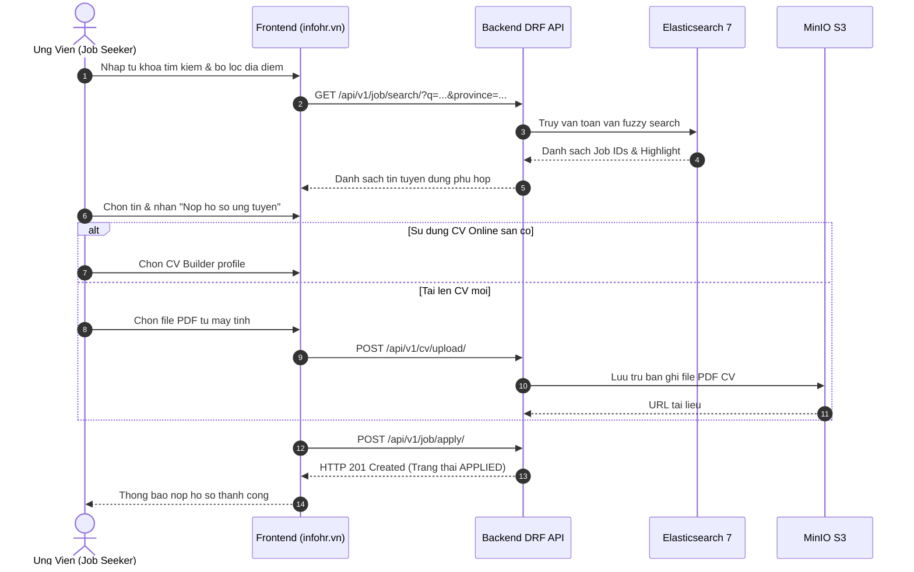
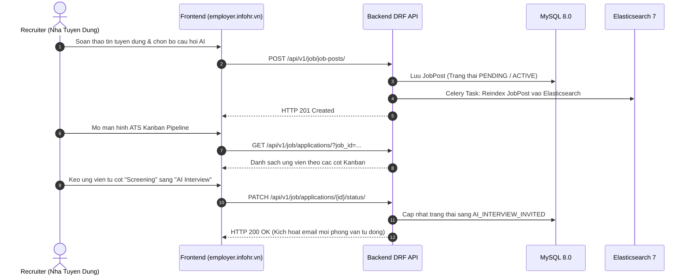
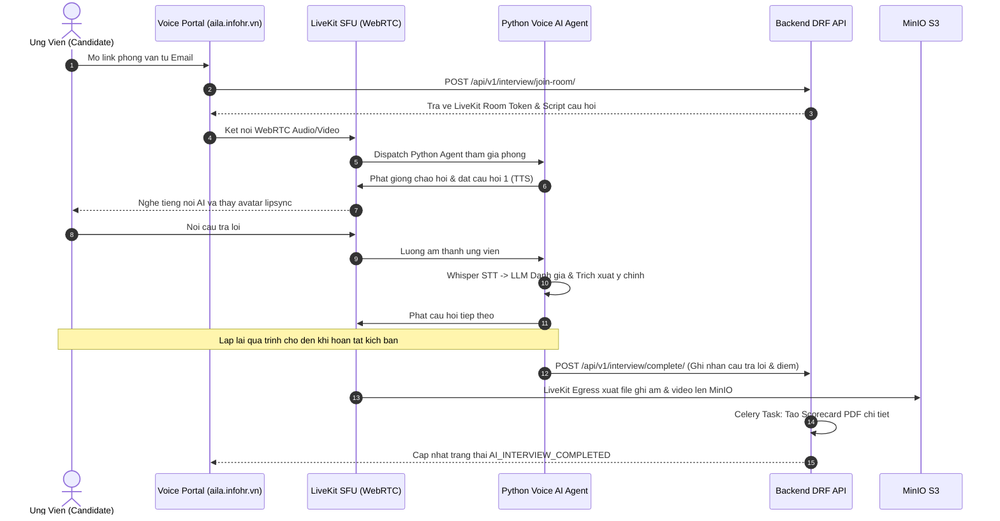

# Luong Cong Viec He Thong (System Workflows)

> **Phan he**: 01-product  
> **Tai lieu**: workflows.md  
> **Ecosystem**: Square Tuyen Dung (InfoHR)

---

## 1. Luong 1: Ung Vien Tim Viec & Nop Ho So 1-Click



---

## 2. Luong 2: Doanh Nghiep Dang Tin & Loc Ung Vien Tren ATS Kanban



---

## 3. Luong 3: Phong Van Voice AI Thoi Gian Thuc & Cham Diem Tu Dong



---

## 4. Luong 4: Kiem Duyet Giay Phep & Tin Dang Tren Admin Portal

1. **Doanh nghiep tai len ho so xac thuc**: Bao gom ten doanh nghiep, ma so thue va hinh anh/PDF Giay phep kinh doanh.
2. **He thong dua vao hang doi tham dinh**: Doanh nghiep chuyen trang thai `VERIFICATION_PENDING`.
3. **Quan tri vien kiem tra doi chieu**: Admin truy cap `admin.infohr.vn`, doi chieu ma so thue tren he thong Dang ky kinh doanh quoc gia.
4. **Phe duyet hoac Yeu cau bo sung**:
   - Neu hop le: Admin phe duyet, trang thai doanh nghiep tro thanh `VERIFIED`. Doanh nghiep duoc phep dang tin cong khai.
   - Neu khong hop le: Admin nhap ly do tu choi, he thong gui thong bao qua Email cho chu doanh nghiep.

---

## 5. Luong 5: Tuyen Dung Lien Thong HRM (Recruit-to-Retire)

```text
[Ung vien Trung Tuyen (Hired) tren ATS Kanban]
                 │
                 ▼
[Tao ban ghi Employee trong phan he Native HRM]
                 │
                 ├─► Gan Phong ban, Chuc vu, Quan ly truc tiep
                 ├─► Lap Hop dong lao dong (Thu viec / Chinh thuc)
                 └─► Khoi tao Quy phep nam (EmployeeLeaveBalance)
                 │
                 ▼
[Phan Ca & Cham Cong Hang Ngay (Time & Attendance)]
                 │
                 ├─► Nhan su quet the (Check-in / Check-out)
                 ├─► Thuat toan ghep ca tu dong (Ho tro ca dem is_overnight)
                 └─► Xu ly don nghi phep (Tru quy phep voi select_for_update)
                 │
                 ▼
[Tong Hop Cong & Tinh Luong Cuoi Thang (Payroll Engine)]
                 │
                 ├─► Tinh ngay cong thuc te, ngay nghi huong luong, nghi khong luong
                 ├─► Tinh luong Gross, phu cap, khau tru BHXH (8%), BHYT (1.5%), BHTN (1%)
                 ├─► Tinh giam tru gia canh ban than (11tr) + nguoi phu thuoc (4.4tr/nguoi)
                 ├─► Tinh thue TNCN theo bieu luy tien 7 bac cua Luat Thue Viet Nam
                 └─► Xuat Phieu luong A4 (@media print) & Khoa so luong (APPROVED / PAID)
```
