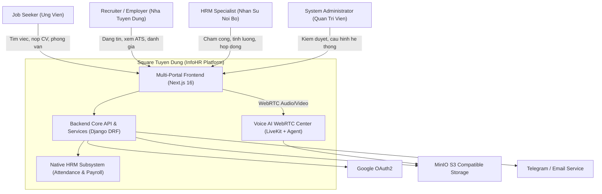
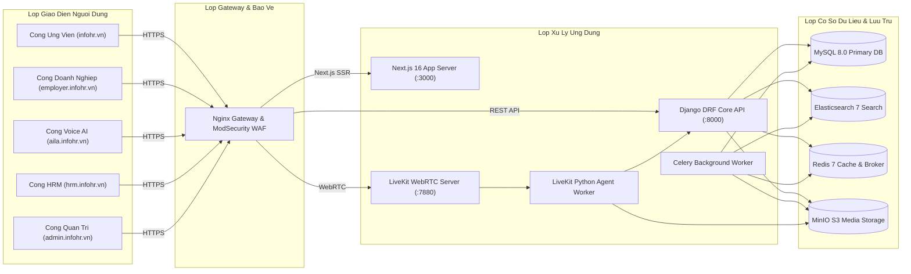
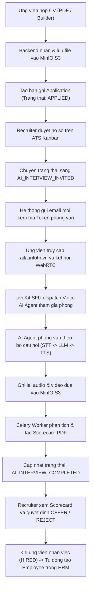

# Bo So Do Kien Truc Mermaid (Mermaid Diagrams)

> **Phan he**: 02-architecture  
> **Tai lieu**: mermaid-diagrams.md  
> **Ecosystem**: Square Tuyen Dung (InfoHR)

---

## 1. C4 Context Diagram: He Sinh Thai InfoHR

---

## 2. Container Diagram: Cac Phan He Chuc Nang

---

## 3. Data Flow Diagram: Tien Trinh Tu Luc Nop CV Den Cham Diem AI

