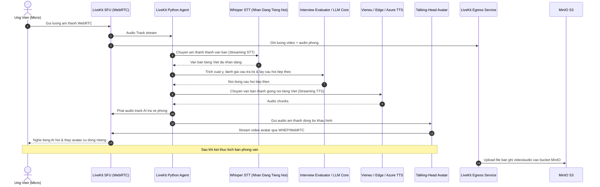

# Kien Truc Voice AI & WebRTC (LiveKit & Speech Pipeline)

> **Phan he**: 02-architecture  
> **Tai lieu**: voice-ai-architecture.md  
> **Ecosystem**: Square Tuyen Dung (InfoHR) / Voice AI Center

---

## 1. Tong Quan Kien Truc Voice AI

He thong Voice AI chiu trach nhiem thuc hien cac cuoc phong van tu dong bang tieng Viet thoi gian thuc giua tro ly ao AILA va ung vien. Kien truc ket hop giua WebRTC SFU, Python Agent Runner va mo hinh sinh khuon mat dong bo khau hinh (Talking-Head Avatar).

```text
voice-ai/
├── livekit_agent/      # LiveKit Python Worker Agent (src/agent.py, src/config.py)
├── talking-head/       # Avatar Lipsync Engine (Wav2Lip / Musetalk / WebRTC WHEP stream)
├── inference/          # Local inference modules (Whisper STT, Vieneu TTS)
├── livekit-configs/    # Cau hinh LiveKit Server & SFU (livekit.yaml)
└── egress.yaml         # Cau hinh LiveKit Egress Service xuat video/audio ra MinIO S3
```

---

## 2. Pipeline Xu Ly Am Thanh & Giong Noi Thoi Gian Thuc



---

## 3. Cac Thanh Phan Cot Loi

### 3.1. LiveKit SFU (Selective Forwarding Unit)
- Dam nhiem vai tro bo dinh tuyen luong truyen thong thoi gian thuc.
- Port van hanh: `7880` (HTTP/WS API & Signaling), `7881` (TCP WebRTC), `7882` (UDP WebRTC).
- Xac thuc phong thong qua Room Token duoc ky bang `LIVEKIT_API_KEY` va `LIVEKIT_API_SECRET`.

### 3.2. LiveKit Python Agent Worker
- Chay tren nền tang `livekit-agents` framework trong container `voice-ai`.
- Khi co ung vien ket noi vao phong, LiveKit SFU phat su kien `RoomCreated` / `ParticipantJoined`, Agent duoc dispatch tu dong de tham gia phong va khoi tao bo dem cau hoi.
- Xu ly tinh huong ngat loi (Barge-in): Khi ung vien bat dau noi trong luc AI dang noi, Agent phat hien VAD (Voice Activity Detection) va lap tuc huy luong TTS dang phat de nhuong loi cho ung vien.

### 3.3. Talking-Head Lipsync Engine
- Module `voice-ai/talking-head` ho tro cac mo hinh dong bo khau hinh tien tien nhu Wav2Lip, Musetalk hoac Ultralight Avatar.
- Chuyen doi am thanh dau ra tu TTS thanh toa do moc khau hinh mat (Facial Landmarks) va xuat hinh anh avatar chuyen dong qua giao thuc WHEP/WebRTC ve trinh duyet nguoi dung.

### 3.4. Ghi Hinh & Ghi Am Egress
- Dich vu LiveKit Egress Service lang nghe cac phien phong van duoc kich hoat che do ghi hinh.
- Tong hop luong am thanh cua ung vien va AI thanh file ban ghi chat luong cao (MP3/WAV/MP4) va tu dong day len bucket `interviews` trong MinIO S3 de nha tuyen dung co the nghe lai.
