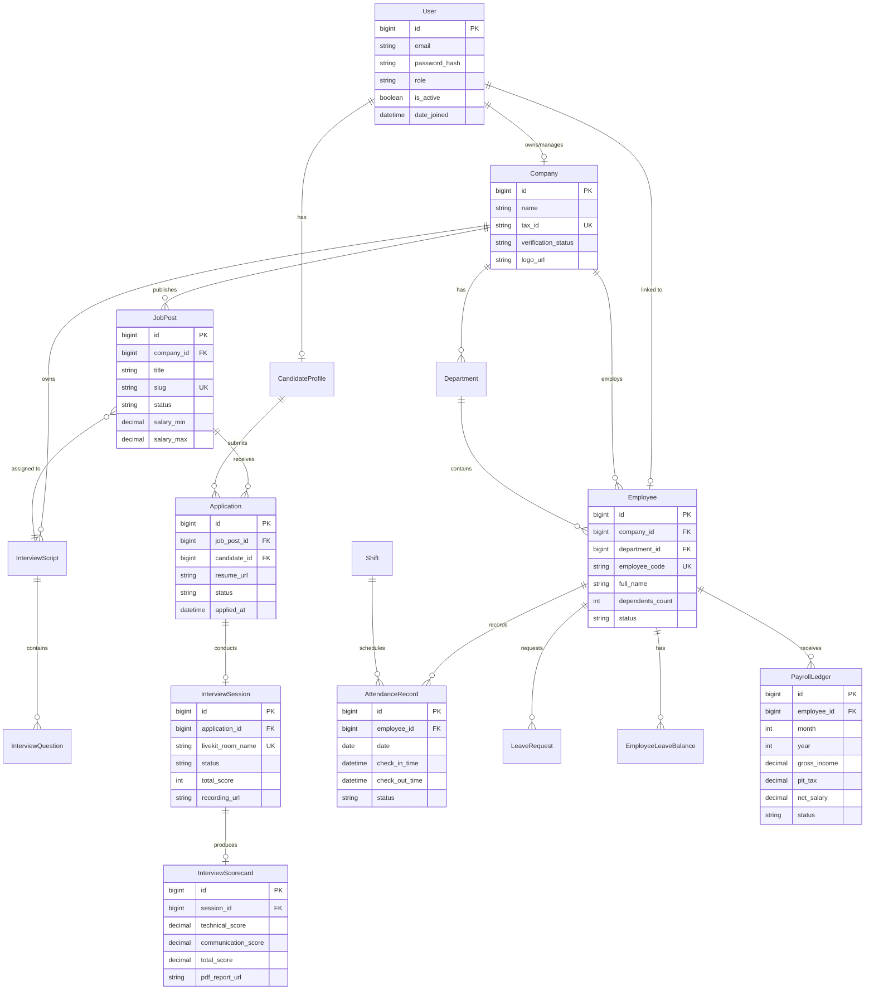

# So Do Thuc The Quan He (Entity-Relationship Diagram - ERD)

> **Phan he**: 05-database  
> **Tai lieu**: erd.md  
> **Dinh dang**: Mermaid `erDiagram`

---

## 1. So Do ERD Tong The He Thong

---

## 2. Giai Thich Quan He Chinh

1. **`User` va `CandidateProfile` / `Company`**: Quan he 1-1. Mot tai khoan nguoi dung co the la mot ung vien so huu ho so ca nhan, hoac la dai dien quan tri mot doanh nghiep.
2. **`JobPost` va `Application`**: Quan he 1-Nhieu. Mot tin tuyen dung nhan nhieu ho so ung tuyen tu cac ung vien khac nhau.
3. **`Application` va `InterviewSession`**: Quan he 1-1. Moi ho so ung tuyen chi lien ket toi toi da 1 phien phong van Voice AI dang hoat dong.
4. **`Employee` va `PayrollLedger`**: Quan he 1-Nhieu. Mot nhan vien nhan nhieu bang luong qua tung thang trong nam, voi rang buoc duy nhat `(employee_id, month, year)`.
