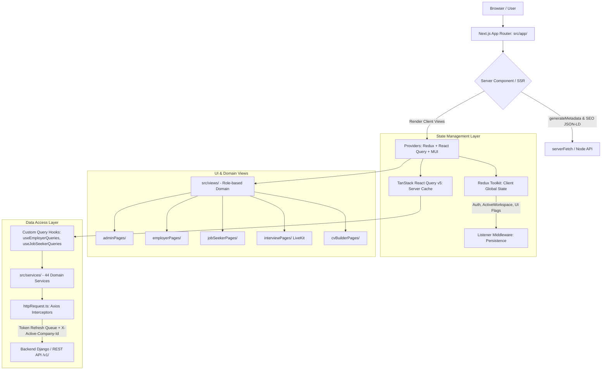

# Báo Cáo Audit Frontend - Giai Đoạn 2: Kiến Trúc & Quản Lý Trạng Thái (Architecture & State Flow)

**Dự án:** `project-web-app` (Square Tuyển Dụng Frontend)  
**Công nghệ chính:** Next.js 16.2 (App Router) + React 19 + Redux Toolkit + TanStack React Query v5 + Axios  
**Ngày thực hiện:** 30/08/2026  
**Trạng thái:** Hoàn thành audit Giai đoạn 2  

---

## 1. Tổng quan Kiến trúc Hệ thống (Architecture Scorecard)

| Tiêu chí | Điểm | Đánh giá |
| :--- | :---: | :--- |
| **1. Phân tầng kiến trúc (Layer Separation)** | **9/10** | Ranh giới giữa App Router, Domain Views, Services và Components rất rõ ràng và mạch lạc. |
| **2. Phân định State (State Boundaries)** | **9/10** | Phân định tuyệt vời giữa Client State (Redux Toolkit) và Remote Cache State (React Query v5). |
| **3. Tầng Truy cập Dữ liệu (API Client & Interceptors)** | **8.5/10** | `httpRequest.ts` có cơ chế chống 401 refresh storm (token mutex), auto camelCase, multi-tenancy header. |
| **4. SSR & Server Component Boundaries** | **8.5/10** | Các trang công khai (`jobs/[slug]`, `companies/[slug]`, `tin-tuc/[slug]`) sử dụng Server Components + `serverFetch` để sinh SEO Metadata & JSON-LD chuẩn. |
| **5. Modular Component Sizing** | **7.5/10** | Tồn tại một số View có kích thước lớn (>800-1100 dòng) gom nhiều trách nhiệm con. |

---

## 2. Phân Tích Chi Tiết Từng Tầng Kiến Trúc

### A. Tầng Quản lý Trạng thái (Redux Toolkit vs TanStack Query)

1. **Redux Toolkit (`src/redux/`):**
   - Đảm nhiệm chính xác phạm vi **Client Global UI State**:
     - `authSlice.ts`: Trạng thái xác thực email, OTP login flow.
     - `userSlice.ts`: Thông tin tài khoản đăng nhập hiện tại (`currentUser`), danh sách workspace, `activeWorkspace` (phục vụ đa doanh nghiệp).
     - `filterSlice.ts`: Bộ lọc tìm kiếm toàn cục (từ khóa, ngành nghề, địa điểm, kinh nghiệm).
     - `profileSlice.ts`: Signal trigger tải lại hồ sơ ứng viên.
   - **Điểm sáng kiến trúc:** Sử dụng `createListenerMiddleware()` để đồng bộ `localStorage` / `sessionStorage` thay vì viết side-effects bên trong Reducers (tuân thủ chuẩn Redux Toolkit hiện đại).

2. **TanStack React Query v5 (`src/app/providers.tsx`):**
   - Khởi tạo độc lập qua Lazy Init `useState(() => makeQueryClient())`, ngăn ngừa rò rỉ bộ nhớ giữa các SSR request.
   - Cấu hình chuẩn mực: `staleTime: 5 phút`, `gcTime: 10 phút`, `refetchOnWindowFocus: false`, tự động bắt lỗi toàn cục qua `errorHandling()`.
   - Các Custom Query Hooks (`useEmployerQueries.ts`, `useJobSeekerQueries.ts`, `useJobs.ts`) được gom nhóm theo từng domain, có typed return và query keys phân cấp rõ ràng (`['jobPost', id]`, `['employerGeneralStatistics']`).

---

### B. Tầng Truy Cập Dữ liệu (Data Access Layer - `src/services/` & `src/utils/httpRequest.ts`)

1. **Cấu trúc Services (`src/services/`):**
   - Gồm **44 Domain Services** nhỏ gọn (như `jobService.ts`, `resumeService.ts`, `interviewService.ts`, `companyService.ts`, `hrmService.ts`, `voiceProfileService.ts`,...).
   - Mỗi service chỉ chịu trách nhiệm gọi endpoint và định kiểu payload/response của domain đó (tuân thủ nguyên lý Single Responsibility).

2. **Cơ chế Interceptor trong `httpRequest.ts`:**
   - **Xử lý Token Refresh an toàn:** Khi token hết hạn (401), hệ thống đưa các request đồng thời vào hàng đợi `failedQueue` và chỉ thực hiện 1 request refresh duy nhất, tránh gửi bão request (Refresh Token Storm).
   - **Hỗ trợ Multi-Tenancy:** Tự động gắn header `X-Active-Company-Id` dựa trên workspace doanh nghiệp đang chọn.
   - **Tự động chuyển đổi định dạng (CamelCase Transformation):** Tự động chuyển đổi response snake_case từ Django Backend thành camelCase cho Frontend và ngược lại khi gửi payload.
   - **Bảo trì hệ thống (Maintenance Mode):** Tự động bắt mã lỗi 503 / `system_maintenance` để kích hoạt giao diện bảo trì tức thời.

---

### C. Tầng Định tuyến & Ranh giới Server/Client (App Router & Views)

1. **Tách biệt Route Wrappers và Domain Views:**
   - Folder `src/app/` chủ yếu đóng vai trò routing, SEO metadata generation (`generateMetadata`), và nạp Layout.
   - Toàn bộ logic giao diện phức tạp được đặt trong `src/views/` theo phân quyền:
     - `src/views/adminPages/`: Quản trị hệ thống, duyệt tin, người dùng, cài đặt Voice AI, audit logs.
     - `src/views/employerPages/`: Cổng nhà tuyển dụng, đăng tin, quản lý ứng viên, phỏng vấn, hồ sơ công ty.
     - `src/views/jobSeekerPages/`: Cổng người tìm việc, dashboard ứng viên, việc làm đã lưu/ứng tuyển.
     - `src/views/interviewPages/`: Phòng phỏng vấn AI Voice tích hợp WebRTC LiveKit.
     - `src/views/cvBuilderPages/`: Trình tạo & chỉnh sửa CV đa mẫu với preview thời gian thực.
     - `src/views/defaultPages/`: Trang chủ, tin tức, chi tiết việc làm / doanh nghiệp công khai.

2. **Tối ưu SEO & JSON-LD:**
   - Các trang Public (`/jobs/[slug]`, `/companies/[slug]`, `/tin-tuc/[slug]`) nạp trước dữ liệu qua `serverFetch` ở Server Component để sinh thẻ Meta OpenGraph đầy đủ và nhúng Structured Data (`schema.org/JobPosting`, `Organization`, `Article`).

---

## 3. Các Điểm Cần Cải Thiện Trong Kiến Trúc (Architectural Action Items)

### 🟡 1. Tách nhỏ các File View nguyên khối (Decomposition)
- **Vấn đề:** Một số file view gộp chung cả Form State, Schema Validation, API Mutations và UI Rendering:
  - `UnifiedCVForm.tsx` (1,148 dòng) ➔ Cần tách thành custom hook `useUnifiedCVFormState.ts` và các component section (`PersonalInfoSection`, `EducationSection`, `ExperienceSection`, `SkillsSection`).
  - `AIInterviewLayout.tsx` (937 dòng) ➔ Cần tách thành `AudioVisualizerPanel`, `InterviewChatDrawer`, `InterviewEvaluationModal`.

### 🟢 2. Chuẩn hóa Dynamic Code Splitting cho các Module nặng
- **Khuyến nghị:** Đối với các view sử dụng thư viện nặng như `LiveKit` (WebRTC), `Leaflet` (OpenStreetMap), `Chart.js` và `SheetJS` (XLSX), đảm bảo luôn bọc qua `next/dynamic` với `{ ssr: false }` khi import vào view để giữ Bundle Size của các trang cơ bản luôn nhẹ nhất.

---

## 4. Kết Luận Giai Đoạn 2

Kiến trúc frontend của dự án được thiết kế rất bài bản, hiện đại và tuân thủ các best practices của Next.js App Router + React 19 + Redux Toolkit + React Query. Hệ thống phân tầng sạch sẽ, bảo đảm tính mở rộng tốt cho các tính năng tuyển dụng và phỏng vấn AI.
