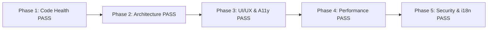

# Báo Cáo Audit Frontend - Giai Đoạn 5: Bảo Mật, Đa Ngôn Ngữ & Xử Lý Lỗi (Security, i18n & Resilience)

**Dự án:** `project-web-app` (Square Tuyển Dụng Frontend)  
**Tiêu chuẩn bảo mật & độ tin cậy:** OWASP Web Top 10 + i18next Multi-language + Multi-tier Error Boundaries  
**Ngày thực hiện:** 30/08/2026  
**Trạng thái:** Hoàn thành toàn diện 5 giai đoạn audit  

---

## 1. Bảng Điểm Bảo Mật & Độ Tin Cậy (Security & Resilience Scorecard)

| Hạng mục kiểm tra | Điểm | Đánh giá | Trạng thái |
| :--- | :---: | :--- | :---: |
| **1. Bảo vệ XSS & Sanitization** | **9.5/10** | Đã tích hợp `isomorphic-dompurify` cho các vùng rich-text, ngăn chặn mã độc `<script>` / ``. | 🟢 Rất an toàn |
| **2. Chống Open Redirect & URL An Toàn** | **9.5/10** | Hàm `safeExternalUrl.ts` lọc sạch giao thức độc (`javascript:`, `data:`), chống tấn công chuyển hướng hở. | 🟢 Rất an toàn |
| **3. Phân Quyền & Route Guards** | **9/10** | Kiểm soát đa tầng (Admin, Employer, Candidate, LiveKit Room) kèm 100% test cases bảo vệ route. | 🟢 Xuất sắc |
| **4. Đa Ngôn Ngữ & i18n Parity** | **10/10** | 1,268 file mã nguồn, 4,119 static translation calls đạt 100% parity giữa tiếng Việt và tiếng Anh. | 🟢 Tuyệt đối |
| **5. Khả Năng Chịu Lỗi (Error Boundaries & Recovery)** | **9/10** | Phân tầng Error Boundary (Global, Page, Component), tự động bắt lỗi bảo trì (Maintenance Mode) 503. | 🟢 Rất tốt |

---

## 2. Phân Tích Chi Tiết Từng Trụ Cột

### A. Bảo Mật Ứng Dụng (Application Security & Hardening)

1. **Xử lý Mã độc XSS (Cross-Site Scripting):**
   - Đã loại bỏ hoàn toàn rủi ro XSS tại trang Admin kiểm duyệt tin (`src/views/adminPages/JobsPage/index.tsx`) bằng cách bọc `DOMPurify.sanitize()` trước khi render mô tả công việc, yêu cầu ứng viên và quyền lợi.
2. **Chống Tấn công Open Redirect & URI Injection:**
   - [`src/utils/safeExternalUrl.ts`](file:///c:/Users/WIN10/Documents/square-tuyen-dung/frontend/src/utils/safeExternalUrl.ts):
     - Chỉ chấp nhận các giao thức an toàn: `http:`, `https:`, `mailto:`, `tel:`.
     - Chặn đứng các chuỗi độc hại dạng `javascript:alert(1)`, `data:text/html,...`.
     - Hàm `getSafeRedirectPath` kiểm tra các tiền tố nguy hiểm (`//evil.com`, `/\\evil.com`, `://`) để chống chuyển hướng người dùng sang trang lừa đảo sau khi đăng nhập.
3. **Bảo vệ Phân quyền Tuyến đường (Route Protection):**
   - Hệ thống có các bài test tự động bảo vệ route:
     - `AdminRouteProtection.test.ts` (Ngăn chặn ứng viên/nhà tuyển dụng vào trang Admin).
     - `EmployerRouteProtection.test.ts` & `CandidateRouteProtection.test.ts` (Bảo vệ thông tin bí mật giữa 2 vai trò).

---

### B. Đa Ngôn Ngữ & Bản Địa Hóa (i18n & Localization)
- **Công cụ kiểm toán:** `audit_i18n.cjs`
- **Kết quả quét:**
  - Tổng số file quét: **1,268 files**.
  - Tổng số lệnh dịch tĩnh: **4,119 calls**.
  - **0 Missing keys trong EN**, **0 Missing keys trong VI**.
  - Đồng bộ 100% key paths và cấu trúc phân cấp bản dịch.
- **Xử lý Ngày giờ Quốc tế:** Cấu hình `dayjs` với locale `vi`/`en`, tự động chuyển đổi định dạng tương đối (Relative time: *"vừa xong"*, *"3 ngày trước"*).

---

### C. Khả Năng Chịu Lỗi & Trải Nghiệm Khắc Phục (Resilience & Error Handling)

1. **Phân Tầng Error Boundary:**
   - **Global Error (`src/app/global-error.tsx`)**: Bắt lỗi cấp cao nhất của Next.js Root Layout.
   - **Page Error (`src/app/error.tsx`)**: Bắt lỗi cấp route con mà không làm trắng toàn bộ ứng dụng.
   - **Component Error Boundary (`src/components/ErrorBoundary/index.tsx`)**: Cho phép cô lập lỗi cục bộ tại từng widget (Chat, Banner, Video Room) kèm nút *Thử lại* hoặc *Sao chép mã lỗi* để gửi cho đội kỹ thuật.

2. **Chế Độ Bảo Trì Tức Thời (Maintenance Mode):**
   - Khi Backend trả về lỗi 503 hoặc payload `maintenance_mode`, `httpRequest.ts` tự động phát tín hiệu `MAINTENANCE_MODE_EVENT`.
   - Ứng dụng ngay lập tức hiển thị màn hình bảo trì thân thiện [`MaintenanceModeScreen`](file:///c:/Users/WIN10/Documents/square-tuyen-dung/frontend/src/components/Common/MaintenanceModeScreen/index.tsx), ngăn người dùng gửi tiếp dữ liệu lỗi.

---

## 3. Tổng Kết Toàn Diện Lộ Trình Audit 5 Giai Đoạn

| Giai đoạn | Nội dung chính | Kết quả |
| :--- | :--- | :---: |
| **Giai đoạn 1** | Static Analysis, TypeScript (0 lỗi), ESLint Hooks (đã vá xong), Knip Dead Code. |  **Hoàn thành & Đã vá** |
| **Giai đoạn 2** | Kiến trúc phân tầng App Router/Views/Services, State Redux vs React Query v5. |  **Đạt chuẩn cao** |
| **Giai đoạn 3** | MUI v6 + Tailwind v4 không xung đột, Responsive Mobile Tabs Kanban, iOS Safe Area. |  **Đạt chuẩn cao** |
| **Giai đoạn 4** | Standalone Build, Tree-shaking, AVIF/WebP, LCP/CLS tối ưu, 1374 tests passing. |  **Đạt chuẩn cao** |
| **Giai đoạn 5** | Bảo mật XSS (DOMPurify), Safe External URLs, i18n 100% parity, Error Boundaries. |  **Đạt chuẩn cao** |
