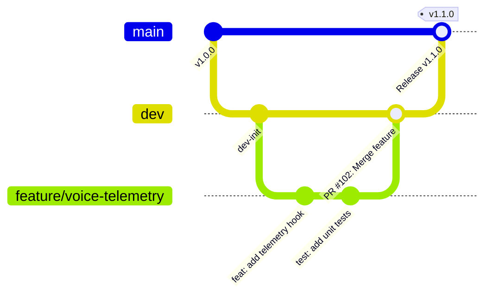

# 🌿 Git Branching Strategy & Workflow Guidelines

> **Ecosystem**: Square Tuyển Dụng (InfoHR)  
> **Standard**: Trunk-Based / Feature-Branch Flow for Monorepo  
> **Audience**: All Software Engineers & AI Coding Assistants

---

## 1. 📌 Overview

InfoHR operates as a monorepo containing multiple subsystems (`frontend`, `api`, `voice-ai`, `nginx-gateway`, `monitoring`). To ensure stability, zero disruption to staging/production, and clean release auditability, all code changes MUST follow this branching model.

---

## 2. 🌲 Core Branches

| Branch | Environment | Access & Policy | Description |
| :--- | :--- | :--- | :--- |
| `main` | Production (`infohr.vn`) | Protected. Direct push prohibited. Requires PR approval + passing CI. | Stable release branch. Every commit here corresponds to a tagged production release (`vX.Y.Z`). |
| `dev` | Staging / Development | Protected. Direct push prohibited. Requires PR + passing CI. | Primary integration branch. All feature branches branch off and merge back into `dev`. |

---

## 3. 🌿 Supporting Branches (Temporary)

### 3.1. Naming Conventions

All supporting branches MUST use kebab-case and adhere to the following prefix scheme:

```text
<prefix>/<short-description>
```

| Branch Type | Prefix Pattern | Examples | Base Branch | Merge Target |
| :--- | :--- | :--- | :--- | :--- |
| **New Feature** | `feature/<name>` or `feat/<name>` | `feature/webrtc-telemetry`<br>`feat/employer-pricing-portal` | `dev` | `dev` |
| **Bug Fix** | `bugfix/<issue-id-or-name>` or `fix/<name>` | `bugfix/cv-upload-timeout`<br>`fix/admin-session-expired` | `dev` | `dev` |
| **Hotfix (Prod)** | `hotfix/<patch-name>` | `hotfix/livekit-token-leak` | `main` | `main` & `dev` |
| **Refactoring** | `refactor/<scope>` | `refactor/django-auth-services` | `dev` | `dev` |
| **Release Prep** | `release/v<version>` | `release/v2.1.0` | `dev` | `main` & `dev` |

---

## 4. 🔄 End-to-End Git Lifecycle



### Step 1: Create a feature branch
Always ensure your local `dev` branch is up-to-date before creating a new branch:
```bash
git checkout dev
git pull origin dev
git checkout -b feature/interview-script-builder
```

### Step 2: Keep branch updated with rebase
During active development, rebase frequently onto `origin/dev` to avoid painful merge conflicts:
```bash
git fetch origin
git rebase origin/dev
```

### Step 3: Verify before creating PR
Run all verification scripts before opening a Pull Request:
```bash
# Frontend checks
cd frontend && pnpm run lint && pnpm run build

# Backend checks
cd api && ruff check . && pytest

# Secret audit
git diff --staged | grep -iE 'api[_-]?key|secret|password|bearer'
```

### Step 4: Open Pull Request
- PR title must follow Conventional Commits (e.g. `feat(voice-ai): add live speech confidence meter`).
- PR description must reference relevant spec/plan in `docs/features/`.
- Ensure all CI checks (linting, tests, build) pass.
- Request review from codeowners.

---

## 5. 🛡️ Branch Protection & Safety Rules

1. **No Direct Commits to `main` or `dev`**: Any push without a PR will be rejected by GitHub branch protection rules.
2. **Squash & Merge or Rebase Merge**: Prefer Squash & Merge for single cohesive feature PRs to keep git history readable.
3. **No Force Pushes (`--force`) on Shared Branches**: Never force push to `main` or `dev`.
4. **Delete Branches After Merging**: Automatically delete feature branches upon PR merge to keep the repository clean.
