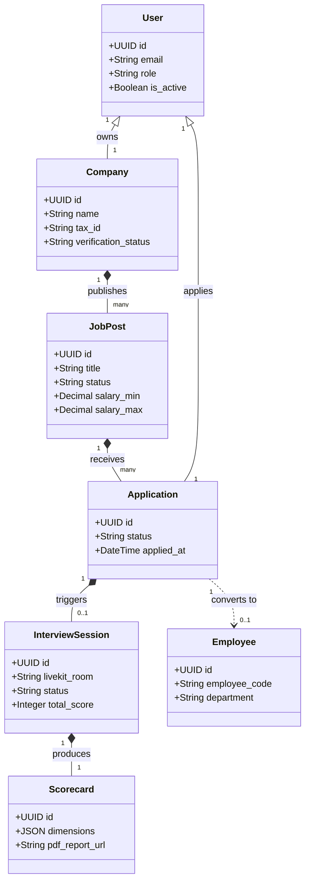

# 🌐 Domain Model & Ubiquitous Language

> **Ecosystem**: Square Tuyển Dụng (InfoHR)  
> **Methodology**: Domain-Driven Design (DDD)  
> **Audience**: Backend Engineers, Frontend Engineers, Domain Experts & AI Agents

---

## 1. 📌 Ubiquitous Language (Từ Điển Thuật Ngữ)

To eliminate ambiguity across development teams and AI assistants, the following terms MUST be used consistently:

| Term (EN) | Term (VN) | Definition |
| :--- | :--- | :--- |
| **Candidate** | Ứng viên | A job seeker registered on the platform who uploads resumes and applies for vacancies. |
| **Employer** | Nhà tuyển dụng | A company representative managing company profile, job posts, and candidate pipelines. |
| **Job Post** | Tin tuyển dụng | An open vacancy published by an employer specifying job requirements and salary. |
| **Application** | Hồ sơ ứng tuyển | The binding entity linking a candidate to a specific job post throughout the recruitment funnel. |
| **Interview Script** | Kịch bản phỏng vấn | A structured set of questions, evaluation rubrics, and instructions used by the Voice AI agent. |
| **Interview Session** | Phiên phỏng vấn | A single real-time WebRTC audio/video interview meeting room between candidate and AI interviewer. |
| **Scorecard** | Báo cáo đánh giá | The multi-dimensional evaluation report generated by AI summarizing the interview performance. |
| **Proctoring Event** | Sự kiện giám sát | Telemetry tracking candidate presence, tab switching, audio anomalies, or multiple faces detected. |
| **Employee** | Nhân viên | A hired candidate who has been onboarded into the internal enterprise HRM system. |

---

## 2. 🧩 Bounded Contexts & Architecture Map



---

## 3. 🔄 Key Entity Lifecycles & State Transitions

### 3.1. Application Funnel State Machine
```text
[APPLIED] ──► [SCREENING] ──► [AI_INTERVIEW_INVITED] ──► [AI_INTERVIEW_COMPLETED]
                                                                  │
                                      ┌───────────────────────────┴───────────────────────────┐
                                      ▼                                                       ▼
                                  [OFFERED]                                               [REJECTED]
                                      │
                                      ▼
                                   [HIRED] ──► (Automated Employee Onboarding in HRM)
```

### 3.2. Voice AI Interview Session State Machine
```text
[SCHEDULED] ──► [CANDIDATE_READY] ──► [CONNECTED_IN_ROOM] ──► [INTERVIEWING]
                                                                    │
                                                                    ▼
[EVALUATION_FAILED] ◄── [SCORING_IN_PROGRESS] ◄── [ROOM_COMPLETED]
                                │
                                ▼
                       [REPORT_GENERATED]
```

---

## 4. 📦 Data Integrity & Invariants

1. **One Active Interview per Application**: An application cannot have more than one concurrent `InterviewSession` in `CONNECTED_IN_ROOM` or `INTERVIEWING` state.
2. **Immutable Scorecards**: Once an `InterviewScorecard` is generated and committed, its score values cannot be overwritten. Corrections must be recorded as moderator override logs.
3. **Employer Isolation**: An employer user cannot view applications or interview recordings belonging to another employer company.
