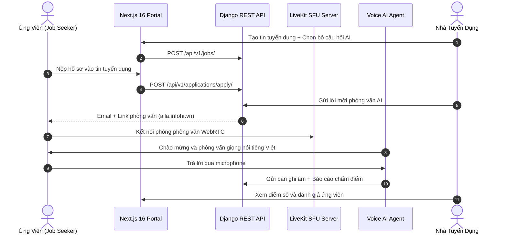

# 📄 Feature Spec: MVP Bootstrap (InfoHR Core Ecosystem)

> **Feature Slug**: `2026-10-02-mvp-bootstrap`  
> **Status**: IN PROGRESS  
> **Author**: Core Engineering Team  
> **Target Release**: v1.0.0 (MVP)

---

## 1. 🎯 Problem Statement & Executive Summary

Recruitment processes in Vietnam suffer from high screening overhead, subjective early-stage interviews, and disconnected workflows between job boards and internal HRM systems.

**InfoHR (Square Tuyển Dụng)** solves this by creating an integrated ecosystem where employers can post jobs with customizable AI interview scripts, candidates can complete automated real-time voice interviews, and resulting candidate evaluations flow directly into recruitment pipelines and internal HRM systems.

---

## 2. 🚀 Goals & Non-Goals

### Goals
* **Pillar 1 (Job Seeker)**: Candidate registration, profile/CV management, job search with Elasticsearch, and 1-click job application.
* **Pillar 2 (Employer)**: Company onboarding, job posting, application Kanban board, and custom interview script assignment.
* **Pillar 3 (Voice AI)**: LiveKit WebRTC room connection, real-time Vietnamese speech interaction (<1.5s round-trip latency), speech-to-text, and automated PDF scorecard generation.
* **Pillar 4 (Admin)**: Subdomain routing to `/admin`, employer business verification, job post moderation, and audit logs.
* **Pillar 5 (HRM Baseline)**: Transitioning accepted candidates into employee directory with basic attendance tracking.

### Non-Goals (Post-MVP)
* Complex biometric face anti-spoofing (reserved for Phase 2).
* Multi-currency international payroll engine (MVP focuses on VND / Vietnam tax laws).
* Social network feed / candidate direct messaging.

---

## 3. 👥 User Personas & Core Journeys

---

## 4. 🗄️ Core Data Model & API Endpoints

### 4.1. Models
* `User`: Multi-role user (`ADMIN`, `EMPLOYER`, `CANDIDATE`, `EMPLOYEE`).
* `Company`: Employer organization, verification status, subscription tier.
* `JobPost`: Job listings, required skills, salary range, linked `InterviewScript`.
* `Application`: Relationship linking `Candidate` to `JobPost`, status pipeline (`APPLIED`, `AI_INTERVIEW_SCHEDULED`, `PASSED`, `REJECTED`, `HIRED`).
* `InterviewSession`: LiveKit room token, status, duration, total score, proctoring alerts.
* `InterviewScorecard`: Dimension scores (Technical, Communication, Attitude, Language fluency), summary notes, PDF report URL.

### 4.2. Key API Contracts
* `POST /api/v1/auth/token/` - JWT login
* `GET /api/v1/jobs/` - Elasticsearch-backed search
* `POST /api/v1/interviews/session/token/` - LiveKit WebRTC token generation
* `POST /api/v1/interviews/session/complete/` - Submit transcripts and trigger scoring task

---

## 5. 🛡️ Acceptance Criteria (DoD)

1. [ ] Candidate can search jobs, upload CV, and apply in < 3 minutes.
2. [ ] Voice AI interview runs in browser via WebRTC with audio latency < 1500ms.
3. [ ] Interview scorecard PDF automatically generates and uploads to MinIO S3 within 60s of interview completion.
4. [ ] Admin portal enables 1-click approval/rejection of employer verification requests.
5. [ ] Monorepo passes all automated lint and build checks (`pnpm run build`, `ruff check .`).
