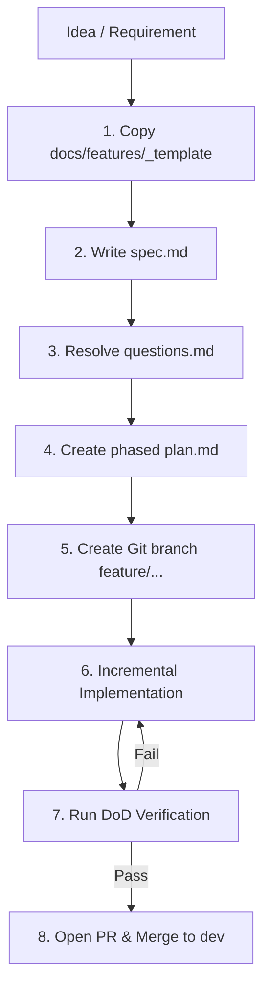

# 🚀 Example Feature Development Workflow

> **Ecosystem**: Square Tuyển Dụng (InfoHR)  
> **Location**: `docs/features/`  
> **Audience**: All Developers & AI Assistants

---

## 1. 📌 Overview

This document walks through an end-to-end example of how a new feature is planned, designed, verified, and shipped in the InfoHR monorepo. Following this workflow prevents regressions, eliminates guesswork, and ensures consistent quality.

---

## 2. 🪜 Step-by-Step Lifecycle



---

### Step 1: Initialize Feature Workspace
When starting a new feature (e.g., `candidate-cv-analyzer`):
```bash
# 1. Copy the standard template
cp -r docs/features/_template docs/features/2026-10-15-candidate-cv-analyzer

# 2. Create your git branch off dev
git checkout dev
git pull origin dev
git checkout -b feature/candidate-cv-analyzer
```

### Step 2: Draft the Specification (`spec.md`)
- Define the user problem, target personas, and scope boundaries.
- Document functional acceptance criteria (Given / When / Then).
- Propose database schema changes and API request/response contracts.

### Step 3: Log Questions & Resolve Ambiguities (`questions.md`)
- If any requirement is underspecified, pause and ask the product owner or tech lead.
- Document the decision options, trade-offs, and final choice in `questions.md`.
- Explicitly list working assumptions.

### Step 4: Write Phased Implementation Plan (`plan.md`)
- Break the task into bite-sized phases:
  - Phase 1: Database models, serializers, migrations, TypeScript types.
  - Phase 2: Service layer business logic, queries, and unit tests.
  - Phase 3: Frontend API clients, components, and pages.
  - Phase 4: Integration testing and verification.

### Step 5: Incremental Code Implementation
- Commit early and often using Conventional Commits (`feat:`, `fix:`, `refactor:`).
- Always synchronize backend serializers with `frontend/src/types/`.

### Step 6: Execute DoD Verification Checklist
Run all commands required by [05_definition_of_done.md](file:///c:/Users/WIN10/Documents/square-tuyen-dung/docs/coding_guidelines/05_definition_of_done.md):
```bash
# Frontend checks
cd frontend && pnpm run lint && pnpm run build

# Backend checks
cd api && ruff check . && pytest
```

### Step 7: Pull Request & Merge
- Open a PR from `feature/candidate-cv-analyzer` targeting `dev`.
- Link the feature folder `docs/features/2026-10-15-candidate-cv-analyzer/` in the PR body.
- After code review and CI approval, squash and merge into `dev`.
