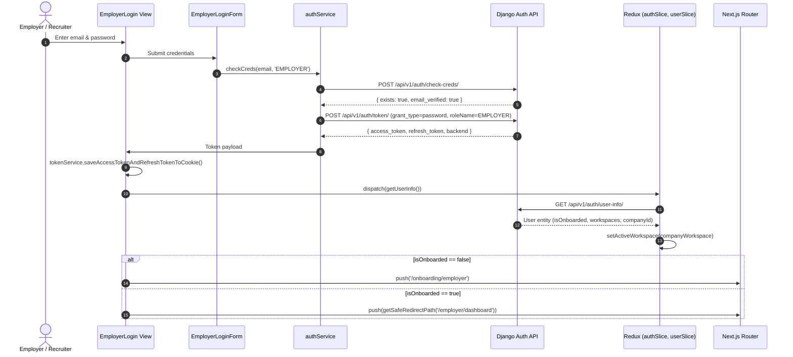
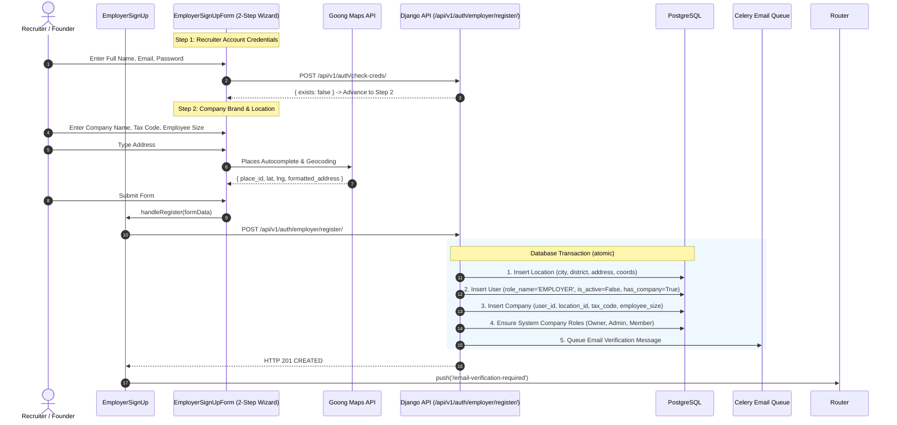

# Employer Authentication & Onboarding Architecture

## 1. Authentication Lifecycle

## 2. Employer Registration & Company Provisioning Flow

## 3. Employer Onboarding State Machine & KYC Verification

* **Draft Persistence**: Changes at Step 1 (`StepCompanyProfile`) and Step 2 (`StepRecruiterProfile`) are atomically saved to the server via `PATCH /api/v1/auth/onboarding/employer/step/`.
* **Invited Member Flow**: When a company invites a new recruiter via email, `GetOnboardingStatusView` detects `hasExistingMembership=True` and shows the direct `Accept & Continue` card bypassing new company creation.
* **KYC / GPKD Verification**: Step 3 provides a dual action:
  1. `Hoàn thành thiết lập`: Attaches `gpkdFileId` -> creates `CompanyVerification` record in `PENDING` review state.
  2. `Bỏ qua & Xác thực sau`: Omits GPKD document -> marks user `is_onboarded=True` while allowing verification document upload later in `/employer/verification`.
