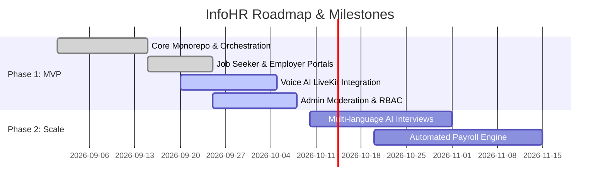

# 📊 Project Progress & Milestone Dashboard

> **Ecosystem**: Square Tuyển Dụng (InfoHR)  
> **Location**: `docs/progress/`  
> **Current Sprint**: MVP Foundation & Stabilization  
> **Last Updated**: 2026-10-02

---

## 1. 🎯 Milestone Roadmap

---

## 2. 🚦 Subsystem Completion Status

| Subsystem | Target Port / Domain | Primary Tech | Completion % | Health | Notes |
| :--- | :--- | :--- | :--- | :--- | :--- |
| **Frontend Portals** | `infohr.vn` / `employer` | Next.js 16, React 19, Tailwind v4 | 90% | 🟢 Stable | Candidate & Employer flows functional; polish telemetry UI. |
| **Backend Core API** | `api/` (Port 8000) | Django 4.2, DRF, Celery, MySQL 8 | 85% | 🟢 Stable | Core CRUD, Auth, and Scorecard models implemented. |
| **Voice AI Agent** | LiveKit (Port 7880) | LiveKit SFU, Python Agent, TTS/STT | 80% | 🟡 Active | Real-time Vietnamese conversational flow active; tuning lipsync. |
| **Nginx Gateway** | Ports 80, 443 | Nginx, SSL, Subdomain Proxy | 95% | 🟢 Stable | Wildcard routing and WAF OWASP CRS rules verified. |
| **Internal HRM** | `hrm.infohr.vn` | Next.js 16, Django Apps | 70% | 🟡 In Progress | Employee directory active; time-attendance integration next. |
| **Storage & Media** | MinIO (Port 4433) | S3 API, Buckets: cv, audio, video | 95% | 🟢 Stable | Pre-signed upload/download URLs functional. |

---

## 3. 📝 Current Sprint Priorities

1. **Sprint Goal**: Complete end-to-end Voice AI interview testing and stabilize documentation hierarchy.
2. **Key Tasks in Progress**:
   - [x] Standardize engineering documentation hierarchy (`docs/coding_guidelines/`, `decisions/`, `features/`).
   - [x] Clean root markdown files (`README.md`, `CONTRIBUTING.md`, `AGENTS.md`).
   - [ ] Execute automated verification scripts across frontend and backend.
   - [ ] Conduct end-to-end mock interview session on `aila.infohr.vn`.
