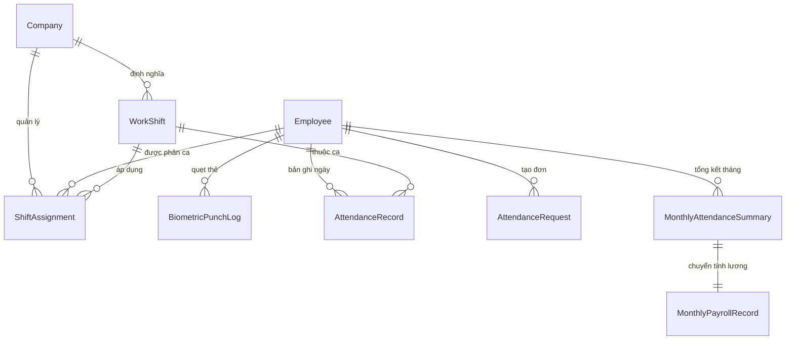

# Thiết Kế Phân Hệ Chấm Công (Time & Attendance) — Dưới Quản Lý Nhân Sự (HRM)

## 1. Tổng Quan & Mục Tiêu

Hệ thống Chấm công được thiết kế theo tiêu chuẩn phân hệ quản trị nhân sự cao cấp (tham chiếu hình mẫu MISA AMIS Chấm công), đặt trực thuộc phân hệ **Quản lý nhân sự (HRM)** của nền tảng InfoHR.

Mục tiêu:
1. Cung cấp một **Workspace chuyên biệt** với thanh điều hướng ngang (Top Sub-Navbar) gồm đầy đủ 6 cụm chức năng chính và các menu con.
2. Quản lý toàn diện ca làm việc, phân ca, thu thập dữ liệu máy chấm công (ZKTeco & Excel import), bảng chấm công chi tiết theo ngày và bảng tổng hợp tháng.
3. Hỗ trợ quy trình phê duyệt đơn từ 2 cấp (Quản lý trực tiếp ➔ HR/Admin) với cơ chế tự động bù/tính công khi đơn được duyệt.
4. Kết nối liền mạch nút **"Chuyển tính lương"** từ Bảng chấm công tổng hợp sang module Tính lương (`MonthlyPayrollRecord`).
5. Phân quyền vai trò chi tiết theo từng chức năng (Xem, Thêm, Sửa, Xóa, Xuất khẩu, Khóa/Mở khóa, Chuyển tính lương).

---

## 2. Cấu Trúc Điều Hướng (Navigation & UI Architecture)

### 2.1. Vị trí trên Sidebar chính
Trong thanh sidebar bên trái của Nhà tuyển dụng (`EmployerMenu` / `AdminMenu`), dưới nhóm **Quản lý nhân sự**, mục **Chấm công** (`/employer/hrm/attendances`) sẽ đóng vai trò là cửa ngõ dẫn vào Workspace Chấm công chuyên biệt.

### 2.2. Thanh điều hướng ngang (Top Sub-Navbar Workspace)
Khi người dùng truy cập vào bất kỳ trang nào thuộc Chấm công, hệ thống hiển thị thanh Sub-Navbar cố định trên cùng:

```
[Icon Chấm công] Tổng quan | Chấm công ▾ | Ca làm việc ▾ | Quản lý đơn ▾ | Báo cáo | Thiết lập
```

Chi tiết các menu con:
* **1. Tổng quan (`/employer/hrm/attendances/overview`)**:
  - Thống kê tỷ lệ đi làm hôm nay, số người có mặt, đi muộn, về sớm, nghỉ phép, vắng mặt không lý do.
  - Danh sách đơn từ mới gửi chờ duyệt.
  - Biểu đồ chuyên cần theo phòng ban trong tuần/tháng.

* **2. Chấm công ▾ (`/employer/hrm/attendances/timesheets`)**:
  - `Bảng chấm công chi tiết` (`/employer/hrm/attendances/timesheets/detailed`): Ma trận ngày 1–31 với ký hiệu công (X: đủ công, V: vắng, P: phép, O: OT, L: đi muộn, E: về sớm). Cho phép click vào từng ô xem log check-in/out, sửa công thủ công (kèm lý do).
  - `Bảng chấm công tổng hợp` (`/employer/hrm/attendances/timesheets/summary`): Bảng tổng kết số công chuẩn, công thực tế, ngày nghỉ phép hưởng lương, ngày nghỉ không lương, giờ làm thêm (ngày thường/cuối tuần/lễ). Đi kèm các hành động: **Khóa / Mở khóa bảng công** và **Chuyển tính lương**.
  - `Dữ liệu máy chấm công` (`/employer/hrm/attendances/biometric-logs`): Xem danh sách log quẹt vân tay/khuôn mặt thô (thời gian, mã máy, ID nhân viên), lọc theo ngày/phòng ban, và nút **Import Excel log chấm công**.

* **3. Ca làm việc ▾ (`/employer/hrm/attendances/shifts`)**:
  - `Danh sách ca` (`/employer/hrm/attendances/shifts/list`): Khai báo các ca làm việc (Ca hành chính, Ca sáng, Ca chiều, Ca đêm; giờ bắt đầu, kết thúc, nghỉ giữa ca, công quy đổi).
  - `Bảng phân ca tổng hợp` (`/employer/hrm/attendances/shifts/matrix`): Ma trận gán ca cho từng nhân viên theo lịch tuần hoặc tháng.
  - `Danh sách ca chi tiết` (`/employer/hrm/attendances/shifts/assignments`): Xem danh sách phân ca chi tiết dạng bảng có bộ lọc theo nhân viên, chức vụ, phòng ban.

* **4. Quản lý đơn ▾ (`/employer/hrm/attendances/requests`)**:
  - `Đơn xin nghỉ` (`/employer/hrm/attendances/requests/leave`): Nghỉ phép năm, nghỉ ốm, việc riêng, thai sản.
  - `Đề nghị cập nhật công` (`/employer/hrm/attendances/requests/regularisation`): Giải trình quên chấm công, máy chấm công lỗi.
  - `Đề nghị công tác` (`/employer/hrm/attendances/requests/business-trip`): Báo lịch công tác ngoại kiểm, khách hàng.
  - `Đơn làm thêm giờ` (`/employer/hrm/attendances/requests/overtime`): Đăng ký làm thêm giờ trước hoặc sau ca.
  - `Đơn đi muộn về sớm` (`/employer/hrm/attendances/requests/late-early`): Xin phép đi muộn hoặc về sớm vì việc đột xuất.

* **5. Báo cáo (`/employer/hrm/attendances/reports`)**:
  - Báo cáo đi muộn về sớm theo tháng.
  - Báo cáo nghỉ phép và quỹ phép tồn.
  - Báo cáo tổng hợp số giờ làm thêm (OT) theo phòng ban.
  - Xuất file Excel / PDF báo cáo.

* **6. Thiết lập (`/employer/hrm/attendances/settings`)**:
  - `Quy định chấm công`: Thời gian cho phép đi muộn / về sớm không phạt (Grace period - ví dụ 5 phút, 15 phút), quy tắc làm tròn giờ công.
  - `Quy định làm thêm`: Hệ số lương OT theo luật lao động (Ngày thường 150%, ngày nghỉ tuần 200%, ngày lễ tết 300%).
  - `Quy định nghỉ`: Số ngày phép chuẩn/năm, quy định thâm niên (+1 ngày sau 5 năm).
  - `Phân quyền / Vai trò`: Phân quyền granular (Xem, Thêm, Sửa, Xóa, Xuất khẩu, Khóa/Mở khóa, Chuyển tính lương).

---

## 3. Thiết Kế Cơ Sở Dữ Liệu (Backend Models - `apps/hrm`)



### 3.1. Model `WorkShift` (Ca làm việc)
* `company`: FK Company
* `code`: CharField (max 50, ví dụ `CA_HC`, `CA_SANG`)
* `name`: CharField (max 100, ví dụ `Ca hành chính 8h00 - 17h00`)
* `start_time`: TimeField (08:00)
* `end_time`: TimeField (17:00)
* `break_start`: TimeField (12:00, nullable)
* `break_end`: TimeField (13:00, nullable)
* `working_hours`: DecimalField (8.00)
* `work_factor`: DecimalField (default 1.0, quy đổi ngày công)
* `is_overnight`: BooleanField (default False)
* `grace_period_late_minutes`: IntegerField (default 5)
* `grace_period_early_minutes`: IntegerField (default 5)
* `is_active`: BooleanField (default True)

### 3.2. Model `ShiftAssignment` (Bảng phân ca)
* `company`: FK Company
* `employee`: FK Employee
* `shift`: FK WorkShift
* `date`: DateField (db_index=True)
* `is_off_day`: BooleanField (default False - đánh dấu ngày nghỉ tuần / lễ)
* `note`: CharField (max 255, blank=True)
* Unique together: `('employee', 'date')`

### 3.3. Model `BiometricPunchLog` (Log chấm công thô)
* `company`: FK Company
* `employee`: FK Employee (nullable, map qua biometric_id / attendance_code)
* `biometric_id`: CharField (max 50, ID trên máy chấm công)
* `punch_time`: DateTimeField (db_index=True)
* `device_name`: CharField (max 100, blank=True)
* `device_ip`: CharField (max 50, blank=True)
* `punch_type`: CharField (CHOICES: `CHECK_IN`, `CHECK_OUT`, `AUTO`)
* `source`: CharField (CHOICES: `ZKTECO`, `EXCEL_IMPORT`, `WEB_APP`, `MANUAL`)

### 3.4. Nâng Cấp Model `AttendanceRecord` (Bảng chấm công chi tiết theo ngày)
* Kế thừa model hiện có, bổ sung:
  - `shift`: FK WorkShift (nullable)
  - `scheduled_in`: TimeField
  - `scheduled_out`: TimeField
  - `actual_in`: TimeField
  - `actual_out`: TimeField
  - `late_minutes`: PositiveIntegerField (default 0)
  - `early_minutes`: PositiveIntegerField (default 0)
  - `effective_work_hours`: DecimalField (max 4, decimal 2)
  - `overtime_hours`: DecimalField (max 4, decimal 2, default 0)
  - `status_code`: CharField (`X`: Đi đủ, `N`: Nửa ngày, `L`: Trễ/Sớm, `V`: Vắng, `P`: Phép, `CD`: Chế độ, `O`: Làm thêm)
  - `is_manually_adjusted`: BooleanField (default False)
  - `adjustment_reason`: TextField
  - `is_locked`: BooleanField (default False)

### 3.5. Model `AttendanceRequest` (Trung tâm Quản lý Đơn từ)
* `company`: FK Company
* `employee`: FK Employee (Người làm đơn)
* `request_type`: CharField (CHOICES: `LEAVE`, `REGULARISATION`, `BUSINESS_TRIP`, `OVERTIME`, `LATE_EARLY`)
* `leave_type`: FK LeaveType (dành cho đơn xin nghỉ)
* `start_date`: DateField
* `end_date`: DateField
* `start_time`: TimeField (nullable, cho đơn OT, đi muộn, quên quẹt thẻ)
* `end_time`: TimeField (nullable)
* `duration_hours`: DecimalField (nullable)
* `reason`: TextField
* `attachment`: FileField (nullable)
* `status`: CharField (CHOICES: `PENDING_STAGE_1`, `APPROVED_STAGE_1`, `APPROVED`, `REJECTED`, `CANCELLED`)
* `manager_reviewer`: FK Employee (Người duyệt cấp 1)
* `manager_approved_at`: DateTimeField
* `hr_reviewer`: FK Employee (Người duyệt cấp 2)
* `hr_approved_at`: DateTimeField
* `rejection_reason`: TextField

### 3.6. Model `MonthlyAttendanceSummary` (Bảng chấm công tổng hợp tháng)
* `company`: FK Company
* `employee`: FK Employee
* `month`: PositiveSmallIntegerField
* `year`: PositiveIntegerField
* `standard_work_days`: DecimalField (ví dụ 22.0)
* `actual_work_days`: DecimalField (ví dụ 21.5)
* `paid_leave_days`: DecimalField (ví dụ 1.0)
* `unpaid_leave_days`: DecimalField (ví dụ 0.5)
* `overtime_hours_weekday`: DecimalField (ví dụ 8.0)
* `overtime_hours_weekend`: DecimalField (ví dụ 4.0)
* `overtime_hours_holiday`: DecimalField (ví dụ 0.0)
* `late_occurrences`: PositiveSmallIntegerField (số lần đi muộn)
* `early_occurrences`: PositiveSmallIntegerField (số lần về sớm)
* `is_locked`: BooleanField (default False)
* `locked_by`: FK Employee
* `locked_at`: DateTimeField
* `pushed_to_payroll_at`: DateTimeField (đánh dấu đã chuyển tính lương)
* Unique together: `('employee', 'month', 'year')`

---

## 4. Tích Hợp Dữ Liệu & Luồng Nghiệp Vụ

### 4.1. Luồng đồng bộ & tính công tự động
1. **Thu thập dữ liệu**:
   - Máy chấm công phần cứng (ZKTeco port 4200) gửi bản ghi quẹt thẻ về API `/api/v1/hrm/attendances/biometric-punch/` hoặc HR tải lên file Excel bảng chấm công.
   - Bản ghi được lưu vào `BiometricPunchLog`.
2. **Khớp ca & tính công (Celery Task)**:
   - Dựa vào `ShiftAssignment` của nhân viên trong ngày, hệ thống tìm giờ quẹt thẻ sớm nhất (in) và muộn nhất (out).
   - So sánh với giờ chuẩn của `WorkShift` để xác định: thời gian đi muộn, về sớm, số giờ công thực tế.
   - Ghi nhận trạng thái vào `AttendanceRecord`.
3. **Bù trừ từ Đơn từ**:
   - Khi có `AttendanceRequest` được phê duyệt hoàn tất (Cấp 1 & Cấp 2), hệ thống tự động tái tính toán ngày công tương ứng (ví dụ: cập nhật giờ in/out theo đơn giải trình, hoặc chuyển trạng thái sang `Nghỉ phép hưởng lương`).

### 4.2. Luồng Chuyển Tính Lương (Push to Payroll)
* Khi HR hoàn tất rà soát bảng chấm công tổng hợp tháng:
  1. HR bấm nút **Khóa công**: Bảng chấm công tổng hợp tháng được chốt, không cho phép chỉnh sửa hay duyệt đơn bổ sung của tháng đó.
  2. HR bấm nút **Chuyển tính lương**: Hệ thống gọi action `/api/v1/hrm/attendances/summary/push-to-payroll/`.
  3. Hệ thống tự động tạo hoặc cập nhật bản ghi `MonthlyPayrollRecord` tương ứng với:
     - `standard_working_days` = `MonthlyAttendanceSummary.standard_work_days`
     - `working_days_actual` = `MonthlyAttendanceSummary.actual_work_days`
     - `unpaid_leave_days` = `MonthlyAttendanceSummary.unpaid_leave_days`
     - Giờ làm thêm OT được tính toán theo hệ số quy định để cộng vào thu nhập tăng thêm.

---

## 5. Phân Quyền Vai Trò (Granular Permissions Matrix)

Áp dụng đúng chuẩn MISA AMIS cho các menu:

| Phân hệ con | Xem | Thêm | Sửa | Xóa | Xuất khẩu | Khóa / Mở khóa | Chuyển tính lương |
| :--- | :---: | :---: | :---: | :---: | :---: | :---: | :---: |
| **Tổng quan** | ✅ | - | - | - | ✅ | - | - |
| **Bảng chấm công chi tiết** | ✅ | ✅ | ✅ | ✅ | ✅ | ✅ | - |
| **Bảng chấm công tổng hợp** | ✅ | ✅ | ✅ | ✅ | ✅ | ✅ | ✅ |
| **Dữ liệu máy chấm công** | ✅ | - | ✅ | ✅ | ✅ | - | - |
| **Danh sách ca** | ✅ | ✅ | ✅ | ✅ | - | - | - |
| **Bảng phân ca tổng hợp** | ✅ | - | ✅ | - | ✅ | - | - |
| **Danh sách ca chi tiết** | ✅ | ✅ | ✅ | ✅ | - | - | - |
| **Quản lý đơn từ** | ✅ | ✅ | ✅ | ✅ | ✅ | - | - |
| **Báo cáo chấm công** | ✅ | - | - | - | ✅ | - | - |
| **Thiết lập quy định** | ✅ | ✅ | ✅ | ✅ | - | - | - |

---

## 6. Kế Hoạch Triển Khai (Phased Roadmap)

* **Phase 1 (Khung điều hướng & Quản lý Ca - Đơn từ)**:
  - Xây dựng component `AttendanceWorkspaceLayout` (Top Sub-Navbar) và khai báo các Route mới trong `ROUTES.EMPLOYER.HRM_ATTENDANCES_*`.
  - Triển khai Quản lý Ca (`WorkShift`) & Phân ca (`ShiftAssignment`).
  - Triển khai Quản lý Đơn từ 5 loại (`AttendanceRequest`) với luồng duyệt 2 cấp.
* **Phase 2 (Bảng công chi tiết, Tổng hợp & Kết nối Bảng lương)**:
  - Xây dựng lưới ma trận `Bảng chấm công chi tiết` (ngày 1–31).
  - Xây dựng `Bảng chấm công tổng hợp` kèm action **Khóa công** và **Chuyển tính lương** sang `MonthlyPayrollRecord`.
  - Triển khai import file Excel dữ liệu máy chấm công & API nhận webhook từ `zkteco_service`.
* **Phase 3 (Báo cáo & Thiết lập quy định)**:
  - Báo cáo thống kê đi muộn, về sớm, tổng hợp OT.
  - Trang Thiết lập quy định chấm công, dung sai và phân quyền vai trò.
