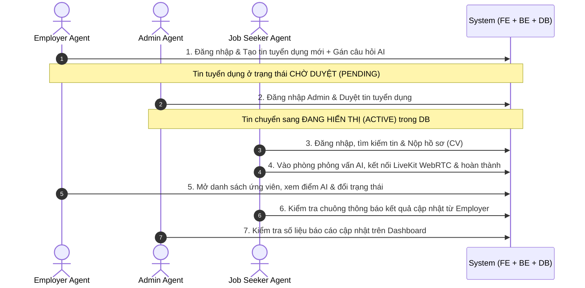

# Multi-Agent Real-User System Audit & UI/UX Evaluation Design Spec

## 1. Mục tiêu & Bối cảnh
- **Dự án**: Square Tuyển Dụng — Nền tảng tuyển dụng thông minh cho ngành Xây dựng & Thiết kế với trợ lý phỏng vấn AI (LiveKit WebRTC, Qwen 2.5, Whisper, TTS).
- **Mục tiêu**: Xây dựng và thực thi hệ thống kiểm thử đa tác tử (Multi-Agent) đóng vai 3 người dùng thật thuộc 3 vai trò cốt lõi (`JOB_SEEKER`, `EMPLOYER`, `ADMIN`), thực hiện kiểm thử tự động toàn diện qua trình duyệt thực tế (Chromium) kết hợp đối soát chéo cơ sở dữ liệu Backend (MySQL/Django DRF).
- **Kết quả mong đợi**: Phát hiện triệt để các lỗi kỹ thuật (Console error, Uncaught exception, Network $4xx/5xx$, sai lệch dữ liệu DB), ghi nhận các điểm nghẽn và bất cập UI/UX (bố cục, font chữ, độ mượt, phản hồi người dùng, microcopy tiếng Việt), xuất bản Báo cáo Đánh giá Toàn diện (Audit Report) kèm bằng chứng trực quan và Kế hoạch Khắc phục (Remediation Plan).

---

## 2. Các Vai trò & Persona Agents
Hệ thống triển khai 3 Persona Agents độc lập, mỗi Agent sở hữu một phiên trình duyệt riêng biệt (`BrowserContext` độc lập với cookie, localStorage, sessionStorage riêng):

### 2.1. Employer Agent (Nhà tuyển dụng)
- **Tài khoản**: `ceohub.hostmaster@gmail.com` / `Password123!`
- **Cấu hình Trình duyệt**: Desktop $1440 \times 900$.
- **Trọng tâm Nghiệp vụ**:
  1. Đăng nhập qua `/employer/dang-nhap`.
  2. Quản lý công ty & hồ sơ doanh nghiệp (`/employer/cai-dat`).
  3. Tạo tin tuyển dụng mới với đầy đủ thông tin kỹ sư xây dựng, mức lương, địa điểm, chế độ đãi ngộ (`/employer/tin-tuyen-dung`).
  4. Thiết lập bộ câu hỏi phỏng vấn AI và gắn vào tin tuyển dụng (`/employer/ngan-hang-cau-hoi`, `/employer/bo-cau-hoi`).
  5. Xem xét hồ sơ ứng viên nộp vào, kiểm tra bảng điểm AI, xem transcript phỏng vấn (`/employer/ho-so-ung-tuyen`).
  6. Thay đổi trạng thái ứng viên (Đạt / Phỏng vấn trực tiếp / Không phù hợp).

### 2.2. Admin Agent (Quản trị viên Hệ thống)
- **Tài khoản**: `admin@project.com` / `Password123!`
- **Cấu hình Trình duyệt**: Desktop $1440 \times 900$.
- **Trọng tâm Nghiệp vụ**:
  1. Đăng nhập quản trị qua portal `/quan-tri` hoặc Django admin `/admin/`.
  2. Duyệt tin tuyển dụng do Employer tạo (kiểm tra quy trình kiểm duyệt tin chờ duyệt $\rightarrow$ kích hoạt hiển thị công khai).
  3. Kiểm tra danh sách người dùng, phân quyền và trạng thái xác thực (`/quan-tri/quan-ly-nguoi-dung`).
  4. Kiểm tra cấu hình hệ thống, kho câu hỏi chung, cấu hình giọng nói AI.
  5. Đánh giá số liệu thống kê trên Dashboard quản trị.

### 2.3. Job Seeker Agent (Ứng viên / Người tìm việc)
- **Tài khoản**: `candidate@project.com` / `Password123!`
- **Cấu hình Trình duyệt**: Desktop $1440 \times 900$ và Mobile $390 \times 844$.
- **Trọng tâm Nghiệp vụ**:
  1. Đăng nhập qua `/dang-nhap`.
  2. Khám phá trang chủ, tìm kiếm việc làm qua bộ lọc ngành nghề, địa điểm, mức lương (`/viec-lam`).
  3. Tìm thấy tin tuyển dụng vừa được Admin duyệt và kiểm tra thông tin chi tiết công việc.
  4. Nộp hồ sơ ứng tuyển (chọn CV online hoặc tải lên file CV đính kèm).
  5. Tham gia phòng phỏng vấn AI (`/luyen-phong-van` hoặc link phỏng vấn trực tiếp): cấp quyền mic/camera giả lập, theo dõi giao diện chào hỏi của AI Bot, đếm ngược và chuyển đổi câu hỏi.
  6. Kiểm tra kết quả đánh giá sau phỏng vấn, xem lịch sử ứng tuyển và theo dõi chuông thông báo (Notifications).

---

## 3. Quy trình Kiểm thử Khép kín (Closed-Loop E2E Lifecycle)
Quy trình phối hợp giữa 3 tác tử được thực hiện theo 5 bước tuần tự:

---

## 4. Kiểm thử Mở rộng Chuyên sâu (Feature Deep-Dive per Role)
Sau khi hoàn thành vòng đời khép kín, từng Agent thực hiện rà soát các tính năng vệ tinh:
1. **Job Seeker Portal**:
   - Trang Tạo CV trực tuyến (CV Builder: `/tao-cv`).
   - Trang Tra cứu lương thị trường (`/tra-cuu-luong`).
   - Trang Danh sách công ty (`/cong-ty`) và trang chi tiết công ty.
   - Trang Cài đặt tài khoản & đổi mật khẩu (`/tai-khoan`).
2. **Employer Portal**:
   - Màn hình Trợ lý Agent AI (`/employer/tro-ly-agent`).
   - Màn hình Báo giá & Dịch vụ (`/employer/bao-gia`, `/employer/dich-vu`).
   - Màn hình Xác thực doanh nghiệp (`/employer/xac-thuc-nha-tuyen-dung`).
3. **Admin Portal**:
   - Quản lý danh mục ngành nghề, tỉnh thành, quận huyện (`/quan-tri/quan-ly-nganh-nghe`, `/quan-tri/quan-ly-tinh-thanh`).
   - Quản lý kho câu hỏi hệ thống (`/quan-tri/kho-cau-hoi`).

---

## 5. Hệ thống Giám sát & Bắt lỗi (Telemetry & Capture)
Tại mỗi hành động và điều hướng trang của từng Agent:
1. **Console Telemetry**:
   - Lắng nghe sự kiện `page.on("console")`: lọc và bắt toàn bộ tin nhắn `error` và `warning`.
   - Lắng nghe `page.on("pageerror")`: bắt mọi uncaught JavaScript runtime exceptions.
2. **Network Telemetry**:
   - Lắng nghe `page.on("response")`: ghi nhận mã HTTP $\ge 400$, URL, method, payload phản hồi lỗi.
   - Ghi nhận các API request có thời gian phản hồi vượt quá $1500ms$ (chậm hiệu năng).
3. **Visual Evidence**:
   - Chụp ảnh màn hình tự động (`screenshot`) khi có lỗi console/network.
   - Chụp ảnh màn hình các cột mốc giao diện quan trọng của từng role.
   - Lưu trữ tại thư mục: `docs/audit_reports/screenshots/`.
4. **Database Verification**:
   - Kết nối trực tiếp vào MySQL database của dự án (thông qua container hoặc Django shell).
   - Xác thực: Trạng thái tin (`status = ACTIVE`), bản ghi ứng tuyển (`JobPostActivity`), bản ghi phỏng vấn (`Interview/Room`) có tồn tại và dữ liệu toàn vẹn hay không.

---

## 6. Tiêu chí Đánh giá UI/UX (Heuristic Evaluation Matrix)
Mỗi màn hình được chấm điểm và nhận xét dựa trên 5 khía cạnh trải nghiệm:
1. **Bố cục & Khoảng cách (Layout & Whitespace)**:
   - Căn chỉnh lưới (grid), lề (padding/margin) có đồng nhất không?
   - Hiện tượng tràn chữ (overflow text), cắt chữ (ellipsis vô lý) hoặc nút bấm bị che khuất.
2. **Khả năng phản hồi & Tương tác (Feedback & Interactivity)**:
   - Có trạng thái loading (spinner/skeleton) khi tải dữ liệu hay bị "đơ" không phản hồi?
   - Nút bấm có trạng thái disabled khi đang submit để chống bấm nhiều lần không?
   - Thông báo (Toast/Alert) xuất hiện có rõ ràng, tự biến mất hợp lý không?
3. **Trạng thái Dữ liệu Trống & Lỗi (Empty & Error States)**:
   - Khi chưa có dữ liệu (chưa có tin tuyển dụng, chưa có ứng viên, chưa có thông báo), giao diện có hướng dẫn thân thiện hay chỉ là khoảng trắng trơ trọi?
   - Lỗi validation form có gắn liền với input cụ thể hay báo chung chung khó hiểu?
4. **Ngôn từ & Tính nhất quán (Microcopy & Consistency)**:
   - Ngôn ngữ tiếng Việt có tự nhiên không? Có bị tình trạng nửa Anh nửa Việt (dịch sót) không?
   - Thuật ngữ chuyên môn có thống nhất trên toàn hệ thống không?
5. **Hiển thị Đa thiết bị (Responsive)**:
   - Kiểm tra hiển thị trên màn hình lớn Desktop ($1440px$) và thiết bị di động ($390px$).

---

## 7. Phân cấp Mức độ Lỗi (Severity Classification)
Mọi vấn đề phát hiện sẽ được phân loại thành 5 cấp độ:
- **BLOCKER (P0)**: Làm sập hệ thống, trắng trang (white screen of death), lỗi HTTP 500 chặn đứt luồng nghiệp vụ khiến người dùng không thể đi tiếp.
- **HIGH (P1)**: Tính năng quan trọng bị hỏng hoặc dữ liệu lưu sai lệch trong DB, người dùng không hoàn thành được tác vụ chính.
- **MEDIUM (P2)**: Lỗi hiển thị rõ rệt, lỗi logic phụ, request lỗi $4xx$ nhưng giao diện vẫn hoạt động gượng gạo, thiếu loading indicator.
- **LOW (P3)**: Lỗi giao diện nhỏ, lệch vài pixel, console warnings không ảnh hưởng chức năng.
- **UX FRICTION (U)**: Trải nghiệm gây ức chế, khó hiểu, thao tác thừa, ngôn ngữ không thân thiện cho người dùng Việt Nam.

---

## 8. Cấu trúc Thư mục Thực thi & Kết quả Bàn giao

### Mã nguồn Kiểm thử (`scripts/audit_agents/`):
- `config.py`: Cấu hình môi trường, URLs, credentials, timeouts.
- `telemetry.py`: Collector bắt console, network, request timing, screenshot manager.
- `db_verifier.py`: Query kiểm tra tính đúng đắn của dữ liệu MySQL.
- `personas/base_agent.py`: Base browser driver với các helper tự động hóa.
- `personas/employer_agent.py`: Agent Nhà tuyển dụng.
- `personas/admin_agent.py`: Agent Quản trị viên.
- `personas/job_seeker_agent.py`: Agent Ứng viên.
- `run_multi_agent_audit.py`: Kịch bản điều phối tổng hợp.

### Báo cáo Đầu ra:
- File Báo cáo: `docs/audit_reports/2026-09-16-multi-agent-system-audit.md`
- Ảnh chụp màn hình: `docs/audit_reports/screenshots/`
- Kế hoạch Đề xuất Sửa lỗi: Danh sách chi tiết các file frontend/backend cần chỉnh sửa kèm giải pháp kỹ thuật, sẵn sàng để người dùng duyệt trước khi triển khai.
