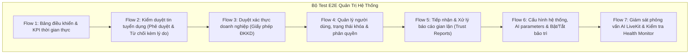

# 🏛️ Đặc Tả Kiến Trúc Phân Hệ Quản Trị (Admin Portal) & Thiết Kế Bộ Test E2E Toàn Diện

> **Tài liệu**: Design Specification (`DESIGN.md` / `SPEC.md`)  
> **Dự án**: InfoHR (Square Tuyển Dụng)  
> **Phân hệ**: Admin Portal (`infohr.vn/quan-tri` / `admin.infohr.vn`) & Playwright E2E Suite  
> **Ngày lập**: 2026-09-22  
> **Trạng thái**: Chờ duyệt (Pending Review)

---

## 1. 🔍 Phân Tích Hiện Trạng & Vấn Đề Thực Tế (Root Cause Analysis)

Dựa trên kiểm tra thực tế codebase và 2 ảnh chụp màn hình do người dùng cung cấp:

### 1.1. Sự cố Ảnh 1 (`infohr.vn/quan-tri/11231211` ➔ Báo lỗi "Không tìm thấy thông tin hồ sơ ứng viên")
* **Nguyên nhân kỹ thuật**: Trong `frontend/src/configs/routeConfig.ts` (dòng 539) và `AdminCatchAllClient.tsx` (dòng 24-27) tồn tại cấu hình rewrite tự do:
  ```typescript
  // routeConfig.ts
  ['/quan-tri/:id(\\d+)', '/admin/profiles/:id'],
  ['/admin/:id(\\d+)', '/admin/profiles/:id'],
  ```
  Khi người dùng nhập đường dẫn chứa chữ số bất kỳ vào sau `/quan-tri/`, Next.js tự động chuyển hướng nó thành xem chi tiết hồ sơ ứng viên (`ProfileDetailPage`). Khi ID không tồn tại trong CSDL, giao diện sinh thông báo toast lỗi đỏ *"Không tìm thấy tài nguyên yêu cầu"* và giao diện trống trơn thay vì hiển thị trang 404 Not Found thân thiện của Admin.
* **Giải pháp**:
  - Gỡ bỏ hoàn toàn rewrite tự do `/quan-tri/:id(\\d+)`.
  - Chuẩn hóa đường dẫn xem chi tiết hồ sơ ứng viên về dạng tường minh: `/admin/profiles/:id` (Tiếng Việt: `/quan-tri/ho-so-ung-vien/:id`).
  - Mọi route không khớp hoặc rác sẽ rơi vào trang 404 nội bộ chuẩn của Admin layout với nút bấm quay lại Bảng điều khiển.

### 1.2. Sự cố Ảnh 2 (`infohr.vn/quan-tri/nhat-ky-tin-tuyen-dung` & Cụm Menu Tuyển dụng / HRM)
* **Nguyên nhân kỹ thuật (Role Pollution)**:
  - Admin Portal hiện đang bị nhồi nhét nhiều tính năng của **Nhà tuyển dụng (Employer)**:
    1. **Quản lý Nhân sự (HRM)**: Nhúng 9 menu con nội bộ (Chấm công, Nghỉ phép, Bảng lương, Hợp đồng, Tiếp nhận, Phòng ban, Sơ đồ tổ chức). Backend `api/apps/hrm/` phụ thuộc vào `request.user.active_company`. Admin hệ thống InfoHR không sở hữu công ty tuyển dụng khách hàng nên các API này không có ý nghĩa vận hành, gây nhầm lẫn nghiêm trọng về mặt phân quyền.
    2. **Ngân hàng câu hỏi & Bộ câu hỏi**: Nhúng nguyên component `QuestionBankPage` và `QuestionGroupsPage` của Nhà tuyển dụng.
    3. **Lịch sử hoạt động (`JobActivityPage`)**: Hiển thị hồ sơ ứng tuyển của tất cả công ty nhưng lại cấp nút **Sửa trạng thái ứng tuyển** (Chờ xác nhận, Đã phỏng vấn, Đã tuyển) và **Xóa đơn ứng tuyển**. Đây là nghiệp vụ tuyển dụng riêng tư của bộ phận Nhân sự từng công ty; Admin sàn tự ý can thiệp sẽ phá vỡ phễu tuyển dụng của khách hàng.
    4. **Thông báo việc làm (`JobNotificationsPage`)**: Trang CRUD cài đặt thông báo việc làm cá nhân của ứng viên.
* **Giải pháp**: Thanh lọc toàn diện phân hệ Admin về đúng vị trí **Quản trị Sàn (Platform Administration) & Giám sát Hệ thống (System Governance)**.

---

## 2. 📋 Bảng Phân Định Nghiệp Vụ Chuẩn Cho Admin Portal

Toàn bộ nghiệp vụ trong Admin Portal được phân bổ thành 3 nhóm rõ ràng:

### 🟢 Nhóm 1: CHUẨN ADMIN — Giữ lại & Tối ưu hóa vận hành

| STT | Menu / Nghiệp vụ | Đường dẫn (EN / VI) | Vai trò chuẩn của Admin |
| :--- | :--- | :--- | :--- |
| 1 | **Bảng điều khiển** | `/admin/dashboard`<br>`/quan-tri/bang-dieu-khien` | Xem KPI sàn: Tổng người dùng, tin đăng, hồ sơ, doanh nghiệp, phiên phỏng vấn AI, biểu đồ tăng trưởng. |
| 2 | **Trợ lý AI AILA** | `/admin/agent-assistants`<br>`/quan-tri/tro-ly-agent-quan-tri` | Quản lý cấu hình mẫu prompt, chỉ dẫn hệ thống (system instructions) cho AILA Voice AI & Chatbot toàn sàn. |
| 3 | **Người dùng & Phân quyền** | `/admin/users`<br>`/quan-tri/quan-ly-nguoi-dung` | Quản lý toàn bộ tài khoản (Ứng viên, NTD, Admin); Khóa/mở khóa tài khoản; Đổi vai trò (Role RBAC). |
| 4 | **Cấu hình hệ thống** | `/admin/settings`<br>`/quan-tri/cai-dat-he-thong` | Chế độ bảo trì (Maintenance Mode), Tự động duyệt tin (Auto-approve), API Keys, Giọng đọc TTS, Thời gian chờ AI. |
| 5 | **Nhật ký hệ thống (Audit Logs)** | `/admin/audit-logs`<br>`/quan-tri/nhat-ky-he-thong` | Nhật ký an ninh kiểm toán: IP, người thao tác, hành động nhạy cảm, xuất file Excel/CSV. |
| 6 | **Xác thực công ty (ĐKKD)** | `/admin/company-verifications`<br>`/quan-tri/xac-thuc-cong-ty` | **Trọng yếu**: Duyệt giấy phép kinh doanh của NTD, cấp tích xanh uy tín, từ chối công ty ma. Có badge số lượng chờ duyệt. |
| 7 | **Quản lý công ty** | `/admin/companies`<br>`/quan-tri/quan-ly-cong-ty` | Tra cứu hồ sơ doanh nghiệp toàn sàn, khóa công ty vi phạm quy định. |
| 8 | **Hồ sơ ứng viên** | `/admin/profiles`<br>`/quan-tri/quan-ly-ho-so-ung-vien` | Giám sát hồ sơ người tìm việc, lọc theo ngành nghề/tỉnh thành, khóa hồ sơ spam. |
| 9 | **Quản lý CV & Import** | `/admin/resumes`<br>`/quan-tri/quan-ly-cv-resume` | Giám sát CV tải lên, công cụ tích hợp nhập liệu ứng viên từ Vieclam24h. |
| 10 | **Kiểm duyệt Tin tuyển dụng** | `/admin/jobs`<br>`/quan-tri/quan-ly-tin-tuyen-dung` | **Trọng yếu**: Duyệt tin tuyển dụng (Phê duyệt / Từ chối kèm lý do / Gỡ tin vi phạm chính sách). |
| 11 | **Báo cáo vi phạm (Trust Reports)** | `/admin/trust-reports`<br>`/quan-tri/bao-cao-tin-cay` | **Trọng yếu**: Xử lý tố cáo từ ứng viên về tin lừa đảo, cọc tiền, môi giới bất chính. Có badge đếm số vi phạm. |
| 12 | **Giám sát Phỏng vấn AI** | `/admin/interviews`<br>`/quan-tri/quan-ly-phong-van` | Giám sát các phòng phỏng vấn LiveKit WebRTC, kiểm tra tình trạng AI STT/TTS, nghe lại ghi âm giải quyết tranh chấp. |
| 13 | **Hồ sơ giọng nói AI** | `/admin/voice-profiles`<br>`/quan-tri/quan-ly-giong-noi-ai` | Quản lý danh sách giọng AI chuẩn và giọng nhân bản (Voice clone) dùng cho AILA. |
| 14 | **Danh mục chung (4 trang)** | `careers`, `cities`, `districts`, `wards`<br>`quan-ly-nganh-nghe/tinh-thanh...` | Quản lý dữ liệu danh mục hành chính và cây ngành nghề toàn quốc. |
| 15 | **Nội dung & CSKH (6 trang)** | `banners`, `banner-types`, `feedbacks`, `contact-messages`, `articles`, `chat` | Quản trị Banner trang chủ, Blog tin tức tuyển dụng, tin nhắn liên hệ, chat hỗ trợ NTD. |

---

### 🟡 Nhóm 2: CHUYỂN ĐỔI — Chuyển sang chế độ Chỉ xem (Read-Only Audit Log)

| Menu | Hiện tại | Thiết kế mới |
| :--- | :--- | :--- |
| **Lịch sử hoạt động** (`/admin/job-activity`) | Cho phép Admin can thiệp: Đổi trạng thái tuyển dụng ("Đã phỏng vấn", "Trúng tuyển") và Xóa ứng tuyển của NTD. | **Đổi thành "Nhật ký ứng tuyển sàn" (Read-only)**:<br>• Loại bỏ hoàn toàn cột hành động (Sửa/Xóa đơn).<br>• Chỉ hiển thị dữ liệu phục vụ thống kê & kiểm tra tranh chấp (Ứng viên nào nộp tin nào, công ty nào, lúc mấy giờ, trạng thái hiện tại do NTD xử lý là gì). |

---

### 🔴 Nhóm 3: LOẠI BỎ HOÀN TOÀN KHỎI ADMIN (Removed / Purged)

| Nghiệp vụ bị loại bỏ | Lý do loại bỏ | Vị trí chuẩn thực tế |
| :--- | :--- | :--- |
| **Quản lý Nhân sự (HRM)** (9 menu con) | HRM là phần mềm nội bộ của Doanh nghiệp (Chấm công, Bảng lương, Nghỉ phép). Không thuộc phạm vi quản trị sàn của Admin. | Cổng Doanh nghiệp (`/nha-tuyen-dung/hrm` hoặc subdomain `hrm.infohr.vn`). |
| **Ngân hàng câu hỏi** (`/admin/questions`) | Đây là câu hỏi phỏng vấn kỹ năng chuyên môn do từng NTD biên soạn cho vị trí tuyển dụng của họ. | Cổng Doanh nghiệp (`/nha-tuyen-dung/ngan-hang-cau-hoi`). |
| **Bộ câu hỏi** (`/admin/question-groups`) | Bộ câu hỏi đóng gói của Nhà tuyển dụng. | Cổng Doanh nghiệp (`/nha-tuyen-dung/bo-cau-hoi`). |
| **Thông báo việc làm** (`/admin/job-notifications`) | Cài đặt Job Alerts cá nhân của ứng viên khi tìm việc. Admin sàn không đi tạo/sửa thông báo tìm việc hộ ứng viên. | Cổng Ứng viên (`/thong-bao-viec-lam`). |
| **Rewrite tự do `/quan-tri/:id(\d+)`** | Gây xung đột URL và sinh lỗi 404 giả như Ảnh 1. | Route chuẩn: `/admin/profiles/:id`. |

---

## 3. 📐 Kiến Trúc Sidebar Menu Admin Sau Khi Tối Ưu

Cấu trúc cây Sidebar mới trong `AdminMenu.tsx`:

```text
InfoHR Admin
├── 📊 Tổng quan (/admin/dashboard)
├── 🤖 Trợ lý AI AILA (/admin/agent-assistants)
│
├── ⚙️ Hệ thống & Người dùng
│   ├── Người dùng & Phân quyền (/admin/users)
│   ├── Cấu hình hệ thống (/admin/settings)
│   └── Nhật ký an ninh (/admin/audit-logs)
│
├── 🏢 Hồ sơ & Doanh nghiệp
│   ├── Duyệt giấy phép công ty (/admin/company-verifications) [BADGE]
│   ├── Danh sách công ty (/admin/companies)
│   ├── Hồ sơ ứng viên (/admin/profiles)
│   └── Quản lý CV / Resume (/admin/resumes)
│
├── 📢 Tuyển dụng & Phỏng vấn
│   ├── Duyệt tin tuyển dụng (/admin/jobs)
│   ├── Xử lý báo cáo vi phạm (/admin/trust-reports) [BADGE]
│   ├── Giám sát phỏng vấn LiveKit AI (/admin/interviews)
│   ├── Hồ sơ giọng nói AI (/admin/voice-profiles)
│   └── Nhật ký ứng tuyển sàn (Read-only) (/admin/job-activity)
│
├── 🌐 Danh mục chung
│   ├── Ngành nghề tuyển dụng (/admin/careers)
│   ├── Tỉnh / Thành phố (/admin/cities)
│   ├── Quận / Huyện (/admin/districts)
│   └── Phường / Xã (/admin/wards)
│
└── 📝 Quản lý nội dung
    ├── Banner quảng cáo (/admin/banners)
    ├── Vị trí hiển thị banner (/admin/banner-types)
    ├── Tin tức & Blog (/admin/articles)
    ├── Tin nhắn liên hệ (/admin/contact-messages) [BADGE]
    ├── Đánh giá sàn (/admin/feedbacks)
    └── Hỗ trợ NTD trực tuyến (/admin/chat)
```

---

## 4. 🧪 Thiết Kế Bộ Test E2E Playwright Toàn Diện (7 Core Admin Flows)

Bộ test `frontend/tests/e2e/admin/admin-governance.spec.ts` được nâng cấp và mở rộng để bao phủ toàn bộ 7 quy trình nghiệp vụ then chốt:



### Chi Tiết Kịch Bản 7 Luồng Kiểm Thử:

1. **Flow 1: Dashboard KPIs & Analytics (`/admin/dashboard`)**:
   - Truy cập `/admin`, tự động redirect `/admin/dashboard`.
   - Kiểm tra render đủ các card chỉ số: Tổng người dùng, Tin tuyển dụng, Doanh nghiệp đã xác thực, Phiên phỏng vấn AI.
   - Kiểm tra nút làm mới (refresh) tải lại dữ liệu không gặp lỗi.

2. **Flow 2: Kiểm duyệt tin tuyển dụng (`/admin/jobs`)**:
   - Hiển thị danh sách tin tuyển dụng với các trạng thái (Chờ duyệt, Đã duyệt, Bị từ chối).
   - Kiểm tra flow Duyệt tin (`approve-job-btn` ➔ modal xác nhận ➔ cập nhật trạng thái "Đã duyệt").
   - Kiểm tra flow Từ chối tin (`reject-job-btn` ➔ nhập lý do bắt buộc ➔ modal xác nhận ➔ cập nhật trạng thái "Bị từ chối").

3. **Flow 3: Duyệt xác thực doanh nghiệp (`/admin/company-verifications`)**:
   - Hiển thị danh sách yêu cầu xác thực giấy phép kinh doanh.
   - Xem chi tiết tài liệu ĐKKD đính kèm (giấy chứng nhận đăng ký doanh nghiệp).
   - Thao tác phê duyệt cấp tích xanh hoặc từ chối kèm ghi chú hướng dẫn bổ sung giấy tờ.

4. **Flow 4: Quản lý người dùng & Phân quyền (`/admin/users`)**:
   - Tìm kiếm người dùng theo email/họ tên.
   - Bật/tắt switch kích hoạt tài khoản (`toggle-user-active-switch`).
   - Kiểm tra hiển thị đúng vai trò (Candidate, Employer, Admin).

5. **Flow 5: Xử lý báo cáo vi phạm (`/admin/trust-reports`)**:
   - Lọc báo cáo theo trạng thái `pending` / `resolved`.
   - Xem chi tiết nội dung tố cáo của ứng viên (tin lừa đảo, cọc tiền).
   - Thao tác Đánh dấu đã xử lý (`resolve-trust-report-btn`).

6. **Flow 6: Cấu hình hệ thống & AI (`/admin/settings`)**:
   - Truy cập trang cài đặt hệ thống.
   - Kiểm tra toggle chế độ bảo trì (Maintenance Mode) và Tự động duyệt tin.
   - Kiểm tra cấu hình AI interview (khoảng lặng tối thiểu, tốc độ đọc).
   - Lưu cài đặt thành công.

7. **Flow 7: Giám sát phỏng vấn LiveKit AI (`/admin/interviews`)**:
   - Kiểm tra banner tình trạng dịch vụ AI (`AIServiceHealthBanner`).
   - Hiển thị danh sách phiên phỏng vấn với chip trạng thái (completed, scheduled, in_progress).
   - Kiểm tra liên kết bản ghi âm / video phỏng vấn an toàn (`safeResourceUrl`).

---

## 5. 🛠️ Kế Hoạch Triển Khai Kỹ Thuật (Implementation Roadmap)

1. **Bước 1**: Cập nhật `routeConfig.ts` & `AdminCatchAllClient.tsx`:
   - Gỡ bỏ rewrite `/quan-tri/:id(\\d+)`.
   - Gỡ bỏ các rewrite cho `/admin/questions`, `/admin/question-groups`, `/admin/hrm/*`, `/admin/job-notifications`.
2. **Bước 2**: Tối ưu `AdminMenu.tsx`:
   - Gỡ bỏ khối HRM Menu.
   - Gỡ bỏ `Ngân hàng câu hỏi`, `Bộ câu hỏi`, `Thông báo việc làm`.
   - Cập nhật `Lịch sử hoạt động` thành "Nhật ký ứng tuyển" và gỡ bỏ quyền Sửa/Xóa trong `JobActivityPage/index.tsx`.
3. **Bước 3**: Xóa các page wrappers thừa trong `frontend/src/app/admin/`:
   - Xóa `app/admin/questions/`, `app/admin/question-groups/`, `app/admin/hrm/`, `app/admin/job-notifications/`.
4. **Bước 4**: Nâng cấp Mock API & mở rộng Playwright E2E spec trong `frontend/tests/e2e/admin/admin-governance.spec.ts`.
5. **Bước 5**: Chạy `pnpm exec playwright test` và `pnpm run lint` để kiểm tra độ tin cậy tuyệt đối.
