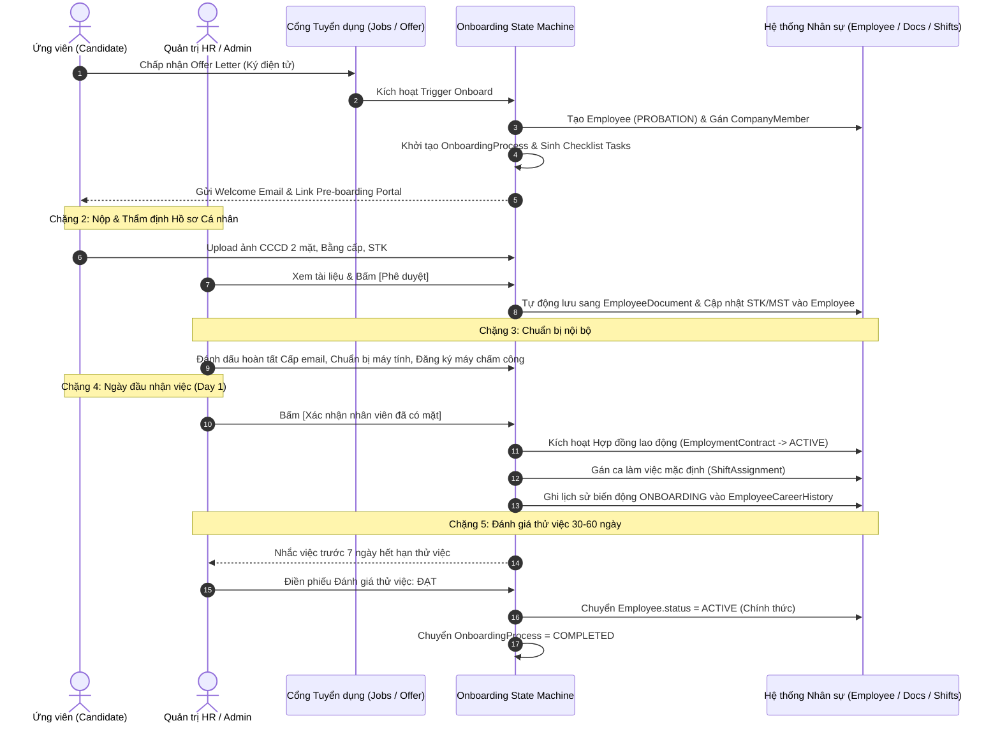

# Đặc tả Thiết kế: Hệ thống Quản trị Tiếp nhận Ứng viên thành Nhân viên (Candidate to Employee Onboarding Hub)

> **Mã thiết kế**: `SPEC-HRM-ONBOARDING-2026-09-23`  
> **Phân hệ**: Tuyển dụng (ATS) & Quản trị Nhân sự Nội bộ (HRM)  
> **Trạng thái**: Đã thống nhất thiết kế (Approved Design)  
> **Phiên bản**: 1.0.0  
> **Tác giả / Nhóm phụ trách**: Square Tuyển Dụng / InfoHR Engineering

---

## 1. 🎯 Tổng quan & Bối cảnh Nghiệp vụ (Overview & Problem Statement)

Trong hệ thống InfoHR, phân hệ Tuyển dụng (ATS) phụ trách đăng tuyển, sàng lọc hồ sơ và phỏng vấn AI/Human. Khi ứng viên vượt qua các vòng đánh giá và được gửi Thư mời nhận việc (`JobOfferLetter`), tồn tại một khoảng cách lớn giữa việc **"Chấp nhận Offer"** và **"Hòa nhập thành Nhân viên chính thức"**.

Trước đây:
* Việc tiếp nhận chỉ dừng ở một thao tác gọi API đơn lẻ (`CandidateToEmployeeConverter`), tạo bản ghi `Employee` nhưng thiếu quy trình giám sát tiến độ chuẩn bị (Pre-boarding) và theo dõi giai đoạn thử việc.
* Doanh nghiệp thiếu màn hình quản trị tập trung để biết: Ứng viên nào đã nộp CCCD/bằng cấp? IT đã chuẩn bị máy tính và email công ty chưa? Đã lấy mã vân tay/khuôn mặt trên máy chấm công chưa? Nhân sự nào sắp hết hạn thử việc 60 ngày để gửi phiếu đánh giá?

**Mục tiêu của thiết kế này:**
Xây dựng **Trung tâm Quản trị Tiếp nhận (Onboarding Hub & State Machine)** chuẩn hóa 5 chặng khép kín, kết nối liền mạch từ lúc ứng viên ký nhận Offer điện tử cho đến khi hoàn thành thử việc và trở thành nhân viên chính thức (`ACTIVE`).

---

## 2. 🏛️ Kiến trúc Dữ liệu & State Machine (Data Models & States)

### 2.1. Model `EmployeeOnboardingProcess` (Vòng đời tiếp nhận)

Thực thể quản lý toàn diện tiến độ của một nhân sự mới trong hệ thống HRM:

```text
Table: project_hrm_employee_onboarding_process
---------------------------------------------------------------------------------
id (UUID / BigAutoField, Primary Key)
company_id (ForeignKey -> Company, on_delete=CASCADE)
employee_id (OneToOneField -> Employee, related_name="onboarding_process")
offer_letter_id (OneToOneField -> JobOfferLetter, null=True, blank=True)
application_id (ForeignKey -> JobPostActivity, null=True, blank=True)

stage (CharField, max_length=30, choices=STAGE_CHOICES, default="PREBOARDING_DOCS")
target_start_date (DateField, verbose_name="Ngày nhận việc dự kiến")
actual_start_date (DateField, null=True, blank=True, verbose_name="Ngày nhận việc thực tế")
probation_end_date (DateField, null=True, blank=True, verbose_name="Hạn kết thúc thử việc")

progress_percent (PositiveSmallIntegerField, default=0, verbose_name="Tiến độ hoàn thành %")
cancel_reason (TextField, blank=True, default="", verbose_name="Lý do hủy tiếp nhận")
cancelled_at (DateTimeField, null=True, blank=True)
cancelled_by (ForeignKey -> User, null=True, blank=True)

create_at (DateTimeField, auto_now_add=True)
update_at (DateTimeField, auto_now=True)
```

#### Các trạng thái vòng đời (`stage`):
1. `OFFER_ACCEPTED`: Ứng viên vừa chấp thuận Offer Letter điện tử.
2. `PREBOARDING_DOCS`: Đang thu thập và chờ HR thẩm định hồ sơ số cá nhân (CCCD, bằng cấp, STK, MST).
3. `INTERNAL_PREP`: Đang thực hiện các công việc nội bộ (cấp email, bàn giao laptop, đăng ký máy chấm công).
4. `DAY_ONE_WELCOME`: Chào đón ngày đầu nhận việc, xác nhận có mặt thực tế, kích hoạt HĐLĐ thử việc.
5. `PROBATION_EVALUATION`: Trong thời gian thử việc (30/60 ngày), thực hiện theo dõi và đánh giá năng lực.
6. `COMPLETED`: Tiếp nhận thành công rực rỡ — nhân viên chính thức nâng lên trạng thái `ACTIVE`.
7. `CANCELLED`: Hủy quy trình (ứng viên ghost offer hoặc không vượt qua thử việc).

---

### 2.2. Model `OnboardingTaskItem` (Danh mục đầu việc chuẩn hóa)

Mỗi quy trình tiếp nhận bao gồm danh sách các nhiệm vụ cụ thể được sinh ra tự động:

```text
Table: project_hrm_onboarding_task_item
---------------------------------------------------------------------------------
id (BigAutoField, Primary Key)
process_id (ForeignKey -> EmployeeOnboardingProcess, related_name="tasks")
stage (CharField, max_length=30, verbose_name="Chặng quy trình")
code (CharField, max_length=50, verbose_name="Mã định danh công việc")
title (CharField, max_length=255, verbose_name="Tiêu đề công việc")
description (TextField, blank=True, default="")

assigned_role (CharField, max_length=20, choices=[CANDIDATE, HR, IT, MANAGER])
assigned_to (ForeignKey -> User, null=True, blank=True)

is_required (BooleanField, default=True)
is_completed (BooleanField, default=False, db_index=True)
completed_at (DateTimeField, null=True, blank=True)
completed_by (ForeignKey -> User, null=True, blank=True)

document_id (ForeignKey -> EmployeeDocument, null=True, blank=True)
rejection_note (TextField, blank=True, default="")
order (PositiveSmallIntegerField, default=0)
```

#### Bộ task chuẩn định sẵn theo từng chặng:
* **Chặng 2 (`PREBOARDING_DOCS`)**:
  * `UPLOAD_ID_CARD`: Tải ảnh CCCD 2 mặt (Người làm: `CANDIDATE`).
  * `UPLOAD_DEGREE`: Tải ảnh/scan Bằng tốt nghiệp đại học / chứng chỉ chuyên môn (Người làm: `CANDIDATE`).
  * `BANK_ACCOUNT`: Cung cấp thông tin số tài khoản ngân hàng chi trả lương (Người làm: `CANDIDATE`).
  * `TAX_INFO`: Cung cấp mã số thuế cá nhân & đăng ký người phụ thuộc (Người làm: `CANDIDATE`).
* **Chặng 3 (`INTERNAL_PREP`)**:
  * `PROVISION_EMAIL`: Cấp địa chỉ email doanh nghiệp `@company.com` (Người làm: `IT`).
  * `PROVISION_HARDWARE`: Chuẩn bị laptop/PC, bàn làm việc, thẻ ra vào (Người làm: `IT` / `HR`).
  * `ENROLL_BIOMETRIC`: Đăng ký mã ID và vân tay/FaceID trên máy chấm công chi nhánh (Người làm: `HR` / `IT`).
* **Chặng 4 (`DAY_ONE_WELCOME`)**:
  * `CONFIRM_ATTENDANCE`: Xác nhận nhân viên đã có mặt thực tế tại văn phòng (Người làm: `HR`).
  * `SIGN_LABOR_CONTRACT`: Ký kết hợp đồng lao động thử việc (Người làm: `HR` & `CANDIDATE`).
  * `HANDOVER_ASSETS`: Ký biên bản bàn giao trang thiết bị (Người làm: `HR` & `CANDIDATE`).
* **Chặng 5 (`PROBATION_EVALUATION`)**:
  * `CHECKIN_30_DAYS`: Phỏng vấn trao đổi định kỳ sau 30 ngày (Người làm: `MANAGER` / `HR`).
  * `FINAL_PROBATION_REVIEW`: Đánh giá tổng kết thử việc sau 60 ngày (Người làm: `MANAGER` & `HR`).

---

## 3. 🔄 Luồng Nghiệp vụ & Cơ chế Tự động hóa (Data Flow & Automations)



---

## 4. 🖥️ Đặc tả Giao diện Quản trị Onboarding Hub (Frontend UX / `/employer/hrm/onboarding`)

### 4.1. Top Header & Thẻ thống kê KPI Tiếp nhận
* **Card 1 (Tổng quan)**: `Tổng nhân sự đang Onboarding` (Ví dụ: 8 nhân sự).
* **Card 2 (Cảnh báo hồ sơ)**: `Chờ duyệt hồ sơ Pre-boarding` (Có badge đỏ nhấp nháy nếu có hồ sơ chờ duyệt > 24 giờ).
* **Card 3 (Sắp nhận việc)**: `Sắp đến ngày nhận việc (Day 1)` (Đếm số nhân sự nhận việc trong vòng 7 ngày tới).
* **Card 4 (Đánh giá)**: `Cần đánh giá hết thử việc` (Số nhân sự kết thúc thử việc trong 15 ngày tới).

### 4.2. Danh sách Quản trị Trung tâm (Dual View)
* **Table View (Mặc định)**:
  * Cột thông tin: Avatar & Họ tên, Mã NV, Chức danh & Phòng ban, Quản lý, Ngày nhận việc dự kiến, Chặng Onboarding (Chip màu: Cam/Xanh dương/Tím/Xanh lá), Thanh tiến độ % hoàn thành, Thao tác mở Drawer.
* **Kanban Board View (Chuyển đổi 1-click)**:
  * 5 cột trực quan tương ứng 5 chặng, cho phép kéo thả hoặc click vào từng card nhân viên để xem chi tiết.

### 4.3. Drawer Chi tiết Tiếp nhận (Onboarding Action Drawer)
Khi HR click vào một nhân viên, Drawer trượt ra từ bên phải:
* **Header**: Avatar, Họ tên, Mã nhân viên, Phòng ban, Thanh Stepper 5 bước và Thanh tiến độ tổng thể %.
* **Nội dung theo từng Tab chặng**:
  * **Tab 1 (Offer Letter)**: Xem trước nội dung Offer đã ký, mức lương thỏa thuận, ngày ký.
  * **Tab 2 (Hồ sơ số Pre-boarding)**:
    * Grid ảnh trực quan: Mặt trước CCCD, Mặt sau CCCD, Bằng cấp.
    * Click ảnh mở Lightbox Modal xem độ nét cao.
    * Nút hành động nhanh: **[Duyệt tài liệu]** (tự động đẩy vào `EmployeeDocument`) hoặc **[Yêu cầu nộp lại]** (popup nhập lý do gửi thông báo cho ứng viên).
  * **Tab 3 (Chuẩn bị nội bộ)**:
    * Checklist checkbox: Cấp email, bàn giao laptop, đăng ký máy chấm công vân tay/FaceID.
    * Ô nhập thông tin nhanh (Email công ty đã cấp, Số serial máy).
  * **Tab 4 (Ngày đầu nhận việc - Day 1)**:
    * Nút lớn: **[Xác nhận nhân viên đã đến nhận việc]**.
    * Bật modal xác nhận bàn giao tài sản và kích hoạt HĐLĐ thử việc.
  * **Tab 5 (Đánh giá thử việc)**:
    * Bộ đếm số ngày thử việc còn lại.
    * Form đánh giá thử việc 3 phương án:
      * 🟢 **Đạt**: Nâng cấp lên Nhân viên chính thức (`ACTIVE`), kích hoạt tạo HĐLĐ chính thức.
      * 🟡 **Gia hạn**: Chọn số ngày gia hạn thêm (tối đa 30 ngày) kèm lý do.
      * 🔴 **Dừng hợp tác**: Hủy tiếp nhận và kết thúc hợp đồng thử việc.

---

## 5. 🛡️ Ma trận Phân quyền & Bảo mật (RBAC & PII Protection)

| Vai trò người dùng | Chặng 1: Offer | Chặng 2: Hồ sơ số | Chặng 3: Chuẩn bị | Chặng 4: Day 1 | Chặng 5: Đánh giá | Xem Lương & STK |
| :--- | :---: | :---: | :---: | :---: | :---: | :---: |
| **Company Owner / Admin** | ✅ Toàn quyền | ✅ Toàn quyền | ✅ Toàn quyền | ✅ Toàn quyền | ✅ Toàn quyền | ✅ Có |
| **HR Manager / C&B** | ✅ Toàn quyền | ✅ Toàn quyền | ✅ Toàn quyền | ✅ Toàn quyền | ✅ Toàn quyền | ✅ Có |
| **Quản lý trực tiếp (`reports_to`)** | ❌ Ẩn | ❌ Ẩn | 👁️ Xem tiến độ | 👁️ Xác nhận | ✅ Đánh giá NV | ❌ **Tuyệt đối ẩn** |
| **IT Support / Hành chính** | ❌ Ẩn | ❌ Ẩn | ✅ Hoàn thành task | ❌ Ẩn | ❌ Ẩn | ❌ **Tuyệt đối ẩn** |
| **Ứng viên / Nhân viên mới** | 👁️ Ký xem | 📤 Upload hồ sơ | 👁️ Xem tiến độ | 👁️ Xem HĐLĐ | 👁️ Xem kết quả | 👁️ Xem của chính mình |

* **Bảo vệ dữ liệu cá nhân (PII Protection)**:
  * File ảnh CCCD và bằng cấp được lưu trữ trên bucket MinIO bảo mật (`private-documents`).
  * Chỉ sinh Pre-signed URL có hiệu lực trong 15 phút khi HR được ủy quyền mở Drawer xem xét.

---

## 6. ⚠️ Xử lý Tình huống Ngoại lệ (Edge Cases & Resilience)

1. **Ứng viên bỏ việc trước ngày nhận việc ("Ghost Offer"):**
   * HR chọn **[Hủy tiếp nhận]** tại bất kỳ chặng nào.
   * `EmployeeOnboardingProcess` chuyển trạng thái `CANCELLED`, lưu lý do hủy.
   * Bản ghi `Employee` chuyển trạng thái `RESIGNED` hoặc đánh dấu lưu trữ, không đưa vào danh sách chấm công hoặc bảng lương tháng.
2. **Dời ngày nhận việc (Reschedule Day 1):**
   * Cho phép HR sửa `target_start_date`.
   * Hệ thống tự động dời thời hạn của các task nội bộ và gửi thông báo cập nhật cho IT.
3. **Ảnh hồ sơ mờ / sai định dạng:**
   * Khi HR bấm "Yêu cầu nộp lại", trạng thái task chuyển về `REJECTED`, mở lại quyền upload cho ứng viên trên portal kèm thông báo lý do chi tiết.
4. **Idempotency & Khóa dữ liệu:**
   * Đảm bảo tính toán vẹn dữ liệu: Không bao giờ tạo 2 bản ghi `Employee` hay 2 quy trình onboarding cho cùng 1 đơn ứng tuyển hoặc cùng 1 tài khoản User.

---

## 7. 🧪 Kế hoạch Kiểm thử & Xác thực (Verification Plan)

### 7.1. Automated Backend Tests (Django / Pytest)
* `test_onboarding_process_creation_on_offer_accepted`: Kiểm tra trigger tự động sinh `EmployeeOnboardingProcess` và `OnboardingTaskItem` khi ứng viên ký offer.
* `test_document_approval_syncs_to_employee_document`: Kiểm tra khi HR duyệt ảnh CCCD/bằng cấp thì tự động tạo bản ghi trong `EmployeeDocument`.
* `test_day_one_confirmation_activates_contract_and_shift`: Kiểm tra bấm xác nhận Day 1 sẽ kích hoạt HĐLĐ và phân ca làm việc.
* `test_probation_passed_promotes_employee_to_active`: Kiểm tra hoàn tất thử việc sẽ cập nhật `Employee.status = ACTIVE` và ghi log `EmployeeCareerHistory`.
* `test_cancel_onboarding_revokes_access`: Kiểm tra hủy tiếp nhận sẽ cập nhật trạng thái an toàn.

### 7.2. Frontend Tests & Quality Gates
* Chạy `pnpm run lint` và `pnpm run build` không phát sinh cảnh báo lỗi TypeScript.
* Kiểm thử các tương tác trên Drawer: xem trước ảnh CCCD phóng to, nút duyệt/từ chối, chuyển tab chặng mượt mà.
* Kiểm thử hiển thị chuẩn responsive trên Desktop (1920x1080, 1440x900) và Tablet.
