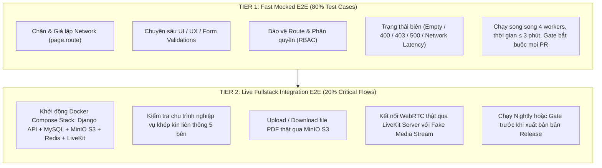

# 🏛️ ĐẶC TẢ THIẾT KẾ TOÀN DIỆN: MA TRẬN KIỂM THỬ TỰ ĐỘNG E2E PLAYWRIGHT CHO TOÀN BỘ HỆ THỐNG INFOHR

> **Dự án**: Square Tuyển Dụng (InfoHR)  
> **Phiên bản tài liệu**: 2.0 (Deep Enterprise-Grade Specification)  
> **Ngày cập nhật**: 24/09/2026  
> **Tác giả / Vai trò**: Antigravity Quality Engineering & Architecture Team  
> **Phạm vi**: 5 Phân hệ chính (Ứng viên, Nhà tuyển dụng, Voice AI AILA, Quản lý nhân sự HRM, Quản trị Admin) + Tích hợp Live Backend + CI/CD Matrix  

---

## 1. 🌐 TỔNG QUAN HỆ THỐNG & CHIẾN LƯỢC KIỂM THỬ (TESTING STRATEGY)

InfoHR là nền tảng tuyển dụng thông minh tích hợp phỏng vấn WebRTC Voice AI thời gian thực và quản trị nhân sự HRM nội bộ. Hệ thống vận hành dưới mô hình Monorepo đa cổng (Multi-portal). Để đảm bảo không xuất hiện lỗi hồi quy (zero regressions) và độ tin cậy tuyệt đối, hệ thống kiểm thử tự động E2E với Playwright được thiết kế theo mô hình **Kim tự tháp kiểm thử phân tầng kép (Dual-Tier Testing Pyramid)**:



---

## 2. 📁 KIẾN TRÚC THƯ MỤC & PAGE OBJECT MODEL (POM)

Để loại bỏ hoàn toàn mã trùng lặp, cô lập các CSS/XPath selector và giúp mã kiểm thử thích ứng ngay khi giao diện MUI/Tailwind thay đổi, toàn bộ mã nguồn kiểm thử được chuẩn hóa theo mẫu **Page Object Model (POM)** kết hợp **Domain Modules**:

```text
frontend/tests/
├── e2e/                                 # Các kịch bản kiểm thử (Test Specs) theo domain
│   ├── 01-auth/                         # Kịch bản Xác thực & Quản lý phiên
│   │   ├── auth-login.spec.ts
│   │   ├── auth-register.spec.ts
│   │   ├── auth-password-recovery.spec.ts
│   │   └── auth-role-guards.spec.ts
│   ├── 02-candidate/                    # Kịch bản Ứng viên
│   │   ├── job-search-filter.spec.ts
│   │   ├── job-apply-flow.spec.ts
│   │   ├── cv-builder-editor.spec.ts
│   │   ├── online-profile.spec.ts
│   │   ├── candidate-dashboard.spec.ts
│   │   └── candidate-responsive-mobile.spec.ts
│   ├── 03-employer/                     # Kịch bản Nhà tuyển dụng & Tuyển dụng
│   │   ├── employer-dashboard-kpi.spec.ts
│   │   ├── job-post-crud-lifecycle.spec.ts
│   │   ├── ats-kanban-pipeline.spec.ts
│   │   ├── question-bank-scripts.spec.ts
│   │   ├── interview-scheduling.spec.ts
│   │   ├── ai-scorecard-review.spec.ts
│   │   └── company-profile-verification.spec.ts
│   ├── 04-voice-ai/                     # Kịch bản Voice AI AILA & Phòng phỏng vấn
│   │   ├── preflight-device-checks.spec.ts
│   │   ├── livekit-room-connection.spec.ts
│   │   ├── in-call-hud-interactions.spec.ts
│   │   ├── media-controls-speech.spec.ts
│   │   └── post-interview-processing.spec.ts
│   ├── 05-hrm/                          # Kịch bản Quản lý nhân sự nội bộ
│   │   ├── employee-management.spec.ts
│   │   ├── org-chart-departments.spec.ts
│   │   ├── leave-request-approval.spec.ts
│   │   ├── attendance-shift-requests.spec.ts
│   │   └── payroll-calculation-audit.spec.ts
│   ├── 06-admin/                        # Kịch bản Quản trị viên tối cao
│   │   ├── job-moderation-approval.spec.ts
│   │   ├── company-verification.spec.ts
│   │   ├── user-governance-rbac.spec.ts
│   │   ├── system-taxonomies-config.spec.ts
│   │   └── audit-logs-inspection.spec.ts
│   └── 07-cross-portal-live/            # Kịch bản liên thông toàn trình (Live Docker)
│       └── full-recruitment-lifecycle.spec.ts
│
├── pages/                               # Page Object Classes
│   ├── base.page.ts                     # Base Page: waitLoader, toast, modal, clickOutside
│   ├── auth/
│   │   ├── login.page.ts
│   │   ├── register.page.ts
│   │   └── forgot-password.page.ts
│   ├── candidate/
│   │   ├── job-search.page.ts
│   │   ├── job-detail.page.ts
│   │   ├── apply-modal.page.ts
│   │   ├── cv-builder.page.ts
│   │   ├── online-profile.page.ts
│   │   └── my-jobs.page.ts
│   ├── employer/
│   │   ├── employer-dashboard.page.ts
│   │   ├── job-post-editor.page.ts
│   │   ├── ats-kanban.page.ts
│   │   ├── question-bank.page.ts
│   │   ├── ai-scorecard.page.ts
│   │   └── company-profile.page.ts
│   ├── voice-ai/
│   │   ├── preflight.page.ts
│   │   ├── livekit-room.page.ts
│   │   └── post-interview.page.ts
│   ├── hrm/
│   │   ├── hrm-dashboard.page.ts
│   │   ├── employee-directory.page.ts
│   │   ├── leave-manager.page.ts
│   │   ├── attendance-manager.page.ts
│   │   └── payroll-engine.page.ts
│   └── admin/
│       ├── admin-dashboard.page.ts
│       ├── job-moderation.page.ts
│       ├── company-verify.page.ts
│       └── user-rbac.page.ts
│
├── fixtures/                            # Custom Test Fixtures
│   ├── auth.fixtures.ts                 # Contexts: candidateContext, employerContext, adminContext
│   └── mock.fixtures.ts                 # Tự động mount handlers theo domain
│
└── mocks/                               # Modular Network Route Mock Handlers
    ├── index.ts                         # Registry đăng ký toàn bộ handlers
    ├── mock-auth.ts                     # Auth, refresh token, user me
    ├── mock-jobs.ts                     # Jobs list, details, categories, cities
    ├── mock-applications.ts             # Apply CV, candidate resumes, status
    ├── mock-employer.ts                 # Dashboard KPIs, job CRUD, ATS applicants
    ├── mock-voice-ai.ts                 # Token LiveKit, question sets, scorecards, transcripts
    ├── mock-hrm.ts                      # Employees, org chart, leaves, shifts, payroll
    └── mock-admin.ts                    # Job moderation, verifications, taxonomies, audit logs
```

---

## 3. 📊 MA TRẬN 80+ TEST CASE CHI TIẾT THEO DOMAIN

### Phân Hệ 1: Xác Thực & Phân Quyền Bảo Vệ Route (Auth & RBAC)

| Mã Case | Phân hệ & URL | Mức độ | Tiền điều kiện | Luồng thao tác (Step-by-step) | Điểm kiểm chứng (Assertions) | Trạng thái biên / Negative Test |
| :--- | :--- | :---: | :--- | :--- | :--- | :--- |
| `AUTH-01` | Auth<br>`/register` | **P0** | Người dùng chưa đăng nhập | 1. Điền họ tên, email mới.<br>2. Nhập mật khẩu & xác nhận.<br>3. Chọn vai trò "Ứng viên".<br>4. Bấm "Đăng ký". | - Form submit thành công.<br>- Điều hướng sang trang Onboarding/Trang chủ.<br>- Redux lưu thông tin user. | Nhập email đã tồn tại $\rightarrow$ Báo lỗi `Email đã được đăng ký`. Mật khẩu < 8 ký tự $\rightarrow$ Chặn submit tại frontend. |
| `AUTH-02` | Auth<br>`/login` | **P0** | Người dùng có tài khoản hợp lệ | 1. Nhập email & password chính xác.<br>2. Bấm "Đăng nhập". | - Cookie `access_token` và `refresh_token` được gán.<br>- Chuyển hướng đúng Dashboard theo vai trò. | Nhập sai mật khẩu $\rightarrow$ Hiển thị Toast cảnh báo `Email hoặc mật khẩu không chính xác`. |
| `AUTH-03` | Auth<br>`/employer/dashboard` | **P0** | Đang đăng nhập tài khoản Ứng viên | 1. Cố tình gõ trực tiếp URL `/employer/dashboard` trên thanh địa chỉ. | - Middleware Next.js chặn.<br>- Chuyển hướng về `/forbidden` hoặc `/login`. | Xóa token giữa chừng $\rightarrow$ Tự động chuyển hướng về trang đăng nhập với param `?next=...`. |
| `AUTH-04` | Auth<br>`/admin/dashboard` | **P0** | Tài khoản NTD hoặc Ứng viên | 1. Cố tình truy cập `/admin/*`. | - Chặn tuyệt đối.<br>- Trả về mã lỗi 403 Forbidden hoặc redirect về `/admin/login`. | Người dùng thông thường không xem được giao diện quản trị Admin dù có URL. |
| `AUTH-05` | Auth<br>`/forgot-password` | **P1** | Quên mật khẩu | 1. Nhập email đã đăng ký.<br>2. Bấm "Gửi liên kết đặt lại mật khẩu". | - Hiển thị thông báo "Email hướng dẫn đã được gửi".<br>- Gọi API `/auth/password/reset/`. | Nhập sai định dạng email $\rightarrow$ Báo lỗi validation regex email. |
| `AUTH-06` | Auth<br>`/reset-password` | **P1** | Có token reset mật khẩu hợp lệ | 1. Mở trang reset kèm token.<br>2. Nhập mật khẩu mới.<br>3. Bấm xác nhận. | - Đổi mật khẩu thành công.<br>- Điều hướng về `/login` kèm thông báo đăng nhập lại. | Token hết hạn hoặc không hợp lệ $\rightarrow$ Báo lỗi `Liên kết đặt lại mật khẩu đã hết hạn`. |
| `AUTH-07` | Auth<br>Toàn hệ thống | **P1** | Đã đăng nhập | 1. Mở menu Avatar.<br>2. Bấm nút "Đăng xuất". | - Xóa sạch cookie `access_token`, `refresh_token`.<br>- Reset Redux Auth State về rỗng.<br>- Về trang chủ công khai. | Thao tác Đăng xuất không gây lỗi JavaScript console. |
| `AUTH-08` | Auth<br>Toàn hệ thống | **P2** | Access Token hết hạn | 1. Thao tác trên trang kích hoạt request API nhận mã 401. | - Axios Interceptor tự động gọi `/auth/refresh/`.<br>- Lấy token mới và retry request gốc trong suốt. | Refresh token cũng hết hạn $\rightarrow$ Điều hướng về trang Login yêu cầu xác thực lại. |
| `AUTH-09` | Auth<br>`/login` | **P2** | Tài khoản bị khóa bởi Admin | 1. Nhập tài khoản có cờ `is_active: false`.<br>2. Bấm Đăng nhập. | - Hiển thị thông báo `Tài khoản của bạn đã bị khóa. Vui lòng liên hệ hỗ trợ`. | Không lưu bất kỳ cookie phiên nào vào trình duyệt. |

---

### Phân Hệ 2: Ứng Viên (Job Seeker Portal)

| Mã Case | Phân hệ & URL | Mức độ | Tiền điều kiện | Luồng thao tác (Step-by-step) | Điểm kiểm chứng (Assertions) | Trạng thái biên / Negative Test |
| :--- | :--- | :---: | :--- | :--- | :--- | :--- |
| `CAND-01` | Candidate<br>`/jobs` | **P0** | Khách hoặc Ứng viên | 1. Nhập từ khóa "Fullstack".<br>2. Bấm "Tìm kiếm". | - Danh sách công việc lọc chính xác.<br>- URL cập nhật `?kw=Fullstack`.<br>- Thẻ Job Card hiển thị tên việc, công ty, lương. | Từ khóa không khớp $\rightarrow$ Hiển thị Empty State kèm gợi ý từ khóa liên quan. |
| `CAND-02` | Candidate<br>`/jobs` | **P0** | Trang danh sách việc làm | 1. Chọn Thành phố: "Hà Nội".<br>2. Chọn Ngành nghề: "Công nghệ thông tin".<br>3. Chọn Dải lương: "20 - 30 triệu". | - URL cập nhật query params.<br>- Danh sách trả về chỉ chứa công việc thỏa mãn cả 3 tiêu chí.<br>- Hiển thị số lượng kết quả tìm thấy. | Bấm "Đặt lại bộ lọc" $\rightarrow$ Xóa trắng các lựa chọn, tải lại danh sách mặc định. |
| `CAND-03` | Candidate<br>`/jobs/[slug]` | **P0** | Vào trang chi tiết việc làm | 1. Kiểm tra tiêu đề việc làm, tên công ty, logo.<br>2. Xem mô tả JD, yêu cầu, quyền lợi.<br>3. Bấm nút "Ứng tuyển ngay". | - Heading trang hiển thị đúng tiêu đề.<br>- Modal Ứng tuyển (`ApplyFormDialog`) mở lên. | Tin tuyển dụng đã hết hạn $\rightarrow$ Nút ứng tuyển bị vô hiệu hóa (disabled) kèm badge `Hết hạn`. |
| `CAND-04` | Candidate<br>`/jobs/[slug]` | **P0** | Đã đăng nhập Ứng viên, mở Apply Modal | 1. Chọn file CV có sẵn (Online hoặc PDF).<br>2. Nhập thư giới thiệu.<br>3. Bấm "Nộp hồ sơ ứng tuyển". | - Gọi API nộp CV thành công.<br>- Modal đóng.<br>- Nút chuyển thành badge `Đã ứng tuyển`.<br>- Toast thông báo thành công. | Không chọn file CV $\rightarrow$ Báo lỗi `Vui lòng chọn hoặc tải lên CV`. |
| `CAND-05` | Candidate<br>`/jobs/[slug]` | **P1** | Đã mở Apply Modal | 1. Chọn tab "Tải lên CV mới".<br>2. Chọn file `my_cv.pdf` dung lượng 2MB.<br>3. Bấm Nộp. | - File upload thành công lên MinIO S3.<br>- Tiến trình upload hiển thị 100%. | Tải file sai định dạng (`.exe`) hoặc dung lượng > 10MB $\rightarrow$ Chặn và báo lỗi định dạng/kích thước. |
| `CAND-06` | Candidate<br>`/cv-builder` | **P0** | Mở trình tạo CV | 1. Chọn một template CV.<br>2. Điền thông tin cá nhân, mục tiêu nghề nghiệp.<br>3. Thêm mục Học vấn và Kinh nghiệm làm việc. | - Khung Live Preview bên phải cập nhật văn bản thời gian thực.<br>- Bấm "Lưu CV" $\rightarrow$ Lưu thành công vào Redux/API. | Chuyển đổi giữa các Template mà không bị mất dữ liệu đã nhập. |
| `CAND-07` | Candidate<br>`/cv-builder` | **P0** | Đang ở CV Builder có dữ liệu | 1. Bấm nút "Tải PDF". | - Hàm xuất PDF kích hoạt.<br>- File `.pdf` được tải về máy người dùng không bị vỡ layout font tiếng Việt. | Chấm điểm CV bằng AI (Tab AI Score) $\rightarrow$ Trả về phân tích điểm mạnh/điểm yếu của CV. |
| `CAND-08` | Candidate<br>`/online-profile` | **P1** | Đã đăng nhập Ứng viên | 1. Cập nhật số điện thoại, ngày sinh.<br>2. Thêm kỹ năng mới (React, Python).<br>3. Bấm "Lưu thay đổi". | - Thông báo lưu thành công.<br>- Phần trăm hoàn thiện hồ sơ tăng lên (Profile completion percentage). | Bật toggle "Cho phép NTD tìm kiếm hồ sơ" $\rightarrow$ Trạng thái public profile được bật. |
| `CAND-09` | Candidate<br>`/my-jobs` | **P1** | Đã ứng tuyển một số công việc | 1. Mở trang Quản lý việc làm.<br>2. Xem danh sách công việc đã nộp và đã lưu. | - Hiển thị đúng danh sách công việc.<br>- Badge trạng thái hiển thị rõ: *Chờ xác nhận*, *Phù hợp*, *Phỏng vấn*, *Từ chối*. | Bấm "Hủy lưu" việc làm $\rightarrow$ Card biến mất khỏi danh sách Đã lưu. |
| `CAND-10` | Candidate<br>`/practice` | **P1** | Trang luyện tập phỏng vấn AI | 1. Xem danh sách các bộ câu hỏi luyện tập.<br>2. Chọn bộ câu hỏi Kỹ sư phần mềm.<br>3. Bấm "Bắt đầu luyện tập". | - Hiển thị modal cấu hình phỏng vấn thử.<br>- Điều hướng vào trang `/interview/[practiceToken]`. | Xem trước các câu hỏi mẫu trong bộ trước khi bắt đầu. |
| `CAND-11` | Candidate<br>Toàn cổng ứng viên | **P2** | Viewport Mobile (iPhone 14: 390x844) | 1. Mở trang chủ và danh sách việc làm trên Mobile.<br>2. Mở Drawer menu.<br>3. Mở bộ lọc Bottom Sheet. | - Drawer mở mượt mà.<br>- Bộ lọc dạng Bottom Sheet hiển thị vừa vặn.<br>- Nút CTA Ứng tuyển cố định đáy màn hình không che nội dung. | Thao tác vuốt (swipe) không bị vỡ ngang màn hình (Horizontal scroll overflow = 0). |
| `CAND-12` | Candidate<br>`/jobs` | **P2** | Mạng bị mất kết nối (Offline) | 1. Tắt mạng (Offline mode).<br>2. Bấm tìm kiếm. | - Hiển thị thông báo "Không có kết nối mạng".<br>- Có nút "Thử lại" khi mạng khôi phục. | Bật lại mạng $\rightarrow$ Bấm Thử lại $\rightarrow$ Dữ liệu tải lại bình thường. |

---

### Phân Hệ 3: Nhà Tuyển Dụng & Phễu Tuyển Dụng (Employer Portal & ATS)

| Mã Case | Phân hệ & URL | Mức độ | Tiền điều kiện | Luồng thao tác (Step-by-step) | Điểm kiểm chứng (Assertions) | Trạng thái biên / Negative Test |
| :--- | :--- | :---: | :--- | :--- | :--- | :--- |
| `EMP-01` | Employer<br>`/employer/job-posts/create` | **P0** | Đã đăng nhập vai trò NTD | 1. Điền tiêu đề: "Senior Backend Python".<br>2. Chọn ngành nghề, cấp bậc, thành phố.<br>3. Điền dải lương Min-Max.<br>4. Soạn thảo JD rich-text.<br>5. Bấm "Đăng tin". | - Form validate hợp lệ.<br>- Gọi API tạo job post thành công.<br>- Tin xuất hiện trong danh sách tin đăng ở trạng thái *Chờ duyệt* (hoặc *Hiển thị*). | Bỏ trống các trường bắt buộc (Tiêu đề, Ngành nghề, Hạn nộp) $\rightarrow$ Highlight đỏ các ô lỗi. |
| `EMP-02` | Employer<br>`/employer/job-posts` | **P0** | Đang có tin tuyển dụng | 1. Xem danh sách tin.<br>2. Bấm icon menu thao tác $\rightarrow$ Chọn "Đóng tin tuyển dụng". | - Modal xác nhận xuất hiện.<br>- Xác nhận $\rightarrow$ Trạng thái chuyển thành `EXPIRED` / `CLOSED`.<br>- Tin không còn hiển thị ở cổng ứng viên. | Bấm "Mở lại tin" $\rightarrow$ Yêu cầu chọn hạn nộp mới $\rightarrow$ Kích hoạt lại tin. |
| `EMP-03` | Employer<br>`/employer/applied-profiles` | **P0** | Đã có ứng viên nộp hồ sơ | 1. Vào trang Quản lý hồ sơ ứng tuyển.<br>2. Chuyển sang chế độ xem Bảng Kanban.<br>3. Kéo card ứng viên từ "Chờ xác nhận" sang "Phù hợp". | - Card di chuyển mượt mà vào cột mới.<br>- Gọi API cập nhật trạng thái `PATCH /applications/{id}/`.<br>- Badge trạng thái ứng viên đổi màu tương ứng. | Kéo thả thất bại do lỗi mạng $\rightarrow$ Revert vị trí card về cột cũ kèm Toast thông báo lỗi. |
| `EMP-04` | Employer<br>`/employer/applied-profiles` | **P0** | Ứng viên ở trạng thái "Phù hợp" | 1. Bấm nút "Mời phỏng vấn AI".<br>2. Chọn Bộ kịch bản phỏng vấn kỹ thuật.<br>3. Đặt hạn hoàn thành (3 ngày).<br>4. Bấm "Gửi lời mời". | - Tạo bản ghi `InterviewSession` thành công.<br>- Sinh mã `inviteToken`.<br>- Trạng thái ứng viên đổi sang `Đã lên lịch phỏng vấn AI`. | Không chọn kịch bản câu hỏi $\rightarrow$ Chặn gửi kèm thông báo `Vui lòng chọn kịch bản phỏng vấn`. |
| `EMP-05` | Employer<br>`/employer/dashboard` | **P1** | Đã đăng nhập NTD | 1. Vào trang `/employer/dashboard`. | - Hiển thị đúng 4 card KPI: Tổng tin đăng, Hồ sơ mới, Lượt phỏng vấn hoàn thành, Điểm AI trung bình.<br>- Biểu đồ phễu tuyển dụng render không lỗi. | Dữ liệu rỗng (công ty mới) $\rightarrow$ Render các card KPI với giá trị 0, không vỡ layout. |
| `EMP-06` | Employer<br>`/employer/question-bank` | **P1** | Quản lý ngân hàng câu hỏi | 1. Bấm "Thêm câu hỏi mới".<br>2. Nhập nội dung câu hỏi, danh mục Kỹ thuật, độ khó Trung bình, thời gian trả lời 120s.<br>3. Bấm Lưu. | - Câu hỏi lưu thành công vào ngân hàng cá nhân của công ty.<br>- Hiển thị trong bảng câu hỏi. | Xóa câu hỏi đang được gán vào kịch bản phỏng vấn $\rightarrow$ Cảnh báo câu hỏi đang sử dụng. |
| `EMP-07` | Employer<br>`/employer/question-groups` | **P1** | Đã có câu hỏi trong ngân hàng | 1. Bấm "Tạo bộ kịch bản mới".<br>2. Đặt tên: "Kịch bản tuyển React Dev".<br>3. Chọn 5 câu hỏi từ danh sách.<br>4. Sắp xếp thứ tự câu hỏi.<br>5. Bấm Lưu. | - Bộ câu hỏi được tạo thành công.<br>- Tổng thời lượng dự kiến hiển thị chính xác (Tổng duration các câu). | Không chọn câu hỏi nào mà bấm Lưu $\rightarrow$ Báo lỗi `Bộ kịch bản cần ít nhất 1 câu hỏi`. |
| `EMP-08` | Employer<br>`/employer/interviews/[id]` | **P1** | Ứng viên đã hoàn thành phỏng vấn AI | 1. Mở trang Chi tiết kết quả phỏng vấn. | - Bảng điểm AI Scorecard hiển thị: Điểm tổng thể (Overall), Điểm kỹ thuật, Điểm giao tiếp.<br>- Trình phát Audio Player phát được đoạn ghi âm.<br>- Bản ghi chép Transcript hiển thị đúng từng câu hỏi/trả lời. | Kiểm tra tab Giám sát (Proctoring): Hiển thị số lần ứng viên chuyển tab trình duyệt. |
| `EMP-09` | Employer<br>`/employer/applied-profiles` | **P1** | Hồ sơ sau phỏng vấn có điểm AI | 1. Lọc ứng viên có điểm AI $\ge 80$.<br>2. Chọn ứng viên xuất sắc $\rightarrow$ Bấm "Trúng tuyển". | - Ứng viên chuyển sang cột "Đã tuyển dụng".<br>- Nút "Chuyển sang HRM" kích hoạt. | Xuất danh sách ứng viên ra file Excel (`.xlsx`) $\rightarrow$ File tải về chứa đúng các cột thông tin. |
| `EMP-10` | Employer<br>`/employer/company` | **P1** | Hồ sơ doanh nghiệp | 1. Cập nhật mô tả công ty, quy mô nhân sự, địa chỉ.<br>2. Upload file GPKD (PDF/JPG) tại mục Xác minh.<br>3. Bấm Gửi yêu cầu xác thực. | - Dữ liệu cập nhật thành công.<br>- Trạng thái xác thực đổi thành `Chờ Admin phê duyệt`. | Upload file quá dung lượng cho phép $\rightarrow$ Báo lỗi dung lượng. |
| `EMP-11` | Employer<br>`/employer/job-posts/create` | **P2** | Tài khoản hết hạn mức đăng tin (Quota Exceeded) | 1. Cố tình đăng tin khi tài khoản đạt giới hạn gói miễn phí. | - Hệ thống hiển thị Modal thông báo nâng cấp gói dịch vụ (`/employer/pricing`).<br>- Không văng lỗi crash ứng dụng. | Bấm vào gói nâng cấp $\rightarrow$ Điều hướng tới trang Bảng giá dịch vụ. |

---

### Phân Hệ 4: Voice AI AILA & Phòng Phỏng Vấn Trực Tuyến (LiveKit WebRTC)

| Mã Case | Phân hệ & URL | Mức độ | Tiền điều kiện | Luồng thao tác (Step-by-step) | Điểm kiểm chứng (Assertions) | Trạng thái biên / Negative Test |
| :--- | :--- | :---: | :--- | :--- | :--- | :--- |
| `VOICE-01` | Voice AI<br>`/interview/[token]` | **P0** | Trình duyệt mở link phỏng vấn kèm cờ fake-device | 1. Mở trang phỏng vấn với `inviteToken` hợp lệ.<br>2. Trình duyệt tự cấp quyền Mic/Cam. | - Trang Preflight hiển thị hình ảnh webcam xem trước.<br>- Thanh đo âm lượng Microphone dao động có tín hiệu.<br>- Tên vị trí và tên ứng viên hiển thị đúng. | Trình duyệt bị chặn quyền truy cập Mic/Cam $\rightarrow$ Hiển thị hướng dẫn mở quyền trong cài đặt. |
| `VOICE-02` | Voice AI<br>`/interview/[token]` | **P0** | Hoàn tất Preflight | 1. Chọn thiết bị Mic/Cam mong muốn.<br>2. Bấm "Tôi đã sẵn sàng vào phòng". | - Thiết lập kết nối WebSocket tới LiveKit Server.<br>- Trạng thái chuyển từ `connecting` sang `connected`.<br>- Giao diện phòng phỏng vấn chính xuất hiện. | Kết nối thất bại do sai token $\rightarrow$ Báo lỗi `Token phỏng vấn không hợp lệ hoặc đã hết hạn`. |
| `VOICE-03` | Voice AI<br>Phòng phỏng vấn | **P0** | Đã kết nối phòng LiveKit | 1. Quan sát giao diện HUD phòng phỏng vấn.<br>2. Kiểm tra thẻ Question Card HUD.<br>3. Kiểm tra đồng hồ đếm ngược. | - Question Card hiển thị: "Câu hỏi 1 / 5", danh mục Kỹ thuật và nội dung câu hỏi.<br>- Đồng hồ đếm ngược bắt đầu chạy từ `120s` lùi dần.<br>- Avatar trợ lý AI AILA hiển thị ở vị trí trung tâm. | Câu hỏi hiển thị chuẩn font tiếng Việt, không bị tràn khung hình trên mọi độ phân giải. |
| `VOICE-04` | Voice AI<br>Phòng phỏng vấn | **P0** | Đang trả lời câu hỏi 1 | 1. Phát biểu câu trả lời.<br>2. Bấm nút "Hoàn thành câu trả lời" (hoặc chờ hết giờ). | - Question Card chuyển sang "Câu hỏi 2 / 5".<br>- Nội dung câu hỏi mới được cập nhật.<br>- Đồng hồ đếm ngược reset lại từ đầu. | Chuyển lần lượt đến câu cuối cùng $\rightarrow$ Nút chuyển thành "Hoàn thành buổi phỏng vấn". |
| `VOICE-05` | Voice AI<br>Phòng phỏng vấn | **P0** | Trả lời xong câu cuối cùng | 1. Bấm "Hoàn thành buổi phỏng vấn".<br>2. Xác nhận hộp thoại kết thúc. | - Ngắt toàn bộ kết nối WebRTC audio/video track an toàn.<br>- Chuyển hướng tới màn hình xử lý sau phỏng vấn.<br>- Hiển thị trạng thái "AILA đang phân tích kết quả...". | Không để sót audio track chạy ngầm trong tab trình duyệt. |
| `VOICE-06` | Voice AI<br>Phòng phỏng vấn | **P1** | Đang trong phòng phỏng vấn | 1. Bấm nút Micro (Mute).<br>2. Bấm lại nút Micro (Unmute). | - Khi Mute: Track audio tắt, icon micro đổi thành gạch chéo đỏ.<br>- Khi Unmute: Track audio mở lại, icon trở về bình thường. | Tương tự với Camera: Bấm Tắt Camera $\rightarrow$ Khung webcam đổi thành avatar mặc định. |
| `VOICE-07` | Voice AI<br>Phòng phỏng vấn | **P1** | Giả lập âm thanh đầu vào | 1. Giả lập AI phát âm thanh.<br>2. Giả lập ứng viên phát âm thanh. | - Khi AI nói: Avatar AILA hiển thị hiệu ứng xung sóng âm (Speaking Waveform Pulse).<br>- Khi ứng viên nói: Thanh sóng âm người dùng nhấp nhô tương ứng. | Cả hai cùng nói $\rightarrow$ Trợ lý AI ưu tiên dừng hoặc giảm âm lượng để lắng nghe ứng viên. |
| `VOICE-08` | Voice AI<br>`/interview/[token]` | **P1** | Buổi phỏng vấn đã hoàn thành | 1. Cố tình mở lại URL `/interview/[token]` cũ bằng tab mới. | - Hệ thống nhận diện trạng thái `status: 'completed'`.<br>- Chặn không cho vào phòng, hiển thị thông báo `Buổi phỏng vấn này đã hoàn thành`. | Ngăn chặn tuyệt đối việc ứng viên thi lại gian lận. |
| `VOICE-09` | Voice AI<br>Phòng phỏng vấn | **P2** | Đang phỏng vấn thì mất kết nối mạng | 1. Ngắt kết nối mạng tạm thời (LiveKit state: `reconnecting`). | - Banner cảnh báo màu vàng xuất hiện: "Mất kết nối. Đang tự động kết nối lại...".<br>- Khôi phục mạng $\rightarrow$ Tự động reconnect mà không mất tiến trình câu hỏi. | Mất mạng quá 30 giây $\rightarrow$ Hiển thị thông báo hướng dẫn tải lại trang và khôi phục phiên. |
| `VOICE-10` | Voice AI<br>`/interview/[token]` | **P2** | Viewport Mobile (iPhone 14) | 1. Thực hiện phỏng vấn trên thiết bị di động. | - Giao diện tự động co giãn: Video webcam hiển thị dạng góc thu nhỏ (PIP).<br>- Thẻ câu hỏi và nút "Xong câu hỏi" bố trí thuận tiện thao tác ngón cái. | Giao diện không bị lag giật khung hình khi stream WebRTC trên mobile. |

---

### Phân Hệ 5: Quản Lý Nhân Sự (HRM Subsystem - `/employer/hrm/`)

| Mã Case | Phân hệ & URL | Mức độ | Tiền điều kiện | Luồng thao tác (Step-by-step) | Điểm kiểm chứng (Assertions) | Trạng thái biên / Negative Test |
| :--- | :--- | :---: | :--- | :--- | :--- | :--- |
| `HRM-01` | HRM<br>`/employer/hrm/employees` | **P0** | Đã đăng nhập vai trò HR Manager | 1. Bấm "Thêm nhân viên mới".<br>2. Điền Mã NV `EMP-099`, Họ tên, Email, Phòng ban CNTT, Chức vụ Dev, Lương 30.000.000đ.<br>3. Bấm Lưu. | - Bản ghi nhân viên mới xuất hiện trong danh sách.<br>- Thông báo tạo nhân sự thành công.<br>- Dữ liệu lưu đúng trong database. | Nhập trùng Mã nhân viên đã tồn tại $\rightarrow$ Báo lỗi `Mã nhân viên đã tồn tại trong hệ thống`. |
| `HRM-02` | HRM<br>`/employer/hrm/employees` | **P0** | Đã có danh sách nhân viên | 1. Nhập tìm kiếm theo tên hoặc mã NV.<br>2. Chọn bộ lọc theo Phòng ban: "Kinh doanh".<br>3. Bấm xem chi tiết một nhân viên. | - Bảng danh sách lọc chính xác.<br>- Trang hồ sơ chi tiết nhân sự hiển thị đầy đủ thông tin lương, hợp đồng, bảo hiểm. | Bấm "Khóa / Thôi việc nhân sự" $\rightarrow$ Trạng thái chuyển thành `TERMINATED` kèm ngày kết thúc. |
| `HRM-03` | HRM<br>`/employer/hrm/leaves` | **P0** | Nhân viên có 12 ngày phép năm | 1. Đăng nhập tài khoản Nhân viên $\rightarrow$ Nộp đơn xin nghỉ phép 2 ngày.<br>2. Đăng nhập tài khoản Quản lý $\rightarrow$ Mở danh sách đơn cần duyệt.<br>3. Bấm "Phê duyệt" (Approve). | - Đơn chuyển trạng thái `APPROVED`.<br>- Quỹ phép năm của nhân viên tự động trừ đi 2 ngày (còn 10 ngày).<br>- Nhân viên nhận được thông báo đã duyệt đơn. | Nộp số ngày phép vượt quá số dư hiện có $\rightarrow$ Hệ thống cảnh báo và đề xuất chuyển sang "Nghỉ không lương". |
| `HRM-04` | HRM<br>`/employer/hrm/leaves` | **P1** | Quản lý xem đơn xin nghỉ | 1. Quản lý mở đơn xin nghỉ của nhân viên.<br>2. Bấm "Từ chối" (Reject).<br>3. Nhập lý do: "Dự án đang trong giai đoạn phát hành khẩn cấp".<br>4. Xác nhận. | - Đơn chuyển trạng thái `REJECTED`.<br>- Quỹ ngày phép được hoàn trả nguyên vẹn.<br>- Lý do từ chối hiển thị rõ cho nhân viên xem. | Không nhập lý do từ chối $\rightarrow$ Yêu cầu nhập lý do bắt buộc trước khi từ chối. |
| `HRM-05` | HRM<br>`/employer/hrm/payroll` | **P0** | Đến kỳ tính lương tháng | 1. Mở trang Bảng lương tháng.<br>2. Bấm "Tạo bảng lương tháng mới".<br>3. Xem kết quả tính toán tự động Gross-to-Net. | - Kiểm tra các khoản khấu trừ chuẩn xác:<br>  + BHXH: Lương đóng x 8%<br>  + BHYT: Lương đóng x 1.5%<br>  + BHTN: Lương đóng x 1%<br>  + Thuế TNCN: Tính đúng theo bậc lũy tiến sau giảm trừ gia cảnh.<br>- Lương Net = Tổng thu nhập - Bảo hiểm - Thuế TNCN.<br>- Chi phí doanh nghiệp = Lương đóng x 21.5% + Thu nhập. | Thay đổi số người phụ thuộc của nhân viên $\rightarrow$ Bảng lương tự động tính lại số thuế TNCN được giảm trừ. |
| `HRM-06` | HRM<br>`/employer/hrm/payroll` | **P0** | Bảng lương ở trạng thái `DRAFT` | 1. HR Manager rà soát bảng lương.<br>2. Bấm "Duyệt bảng lương" (Approve). | - Trạng thái bảng lương chuyển sang `APPROVED`.<br>- Các phiếu lương cá nhân được gửi tới tài khoản từng nhân viên.<br>- Khóa chỉnh sửa bảng lương của tháng đó. | Sau khi duyệt, chỉ có Admin hoặc Giám đốc mới có quyền mở lại để điều chỉnh nếu có sai sót. |
| `HRM-07` | HRM<br>`/employer/hrm/departments` | **P1** | Quản lý cơ cấu tổ chức | 1. Bấm "Thêm phòng ban mới".<br>2. Đặt tên: "Phòng Trí tuệ Nhân tạo", mã `AI_LAB`.<br>3. Chỉ định Trưởng phòng.<br>4. Mở tab Sơ đồ tổ chức (Org Chart). | - Phòng ban mới xuất hiện trong cây sơ đồ tổ chức.<br>- Số lượng nhân sự hiển thị đúng 0 người ban đầu. | Xóa phòng ban khi đang còn nhân viên trực thuộc $\rightarrow$ Chặn xóa và yêu cầu điều chuyển nhân sự trước. |
| `HRM-08` | HRM<br>`/employer/hrm/attendances` | **P1** | Nhân viên quên chấm công | 1. Nhân viên nộp "Giải trình quên chấm công" (`CHECKIN_MISSING`) ngày hôm qua kèm lý do.<br>2. Quản lý mở đơn giải trình $\rightarrow$ Phê duyệt. | - Bản ghi chấm công của ngày hôm đó được cập nhật giờ vào hợp lệ.<br>- Không bị trừ công chuyên cần của tháng. | Từ chối giải trình $\rightarrow$ Bản ghi chấm công giữ nguyên trạng thái thiếu check-in và tính là đi muộn/nghỉ. |
| `HRM-09` | HRM<br>`/employer/hrm/payroll` | **P2** | Phân quyền bảo mật bảng lương (RBAC) | 1. Đăng nhập tài khoản Nhân viên bình thường.<br>2. Cố tình truy cập trang tính lương tổng `/employer/hrm/payroll`. | - Bị chặn truy cập hoặc chỉ hiển thị duy nhất tab "Phiếu lương của tôi".<br>- Không xem được mức lương và chi tiết của nhân sự khác. | Đăng nhập tài khoản Kế toán trưởng $\rightarrow$ Xem và xuất được toàn bộ báo cáo bảng lương công ty. |

---

### Phân Hệ 6: Quản Trị Hệ Thống Cấp Cao (Admin Portal - `/admin/`)

| Mã Case | Phân hệ & URL | Mức độ | Tiền điều kiện | Luồng thao tác (Step-by-step) | Điểm kiểm chứng (Assertions) | Trạng thái biên / Negative Test |
| :--- | :--- | :---: | :--- | :--- | :--- | :--- |
| `ADM-01` | Admin<br>`/admin/jobs` | **P0** | Có tin tuyển dụng ở trạng thái `PENDING_APPROVAL` | 1. Vào danh sách kiểm duyệt tin.<br>2. Xem chi tiết nội dung tin: tiêu đề, công ty, mô tả JD.<br>3. Bấm "Phê duyệt" (Approve). | - Trạng thái tin chuyển sang `APPROVED` / `ACTIVE`.<br>- Tin lập tức xuất hiện công khai trên cổng tìm việc của Ứng viên.<br>- Email thông báo gửi tới NTD. | Kiểm duyệt hàng loạt (Batch approval): Chọn 5 tin $\rightarrow$ Bấm Duyệt hàng loạt $\rightarrow$ Cả 5 tin được duyệt cùng lúc. |
| `ADM-02` | Admin<br>`/admin/jobs` | **P0** | Tin tuyển dụng vi phạm chính sách | 1. Mở tin tuyển dụng vi phạm (lừa đảo / đa cấp).<br>2. Bấm "Từ chối" (Reject).<br>3. Chọn lý do: "Mô tả công việc không rõ ràng, yêu cầu đặt cọc tiền".<br>4. Xác nhận. | - Trạng thái tin chuyển sang `REJECTED`.<br>- Tin bị ẩn hoàn toàn khỏi hệ thống công khai.<br>- Lý do từ chối gửi về bảng tin của NTD. | Tin bị từ chối không thể tự ý kích hoạt lại nếu chưa được chỉnh sửa và gửi duyệt lại. |
| `ADM-03` | Admin<br>`/admin/company-verifications` | **P0** | Công ty gửi hồ sơ cấp tích xanh | 1. Mở danh sách yêu cầu xác thực doanh nghiệp.<br>2. Mở xem file Giấy phép kinh doanh (GPKD) đính kèm qua PDF/Image viewer.<br>3. Đối chiếu Mã số thuế và tên công ty.<br>4. Bấm "Xác minh thành công". | - Công ty nhận huy hiệu Tích xanh xác thực (Verified Badge).<br>- Hạn mức đăng tin của công ty được nâng cấp.<br>- Tích xanh hiển thị cạnh tên công ty trên tất cả tin đăng. | GPKD mờ hoặc sai thông tin $\rightarrow$ Bấm Từ chối kèm ghi chú yêu cầu chụp lại ảnh nét hơn. |
| `ADM-04` | Admin<br>`/admin/users` | **P0** | Quản lý người dùng toàn hệ thống | 1. Tìm kiếm người dùng có hành vi gian lận.<br>2. Bấm "Khóa tài khoản" (Deactivate/Ban).<br>3. Nhập lý do khóa. | - Cờ `is_active` của user chuyển thành `false`.<br>- Thu hồi (revoke) toàn bộ session và token hiện tại.<br>- Người dùng bị văng ra ngay lập tức và không thể đăng nhập lại. | Bấm "Mở khóa tài khoản" $\rightarrow$ Kích hoạt lại tài khoản bình thường. |
| `ADM-05` | Admin<br>`/admin/careers` | **P1** | Quản lý danh mục ngành nghề | 1. Bấm "Thêm ngành nghề mới".<br>2. Nhập tên: "Công nghệ Bán dẫn / Vi mạch".<br>3. Chọn icon và lưu. | - Ngành nghề mới lưu thành công.<br>- Lập tức xuất hiện trong bộ lọc tìm việc của Ứng viên và form đăng tin của NTD. | Xóa ngành nghề đang có công việc liên kết $\rightarrow$ Cảnh báo không được xóa khi còn việc làm thuộc ngành. |
| `ADM-06` | Admin<br>`/admin/audit-logs` | **P1** | Giám sát thao tác quản trị | 1. Vào trang Nhật ký kiểm toán hệ thống. | - Bảng hiển thị đầy đủ danh sách thao tác gần nhất:<br>  + Tên Admin thực hiện<br>  + Hành động (Duyệt tin, Khóa user, Cập nhật cấu hình)<br>  + Thời gian chính xác<br>  + Địa chỉ IP<br>  + Diff chi tiết trước và sau khi sửa. | Lọc nhật ký theo tên Admin hoặc theo khoảng ngày $\rightarrow$ Trả kết quả chính xác. |
| `ADM-07` | Admin<br>`/admin/*` | **P2** | Bảo vệ route Quản trị viên cấp cao | 1. Đăng nhập tài khoản không có quyền Admin.<br>2. Cố tình truy cập bất kỳ trang nào trong `/admin/*`. | - Chặn truy cập tuyệt đối.<br>- Điều hướng về `/admin/login` hoặc `/forbidden`.<br>- Ghi nhận log cảnh báo truy cập trái phép. | Không hiển thị bất kỳ thành phần giao diện quản trị nào ra bên ngoài. |

---

### Phân Hệ 7: Kịch Bản Tích Hợp Toàn Trình (Cross-Portal Lifecycle Live E2E)

| Mã Case | Mức độ | Tên Kịch Bản | Chuỗi Phân Hệ | Kịch Bản Chi Tiết & Tương Tác Giữa Các Vai Trò | Kết Quả Mong Đợi Toàn Trình |
| :--- | :---: | :--- | :--- | :--- | :--- |
| `LIVE-01` | **P0** | **Vòng Đời Tuyển Dụng & Onboarding Nhân Sự Toàn Trình (End-to-End Enterprise Flow)** | 1. Employer<br>2. Admin<br>3. Candidate<br>4. Voice AI (AILA)<br>5. Employer<br>6. HRM | **Bước 1 (NTD)**: Đăng nhập NTD, tạo tin tuyển dụng mới "Senior AI Engineer 2026", mức lương 40-60tr, đính kèm kịch bản phỏng vấn Voice AI gồm 3 câu hỏi kỹ thuật.<br><br>**Bước 2 (Admin)**: Đăng nhập Admin, vào danh sách tin chờ duyệt, bấm Phê duyệt tin đăng.<br><br>**Bước 3 (Ứng viên)**: Đăng nhập tài khoản Ứng viên, tìm kiếm việc làm "Senior AI Engineer", mở tin và nộp file CV `candidate_resume.pdf` thật (upload qua MinIO S3).<br><br>**Bước 4 (NTD)**: Nhận thông báo hồ sơ mới trên ATS Kanban, xem CV, chuyển ứng viên sang cột "Phù hợp" và gửi lời mời phỏng vấn AI.<br><br>**Bước 5 (Ứng viên & Voice AI)**: Ứng viên nhận link phỏng vấn, mở phòng `/interview/[token]`, vượt qua Preflight check mic/cam giả lập, hoàn thành trả lời 3 câu hỏi với AI AILA qua kết nối WebRTC thật của LiveKit Server.<br><br>**Bước 6 (NTD)**: NTD nhận kết quả phỏng vấn, vào xem Bảng điểm AI (Overall 88 điểm), nghe đoạn ghi âm và đọc transcript. NTD hài lòng, bấm chuyển trạng thái "Trúng tuyển".<br><br>**Bước 7 (HRM Onboarding)**: NTD bấm nút "Chuyển sang HRM" $\rightarrow$ Hệ thống tự động trích xuất thông tin ứng viên trúng tuyển để điền sẵn vào form tạo nhân viên mới trong phân hệ HRM $\rightarrow$ HR xác nhận tạo nhân viên `EMP-2026-001`, tạo hợp đồng thử việc và kích hoạt tài khoản nhân sự nội bộ. | Dữ liệu luân chuyển liên tục và nhất quán xuyên suốt 5 phân hệ trên hệ thống backend và database MySQL thật; File CV và âm thanh phỏng vấn lưu trữ toàn vẹn trên MinIO S3; Không gặp bất kỳ lỗi nghẽn hoặc rò rỉ dữ liệu giữa các vai trò. |

---

## 4. 🧩 THIẾT KẾ CÁC PAGE OBJECT CLASSES (POM SPECIFICATION)

Để hiện thực hóa ma trận trên, các lớp Page Object được thiết kế với các hàm tác vụ chuẩn hóa:

### 4.1. `BasePage` (`tests/pages/base.page.ts`)
- `goto(url: string)`: Điều hướng an toàn với `waitUntil: 'domcontentloaded'`.
- `waitForLoadingGone()`: Chờ các component `<CircularProgress />` hoặc Skeleton biến mất.
- `expectToastMessage(text: string | RegExp)`: Xác thực thông báo Toast xuất hiện.
- `closeModalIfOpen()`: Đóng các modal/dialog đang mở.
- `takeScreenshot(name: string)`: Chụp ảnh màn hình lưu vết khi cần.

### 4.2. `JobSearchPage` & `JobDetailPage` (`tests/pages/candidate/`)
- `searchByKeyword(kw: string)`: Nhập từ khóa và bấm tìm kiếm.
- `filterBy(cityId: number, careerId: number, salaryRange: string)`: Chọn các dropdown lọc.
- `clickJobCard(slug: string)`: Mở trang chi tiết công việc.
- `clickApplyButton()`: Mở Modal ứng tuyển.
- `submitApplication(resumeId: number, coverLetter: string)`: Chọn CV và nộp hồ sơ.

### 4.3. `AtsKanbanPage` (`tests/pages/employer/ats-kanban.page.ts`)
- `switchViewMode('kanban' | 'table')`: Đổi giao diện Kanban hoặc Bảng.
- `dragCandidateCard(candidateId: number, targetColumn: string)`: Kéo thả card giữa các cột phễu.
- `openInterviewScheduleModal(candidateId: number)`: Mở modal gửi lời mời phỏng vấn AI.
- `filterByAiScore(minScore: number)`: Lọc ứng viên có điểm AI cao.
- `moveToHired(candidateId: number)`: Đổi trạng thái sang trúng tuyển.

### 4.4. `VoiceAiRoomPage` (`tests/pages/voice-ai/livekit-room.page.ts`)
- `completePreflightChecks()`: Xác nhận cấp quyền và kiểm tra âm lượng mic.
- `joinRoom()`: Bấm vào phòng và chờ kết nối WebRTC `connected`.
- `getCurrentQuestion()`: Đọc số thứ tự câu hỏi và nội dung câu hỏi từ Question Card HUD.
- `toggleMic(mute: boolean)`: Thao tác bật/tắt Micro.
- `submitAnswerAndNext()`: Bấm hoàn thành câu trả lời để chuyển câu hỏi kế tiếp.
- `finishInterview()`: Bấm kết thúc buổi phỏng vấn và kiểm tra màn hình tổng hợp.

### 4.5. `HrmPayrollPage` (`tests/pages/hrm/payroll-engine.page.ts`)
- `generateMonthlyPayroll(month: number, year: number)`: Khởi tạo bảng lương tháng.
- `verifyEmployeePayrollItem(empCode: string, gross: number, expectedNet: number)`: So khớp lương Net.
- `approvePayroll()`: Phê duyệt bảng lương từ `DRAFT` sang `APPROVED`.

---

## 5. ⚡ CHIẾN LƯỢC TỰ ĐỘNG HÓA TRÊN CI/CD PIPELINE

Toàn bộ ma trận được tích hợp vào GitHub Actions Workflow với 2 jobs độc lập:

```yaml
name: Playwright E2E Quality Gate

on:
  pull_request:
    branches: [main, develop]
  schedule:
    - cron: '0 18 * * *' # Chạy Nightly vào 1h sáng giờ VN
  workflow_dispatch:

jobs:
  fast-mocked-e2e:
    name: "Tier 1: Fast Mocked E2E Matrix"
    runs-on: ubuntu-latest
    timeout-minutes: 10
    steps:
      - uses: actions/checkout@v4
      - uses: pnpm/action-setup@v3
        with:
          version: 9
      - uses: actions/setup-node@v4
        with:
          node-version: 20
          cache: 'pnpm'
      - name: Install dependencies
        run: cd frontend && pnpm install --frozen-lockfile
      - name: Install Playwright Browsers
        run: cd frontend && pnpm exec playwright install --with-deps chromium
      - name: Run Fast Mocked E2E Specs (4 Workers)
        run: cd frontend && pnpm exec playwright test tests/e2e/01-auth tests/e2e/02-candidate tests/e2e/03-employer tests/e2e/04-voice-ai tests/e2e/05-hrm tests/e2e/06-admin --workers=4
      - name: Upload HTML Test Report on Failure
        if: failure()
        uses: actions/upload-artifact@v4
        with:
          name: playwright-mock-report
          path: frontend/playwright-report/
          retention-days: 7

  live-fullstack-e2e:
    name: "Tier 2: Live Fullstack Lifecycle E2E"
    runs-on: ubuntu-latest
    if: github.event_name == 'schedule' || github.event_name == 'workflow_dispatch'
    timeout-minutes: 25
    steps:
      - uses: actions/checkout@v4
      - name: Start Full Docker Compose Stack
        run: docker compose -f docker-compose.yml up -d --build
      - name: Wait for Services Health
        run: |
          docker compose exec -T backend python manage.py migrate
          docker compose exec -T backend python manage.py check
      - name: Run Live E2E Lifecycle Flow
        env:
          LIVE_RECRUITMENT_E2E: '1'
          PLAYWRIGHT_BASE_URL: 'http://localhost:3000'
        run: cd frontend && pnpm exec playwright test tests/e2e/07-cross-portal-live/ --workers=1
```

---

## 6. 🏁 TIÊU CHÍ HOÀN THÀNH (DEFINITION OF DONE - DOD)

Một kịch bản test trong ma trận được coi là hoàn tất khi:
1. Có file Page Object Model tương ứng đóng gói selector sạch sẽ, không dùng XPath tùy tiện.
2. Được gán mã ID rõ ràng (`AUTH-xxx`, `CAND-xxx`, `EMP-xxx`, `VOICE-xxx`, `HRM-xxx`, `ADM-xxx`, `LIVE-xxx`).
3. Chạy độc lập (Isolated) không phụ thuộc vào thứ tự chạy của các test case khác.
4. Có xử lý cả kịch bản thành công (Positive) và kịch bản lỗi biên/mạng (Negative).
5. Vượt qua 100% khi chạy ở chế độ song song (`--workers=4`).
6. Tự động đính kèm Screenshot và Trace khi xảy ra lỗi bất ngờ để phục vụ debug tức thì.
