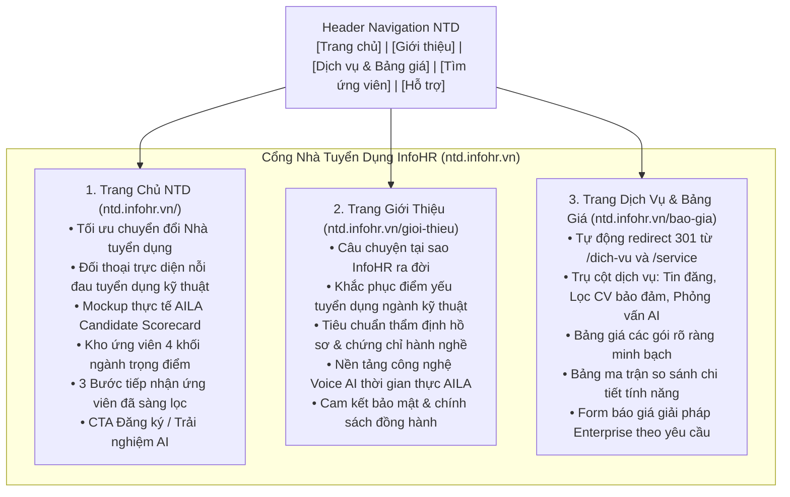

# Đặc Tả Kỹ Thuật: Tái Cấu Trúc Hệ Thống Trang Cổng Nhà Tuyển Dụng (ntd.infohr.vn)

- **Ngày cập nhật**: 2026-09-30  
- **Dự án**: Square Tuyển Dụng (InfoHR) — Employer Portal  
- **Triết lý thiết kế**: Anti-AI Slop, B2B Technical Professional, Đánh thẳng vào nỗi đau thực tế của Nhà tuyển dụng ngành kỹ thuật (Xây dựng, Bất động sản, Kiến trúc, Cơ điện MEP).  
- **Phạm vi tác động**:  
  - Routing & Middleware: `frontend/src/middleware.ts`  
  - Layout & Navigation: `frontend/src/layouts/components/commons/Header/index.tsx`, `LeftDrawer/index.tsx`  
  - Pages & Views:  
    + `frontend/src/app/employer/page.tsx` & `frontend/src/views/employerPages/EmployerHomePage/`  
    + `frontend/src/app/employer/introduce/page.tsx` & `frontend/src/views/employerPages/IntroducePage/`  
    + `frontend/src/app/employer/pricing/page.tsx` & `frontend/src/views/employerPages/PricingPage/`  
    + `frontend/src/app/employer/service/page.tsx` (Redirect 301 về `/bao-gia`)

---

## 1. Bối Cảnh, Nỗi Đau Thực Tế & Định Vị InfoHR

### 1.1. Nỗi đau thực tế của Nhà Tuyển Dụng trong 4 Khối Ngành Kỹ Thuật
1. **Bội thực CV rác, thiếu người có nghề**:
   - Đăng tin đại trà trên các trang việc làm chung (TopCV, VietnamWorks, CareerBuilder...) thì nhận về hàng trăm hồ sơ sinh viên mới ra trường hoặc trái ngành.
   - Khi cần các vị trí then chốt như: *Chỉ huy trưởng công trình*, *Kỹ sư giám sát MEP*, *Kỹ sư QS bóc tách khối lượng cao tầng*, *Kiến trúc sư chủ trì hồ sơ thi công*... thì gần như không có ứng viên đạt yêu cầu nộp đơn.
2. **Nỗi sợ ứng viên "vẽ" CV & HR không đủ chuyên môn kỹ thuật để hỏi**:
   - Chuyên viên tuyển dụng HR thường tốt nghiệp ngành xã hội/quản trị, không có chuyên môn đọc bản vẽ, quy chuẩn thi công, hay xử lý xung đột MEP trên Navisworks/Revit.
   - Khi chuyển thẳng CV lên cho Chỉ huy trưởng hoặc Giám đốc dự án phỏng vấn, lãnh đạo hiện trường mất nhiều giờ quý báu chỉ để phát hiện ứng viên "nói miệng thì hay nhưng không biết làm thật".
3. **Mất tiền mua điểm mở CV nhưng toàn "hồ sơ chết"**:
   - Mua các gói nạp điểm lọc CV tiền triệu, nhưng mở ra thì số điện thoại không liên lạc được, ứng viên đã đổi nghề, hoặc hồ sơ không còn nhu cầu tìm việc.
4. **Chi phí Headhunter quá cao (1.5 - 2 tháng lương)**:
   - Thuê công ty săn đầu người tốn từ 25 - 50 triệu/vị trí kỹ sư, không phù hợp để tuyển số lượng lớn cho các dự án mở rộng.

### 1.2. InfoHR + AILA AI giải quyết triệt để như thế nào?
1. **Chuyên môn hóa 4 khối ngành**: Hồ sơ ứng viên có thông tin dự án thực tế (quy mô dự án, cấp công trình), chứng chỉ hành nghề (Giám sát, Thiết kế, Định giá), kỹ năng phần mềm kỹ thuật (Revit, AutoCAD, BIM, Civil 3D, Plaxis).
2. **AILA AI sơ loại kỹ thuật 24/7**:
   - AILA đóng vai trò là Trợ lý phỏng vấn kỹ thuật sơ bộ: Tự động phỏng vấn ứng viên theo bộ câu hỏi tình huống công trường/dự án chuẩn hóa.
   - Trả về cho HR **Phiếu đánh giá năng lực ứng viên (Scorecard)**: Điểm khớp JD, checklist chứng chỉ, mốc dự án đã làm, và file ghi âm trả lời tình huống thực tế. Lãnh đạo chỉ mất 2 phút nghe và duyệt trước khi mời gặp trực tiếp.
3. **Bảo lưu & Minh bạch**: Chỉ tính phí khi ứng viên xác thực trạng thái đang tìm việc; hỗ trợ bảo hành hồ sơ nếu không liên lạc được.
4. **Chi phí tối ưu**: Trả theo nhu cầu (gói tin đăng, gói điểm lọc có bảo đảm, gói lượt phỏng vấn AI), tiết kiệm 70% ngân sách tuyển dụng.

---

## 2. Nguyên Tắc Thiết Kế UI/UX: Loại Bỏ Hoàn Toàn Vẻ Ngoài "AI Slop"

1. **Bảng màu B2B Modern Technical**:
   - Nền trắng tinh khiết `#FFFFFF` và xám kỹ thuật `#F8FAFC`.
   - Đường kẻ phân cách mảnh sắc sảo `#E2E8F0`, không dùng bóng đổ đen thô kệch.
   - Màu chủ đạo: Xanh Navy công nghiệp `#0F172A` & `#1E3A8A`, Xanh điểm nhấn `#2563EB`, Đỏ kỹ thuật AILA `#DC2626`.
   - **CẤM**: Các khối thẻ pastel xanh đỏ tím vàng rực rỡ như đồ chơi trẻ em (`#EFF6FF`, `#FEF2F2`, `#ECFDF5`, `#FEF3C7`).
2. **Giao diện Sản Phẩm Thực Tế (Product Mockup) thay vì 3D trừu tượng**:
   - Thể hiện trực quan **Mẫu phiếu kết quả phỏng vấn sơ loại AILA (Candidate Evaluation Card)**:
     + Tên ứng viên, vị trí (VD: *Kỹ sư Giám sát Cơ điện MEP - 4 năm kinh nghiệm*).
     + Điểm Match Score kỹ thuật: *86/100*.
     + Thẩm định chứng chỉ: Chứng chỉ hành nghề Giám sát MEP Hạng II (Bộ Xây dựng), Kỹ năng Revit MEP & Navisworks.
     + Đoạn audio sóng âm (waveform) mô phỏng câu trả lời tình huống: *"Quy trình xử lý xung đột ống gió HVAC với dầm bê tông..."*.
3. **Nội dung thực tế, không dùng số liệu "vẽ"**:
   - Bỏ các số liệu sáo rỗng vô căn cứ kiểu `80%`, `3.5x`, `95%`, `1.200+`.
   - Thay bằng giá trị vận hành thực tế:
     + *"Tiết kiệm 15-20 giờ phỏng vấn sơ loại cho mỗi vị trí kỹ sư."*
     + *"100% hồ sơ có thông tin dự án thực tế & chứng chỉ hành nghề."*
     + *"Nhận phiếu đánh giá năng lực AILA trong vòng 3 phút sau phỏng vấn."*
4. **Nhịp điệu bố cục bất đối xứng (Asymmetry & Rhythm)**:
   - Tránh việc rải 4 thẻ giống nhau liên tục ở mọi phân tầng.
   - Áp dụng bố cục Split screen (Vấn đề bên trái - Bằng chứng giải pháp bên phải), các bảng so sánh thực tế, và quy trình dòng chảy hiện đại.

---

## 3. Kiến Trúc Cổng NTD (ntd.infohr.vn)

### 3.1. Phân Tách 3 Trang Riêng Biệt

### 3.2. Cấu Trúc File & Directory
* `frontend/src/views/employerPages/EmployerHomePage/index.tsx`: View Trang chủ NTD mới.
* `frontend/src/app/employer/page.tsx`: Render `EmployerHomePage`.
* `frontend/src/views/employerPages/IntroducePage/index.tsx`: View Giới thiệu mới (hồ sơ năng lực, sứ mệnh, thẩm định kỹ thuật).
* `frontend/src/app/employer/introduce/page.tsx`: Render `IntroducePage`.
* `frontend/src/views/employerPages/PricingPage/index.tsx`: View Dịch vụ & Bảng giá toàn diện (Gói cước, so sánh, form liên hệ).
* `frontend/src/app/employer/pricing/page.tsx`: Render `PricingPage`.
* `frontend/src/app/employer/service/page.tsx`: Redirect 301 về `/employer/pricing`.
* `frontend/src/middleware.ts`: Cập nhật `EMPLOYER_EXACT_MAP` (`/` -> `/employer`, `/gioi-thieu` -> `/employer/introduce`, `/bao-gia` -> `/employer/pricing`, `/dich-vu` -> `/employer/pricing`).
* `frontend/src/layouts/components/commons/Header/index.tsx`: Cập nhật menu `HOST_NAME.EMPLOYER_PROJECT`.
* `frontend/src/layouts/components/commons/LeftDrawer/index.tsx`: Đồng bộ menu mobile.

---

## 4. Chi Tiết Nội Dung Từng Trang

### Trang 1: Trang Chủ NTD (`EmployerHomePage`)
1. **Hero Section (B2B Split Layout)**:
   - **Bên trái**:
     - Label: `TUYỂN DỤNG NHÂN SỰ KỸ THUẬT & CHUYÊN MÔN`.
     - Tiêu đề: **"Đừng để bộ phận HR mất hàng tuần sàng lọc hàng trăm CV không đúng chuyên ngành."**
     - Mô tả: Nền tảng tuyển dụng chuyên sâu cho 4 khối ngành **Xây dựng • Bất động sản • Kiến trúc nội thất • Kỹ thuật MEP**, tích hợp trợ lý Voice AI **AILA** tự động phỏng vấn sơ loại năng lực kỹ thuật trước khi chuyển tới lãnh đạo.
     - Action CTAs: `[Đăng Ký Đăng Tuyển]` (trỏ `/dang-ky`), `[Xem Bảng Giá Dịch Vụ]` (trỏ `/bao-gia`).
     - Tín hiệu tin cậy: Tặng tin đăng tuyển trải nghiệm • Cam kết hồ sơ thật • Hỗ trợ thiết lập kịch bản phỏng vấn kỹ thuật.
   - **Bên phải**: **Mockup Giao diện Thực tế: AILA Candidate Scorecard**:
     - Thẻ hồ sơ ứng viên: *Nguyễn Văn Cường — Kỹ sư Giám sát MEP (4 năm KN)*.
     - Vị trí ứng tuyển: *Chỉ huy phó MEP — Dự án Cao ốc Văn phòng Hạng A*.
     - Match Score: *88% khớp yêu cầu*.
     - Checklist: Chứng chỉ Giám sát MEP Hạng II (Đã xác thực) • Sử dụng thành thạo Revit MEP & Navisworks • Sẵn sàng làm việc ngoài giờ.
     - Audio Player mini: Câu trả lời thực tế tình huống xung đột đường ống tại công trường.
     - Nút duyệt: `[Chuyển Giám Đốc Dự Án Phỏng Vấn Vòng 2]`.
2. **Vấn Đề & Giải Pháp (The Contrast Grid)**:
   - Bảng đối lập: Tuyển dụng truyền thống (Ngập CV rác, HR không biết hỏi kỹ thuật, tốn tiền mua CV chết) vs InfoHR & AILA AI (Ứng viên chuyên ngành có chứng chỉ, AI hỏi sâu kỹ thuật, chỉ trả tiền cho hồ sơ có nhu cầu).
3. **4 Khối Ngành Trọng Điểm**:
   - Thẻ ngành Xây dựng: Kỹ sư hiện trường, Chỉ huy trưởng, Dự toán QS, An toàn HSE.
   - Thẻ ngành Bất động sản: Quản lý dự án, Phát triển mặt bằng, Kinh doanh BĐS công nghiệp/cao cấp.
   - Thẻ ngành Kiến trúc: KTS chủ trì, Triển khai hồ sơ kỹ thuật thi công, Thiết kế nội thất 3D.
   - Thẻ ngành Kỹ thuật MEP: Kỹ sư cơ điện công trình, HVAC, Phòng cháy chữa cháy, Trạm biến áp.
4. **Quy Trình 3 Bước Tinh Gọn**:
   - Bước 1: Doanh nghiệp đăng tin và chọn tiêu chí năng lực kỹ thuật.
   - Bước 2: AILA Voice AI tự động liên hệ ứng viên và phỏng vấn sơ loại tình huống 24/7.
   - Bước 3: Lãnh đạo nhận Scorecard và file ghi âm, chỉ phỏng vấn trực tiếp các ứng viên đạt tiêu chuẩn.
5. **CTA Chuyển Đổi Cuối Trang**:
   - Kêu gọi đăng ký tài khoản doanh nghiệp hoặc gửi yêu cầu demo phỏng vấn AI.

### Trang 2: Trang Giới Thiệu NTD (`IntroducePage` mới)
1. **Hero Giới Thiệu**:
   - Tiêu đề: **"Tại Sao InfoHR Ra Đời? — Lời Giải Cho Bài Toán Nhân Sự Ngành Kỹ Thuật."**
   - Câu chuyện thực tế: Ngành Xây dựng, Bất động sản và Kỹ thuật công trình tại Việt Nam đang thiếu hụt trầm trọng nhân sự có năng lực thực chiến, trong khi các sàn việc làm đại trà không đáp ứng được yêu cầu thẩm định chuyên môn.
2. **3 Trụ Cột Năng Lực Của InfoHR**:
   - **Thẩm định hồ sơ chuyên môn**: Quy trình xác minh bằng cấp, chứng chỉ hành nghề và danh mục dự án đã tham gia.
   - **Công nghệ Voice AI thời gian thực (AILA)**: Khả năng phỏng vấn tương tác bằng giọng nói tự nhiên, hỏi đáp tình huống chuyên môn theo TCVN và quy chuẩn xây dựng.
   - **Hệ sinh thái liên thông**: Kết nối cổng Tuyển dụng InfoHR, Phần mềm Quản trị nhân sự InfoHR HRM, và Trung tâm đánh giá năng lực AILA.
3. **Tiêu Chuẩn Đạo Đức & Bảo Mật Dữ Liệu**:
   - Cam kết bảo mật thông tin dự án và bí mật kinh doanh của doanh nghiệp.
   - Thuật toán chấm điểm khách quan, không thiên vị vùng miền, giới tính.
4. **Cam Kết Đồng Hành Cùng Doanh Nghiệp**:
   - Chính sách bảo hành tuyển dụng (hỗ trợ đổi hồ sơ thay thế nếu ứng viên nghỉ việc trong thời gian thử việc đối với các gói dịch vụ cam kết).
   - Đội ngũ chuyên viên tư vấn hỗ trợ doanh nghiệp tối ưu JD và kịch bản phỏng vấn.

### Trang 3: Trang Dịch Vụ & Bảng Giá (`PricingPage` toàn diện)
1. **Hero Bảng Giá**:
   - Tiêu đề: **"Dịch Vụ & Bảng Giá Tuyển Dụng Chuyên Ngành — Minh Bạch, Trả Theo Nhu Cầu."**
   - Phụ đề: Không phụ phí ẩn, không ép mua gói lớn, chỉ trả tiền cho hồ sơ và dịch vụ mang lại giá trị thật.
2. **Chi Tiết Các Gói Dịch Vụ**:
   - **Gói 1: Đăng Tin Tuyển Dụng Chuyên Ngành (Job Posting)**:
     + Hiển thị ưu tiên chuyên mục ngành.
     + Đẩy tin tự động theo khung giờ vàng ứng viên tìm việc.
     + Hỗ trợ tối ưu JD chuẩn kỹ thuật.
   - **Gói 2: Điểm Lọc Hồ Sơ Bảo Đảm (Verified Resume Search)**:
     + Tiếp cận kho CV có chứng chỉ hành nghề và thông tin dự án.
     + Cam kết bảo lưu: Chỉ trừ điểm khi ứng viên nghe máy hoặc phản hồi; bù điểm nếu số thuê bao không liên lạc được.
   - **Gói 3: Trợ Lý Phỏng Vấn Sơ Loại AILA AI (AI Voice Interviewer)**:
     + Gói theo số lượng ứng viên (VD: 20 lượt, 50 lượt, 100 lượt).
     + Tùy biến kịch bản câu hỏi kỹ thuật theo từng vị trí.
     + Xuất báo cáo Scorecard năng lực và audio ghi âm chi tiết.
   - **Gói 4: Combo Doanh Nghiệp (Enterprise Solution)**:
     + Kết hợp toàn diện: Đăng tin không giới hạn + Điểm lọc CV số lượng lớn + AILA AI phỏng vấn độc quyền + Chuyên viên phụ trách riêng 1-on-1.
3. **Bảng Ma Trận So Sánh Quyền Lợi Tính Năng (Feature Matrix)**:
   - So sánh chi tiết từng tính năng giữa các gói: Số tin, vị trí top, số điểm CV, lượt phỏng vấn AI, thời gian bảo hành, hỗ trợ kỹ thuật.
4. **Form Nhận Báo Giá Tùy Chỉnh Enterprise**:
   - Doanh nghiệp điền thông tin nhu cầu tuyển dụng (số lượng, ngành nghề) để nhận báo giá chiết khấu trong 15 phút.
5. **FAQ Dịch Vụ & Bảng Giá Thực Tế**:
   - Làm sao để được bảo hành hoàn điểm khi ứng viên không nghe máy?
   - AILA AI hỏi những gì và doanh nghiệp có được sửa câu hỏi không?
   - Thanh toán và xuất hóa đơn VAT như thế nào?

---

## 5. Kế Hoạch Triển Khai Chi Tiết

1. **Bước 1**: Cấu hình định tuyến & Middleware (`middleware.ts`, `service/page.tsx`).
2. **Bước 2**: Xây dựng View `EmployerHomePage` (Trang chủ NTD mới, anti-slop, B2B technical, Scorecard mockup).
3. **Bước 3**: Cập nhật `frontend/src/app/employer/page.tsx` render `EmployerHomePage`.
4. **Bước 4**: Xây dựng View `IntroducePage` mới (Hồ sơ năng lực, sứ mệnh thực tế, thẩm định 4 ngành, công nghệ).
5. **Bước 5**: Nâng cấp View `PricingPage` mới (Tích hợp Dịch vụ + Bảng giá + Bảng so sánh + Form Enterprise + FAQ).
6. **Bước 6**: Cập nhật Header Navigation và LeftDrawer cổng NTD.
7. **Bước 7**: Chạy Type check, Linting và Build verification theo Definition of Done.
