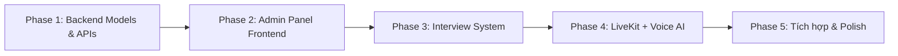

# Tích hợp tính năng SquareAI vào TuyenDungSquare

## Bối cảnh

**TuyenDungSquare** đã có hệ thống tuyển dụng hoàn chỉnh (đăng tin, ứng tuyển, hồ sơ, thống kê) nhưng **thiếu**:
1. **Trang quản trị Admin/HR** hiện đại (chỉ có Django Admin cổ điển)
2. **Quản lý câu hỏi phỏng vấn** (Question Bank)
3. **Quản lý buổi Phỏng vấn trực tuyến** (Interview Sessions)
4. **Tích hợp LiveKit** cho phỏng vấn voice AI

**SquareAI** đã có đầy đủ các tính năng trên, cần follow architecture và port logic sang.

## User Review Required

> [!IMPORTANT]
> Đây là dự án lớn, cần chia thành nhiều phase. Plan này mô tả **tổng thể tất cả những gì cần làm** và thứ tự thực hiện. Mỗi phase sẽ được triển khai tuần tự.

> [!WARNING]
> **Backend hiện tại là Django (Python)** trong khi SquareAI dùng NestJS (TypeScript). Tôi sẽ port logic business sang Django REST Framework thay vì dùng NestJS, để giữ stack thống nhất. Frontend sẽ follow pattern MUI của TuyenDungSquare (không dùng Mantine/Tailwind của SquareAI).

> [!CAUTION]
> Voice-AI agent (LiveKit + STT/LLM/TTS) cần **GPU** để chạy inference models. Docker Compose sẽ cần thêm GPU services. Bạn cần xác nhận máy server có GPU (NVIDIA) không?

---

## Tổng quan các Phase



---

## Phase 1: Backend — Bổ sung Models & API cho Interview System

### Mục tiêu
Thêm các Django models và REST APIs cần thiết cho hệ thống Phỏng vấn trực tuyến, follow schema của SquareAI.

---

### Backend — Interview Models

#### [NEW] [models.py](file:///c:/Users/leduc/Documents/TuyenDungSquare/myjob_api/interview/__init__.py)

Tạo Django app mới [interview](file:///C:/Users/leduc/Documents/squareai/apps/voice-ai/livekit_agent/src/agent.py#132-143) với các models:

| Model | Mô tả | Tham chiếu SquareAI |
|---|---|---|
| [Question](file:///C:/Users/leduc/Documents/squareai/apps/frontend/src/types/question.ts#9-24) | Ngân hàng câu hỏi (text, type, category, complexity, tags) | `interview_questions` |
| [QuestionGroup](file:///C:/Users/leduc/Documents/squareai/apps/frontend/src/types/question.ts#38-47) | Nhóm câu hỏi (name, description, M2M → Question) | [QuestionGroup](file:///C:/Users/leduc/Documents/squareai/apps/frontend/src/types/question.ts#38-47) type |
| [InterviewSession](file:///C:/Users/leduc/Documents/squareai/apps/frontend/src/types/interview.ts#122-151) | Buổi phỏng vấn (candidate, job, status, scheduled_at, questions, recording_url) | `interviews` table |
| `InterviewTranscript` | Lịch sử hội thoại (interview, speaker_role, content) | `interview_transcripts` |
| `InterviewEvaluation` | Đánh giá kết quả (scores, feedback, result) | [Evaluation](file:///C:/Users/leduc/Documents/squareai/apps/frontend/src/types/interview.ts#56-84) type |

#### [NEW] [serializers.py](file:///c:/Users/leduc/Documents/TuyenDungSquare/myjob_api/interview/serializers.py)

DRF Serializers cho tất cả models trên, hỗ trợ nested create/update.

#### [NEW] [views.py](file:///c:/Users/leduc/Documents/TuyenDungSquare/myjob_api/interview/views.py)

REST ViewSets:
- `QuestionViewSet` — CRUD câu hỏi
- `QuestionGroupViewSet` — CRUD nhóm câu hỏi
- `InterviewSessionViewSet` — CRUD + schedule + status update
- `InterviewTranscriptViewSet` — Append transcription
- `InterviewEvaluationViewSet` — CRUD đánh giá

#### [NEW] [urls.py](file:///c:/Users/leduc/Documents/TuyenDungSquare/myjob_api/interview/urls.py)

Endpoints follow SquareAI pattern:
```
/api/interview/web/questions/
/api/interview/web/question-groups/
/api/interview/web/sessions/
/api/interview/web/sessions/:id/context/
/api/interview/web/sessions/:id/status/
/api/interview/web/sessions/:id/append-transcription/
/api/interview/web/sessions/:id/evaluation/
```

#### [MODIFY] [urls.py](file:///c:/Users/leduc/Documents/TuyenDungSquare/myjob_api/myjob_api/urls.py)

Thêm `path('api/interview/', include('interview.urls'))`.

#### [MODIFY] [settings.py](file:///c:/Users/leduc/Documents/TuyenDungSquare/myjob_api/myjob_api/settings.py)

Thêm `'interview'` vào `INSTALLED_APPS`.

---

### Backend — LiveKit Integration

#### [NEW] [livekit_service.py](file:///c:/Users/leduc/Documents/TuyenDungSquare/myjob_api/interview/livekit_service.py)

Service sinh JWT token cho LiveKit rooms (follow [livekit.service.ts](file:///C:/Users/leduc/Documents/squareai/apps/backend/src/livekit/livekit.service.ts) của SquareAI):
- `create_token(room_name, participant_name, is_agent)` → JWT
- Cần package `livekit-api` cho Python

#### [MODIFY] [requirements.txt](file:///c:/Users/leduc/Documents/TuyenDungSquare/myjob_api/requirements.txt)

Thêm: `livekit-api`, `PyJWT`

---

## Phase 2: Admin Panel Frontend (React + MUI)

### Mục tiêu
Xây dựng trang quản trị cho Admin/HR trong frontend React hiện tại, follow pattern MUI đã có, lấy cảm hứng UI từ SquareAI.

---

#### [NEW] Admin Layout & Routes

Tạo layout v routes riêng cho admin (follow pattern `EmployerLayout`):

| File mới | Mô tả |
|---|---|
| `src/layouts/AdminLayout/` | Sidebar + header cho admin |
| `src/pages/adminPages/DashboardPage/` | Tổng quan hệ thống |
| `src/pages/adminPages/UsersPage/` | Quản lý users |
| `src/pages/adminPages/JobsPage/` | Quản lý tin tuyển dụng |
| `src/pages/adminPages/QuestionsPage/` | Ngân hàng câu hỏi |
| `src/pages/adminPages/InterviewsPage/` | Danh sách phỏng vấn |
| `src/pages/adminPages/SettingsPage/` | Cấu hình hệ thống |

#### [MODIFY] [routesConfig.js](file:///c:/Users/leduc/Documents/TuyenDungSquare/my-job-web-app/src/configs/routesConfig.js)

Thêm hostname & routes cho admin panel.

#### [MODIFY] [constants.js](file:///c:/Users/leduc/Documents/TuyenDungSquare/my-job-web-app/src/configs/constants.js)

Thêm `HOST_NAME.ADMIN_MYJOB` và `ROUTES.ADMIN.*`.

#### [NEW] Admin Services

| File mới | Mô tả |
|---|---|
| `src/services/questionService.js` | CRUD câu hỏi |
| `src/services/interviewService.js` | CRUD buổi phỏng vấn |
| `src/services/adminService.js` | APIs quản trị |

---

## Phase 3: Interview System Frontend

### Mục tiêu
UI cho Employer tạo & quản lý buổi Phỏng vấn trực tuyến. UI cho ứng viên tham gia phỏng vấn.

---

#### Employer Side (trong Employer Dashboard)

| Page mới | Mô tả | Tham chiếu SquareAI |
|---|---|---|
| `InterviewListPage` | Danh sách buổi phỏng vấn + filter/search | [(main)/interviews/](file:///c:/Users/leduc/Documents/TuyenDungSquare/my-job-web-app/src/App.jsx#43-127) |
| `InterviewCreatePage` | Tạo buổi phỏng vấn (chọn ứng viên, job, câu hỏi) | [ScheduleInterviewDto](file:///C:/Users/leduc/Documents/squareai/apps/frontend/src/types/interview.ts#168-177) |
| `InterviewDetailPage` | Xem chi tiết: transcript, video, đánh giá AI | [InterviewReport](file:///C:/Users/leduc/Documents/squareai/apps/frontend/src/types/interview.ts#152-167) |
| `QuestionBankPage` | Quản lý ngân hàng câu hỏi | [(main)/questions/](file:///c:/Users/leduc/Documents/TuyenDungSquare/my-job-web-app/src/App.jsx#43-127) |

#### Candidate Side

| Page mới | Mô tả | Tham chiếu SquareAI |
|---|---|---|
| `InterviewRoomPage` | Trang phỏng vấn LiveKit (mic/camera check → interview) | `interview/[id]/` |
| `CandidateLoginPage` | Login bằng invite token | `candidate/login/` |

---

## Phase 4: LiveKit + Voice AI Agent

### Mục tiêu
Tích hợp LiveKit server và voice-AI agent vào Docker Compose.

---

#### [NEW] Voice AI Agent

Copy và adapt từ SquareAI `voice-ai/livekit_agent/`:

| File | Mô tả |
|---|---|
| [livekit_agent/src/agent.py](file:///C:/Users/leduc/Documents/squareai/apps/voice-ai/livekit_agent/src/agent.py) | [InterviewerAgent](file:///C:/Users/leduc/Documents/squareai/apps/voice-ai/livekit_agent/src/agent.py#29-162) — logic phỏng vấn 5 giai đoạn |
| [livekit_agent/src/config.py](file:///C:/Users/leduc/Documents/squareai/apps/voice-ai/livekit_agent/src/config.py) | Config (LLM, STT, TTS URLs) |
| [livekit_agent/src/prompts.py](file:///C:/Users/leduc/Documents/squareai/apps/voice-ai/livekit_agent/src/prompts.py) | System prompt cho AI interviewer |
| [livekit_agent/Dockerfile](file:///C:/Users/leduc/Documents/squareai/apps/voice-ai/livekit_agent/Dockerfile) | Container setup |

Sửa `BACKEND_API_URL` để trỏ về Django backend thay vì NestJS.

#### [MODIFY] [docker-compose.yml](file:///c:/Users/leduc/Documents/TuyenDungSquare/docker-compose.yml)

Thêm services (follow SquareAI docker-compose):
- `livekit` — LiveKit media server
- `livekit_agent` — Python AI agent
- `vieneu-tts` — Vietnamese TTS
- `whisper` — STT service
- `llama-cpp` — LLM service

#### Frontend — LiveKit Components

| File mới | Mô tả |
|---|---|
| `src/components/Interview/LiveKitRoom.jsx` | Wrapper `@livekit/components-react` |
| `src/components/Interview/CalibrationCheck.jsx` | Pre-flight mic/camera check |
| `src/components/Interview/SessionView.jsx` | Main interview UI |

#### [MODIFY] [package.json](file:///c:/Users/leduc/Documents/TuyenDungSquare/my-job-web-app/package.json)

Thêm: `@livekit/components-react`, `@livekit/components-styles`, `livekit-client`

---

## Phase 5: Tích hợp & Polish

- HR Live monitoring (xem phỏng vấn đang diễn ra)
- Auto-evaluation (AI chấm điểm sau phỏng vấn)
- Email notification khi mời phỏng vấn
- Recording playback
- Statistics dashboard cho interviews

---

## Thứ tự thực hiện đề xuất

| # | Task | Phụ thuộc | Ước lượng |
|---|---|---|---|
| 1 | Tạo Django app [interview](file:///C:/Users/leduc/Documents/squareai/apps/voice-ai/livekit_agent/src/agent.py#132-143) (models + migrations) | — | 1-2h |
| 2 | API endpoints (ViewSets + Serializers + URLs) | #1 | 2-3h |
| 3 | Admin Layout + Routes setup | — | 1-2h |
| 4 | Admin Dashboard page | #3 | 1-2h |
| 5 | Question Bank UI (CRUD) | #2, #3 | 2-3h |
| 6 | Interview CRUD UI (Employer side) | #2, #3 | 3-4h |
| 7 | Docker: thêm LiveKit + AI services | — | 1-2h |
| 8 | LiveKit agent port + configure | #2, #7 | 2-3h |
| 9 | Interview Room UI (Candidate side) | #8 | 3-4h |
| 10 | Polish, testing, evaluation features | All | 3-4h |

---

## Verification Plan

### Automated Tests
- Django: `python manage.py test interview` — test models, serializers, views
- Frontend: `npm run test` — test services, components

### Manual Verification
1. **Backend APIs**: Truy cập Swagger (`/swagger/`) để test tất cả endpoints interview
2. **Admin Panel**: Truy cập admin hostname, kiểm tra sidebar, CRUD questions
3. **Interview Flow**: 
   - Employer tạo interview với câu hỏi
   - Ứng viên join interview room qua invite link
   - AI agent kết nối và bắt đầu phỏng vấn voice
   - Employer xem transcript real-time
4. **Docker**: `docker compose up` và kiểm tra tất cả services healthy

> [!NOTE]
> Plan trên bao quát toàn bộ luồng. Tôi đề xuất **bắt đầu từ Phase 1 (backend models + APIs)** trước, vì cả admin panel lẫn interview system đều cần API. Bạn ok bắt đầu từ Phase 1 không?
